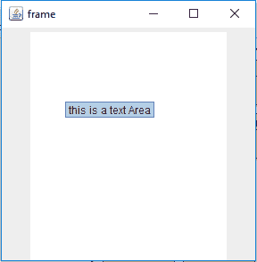
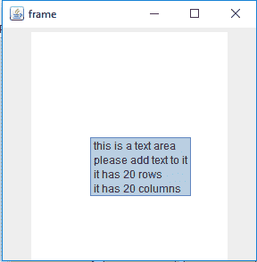
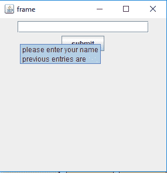
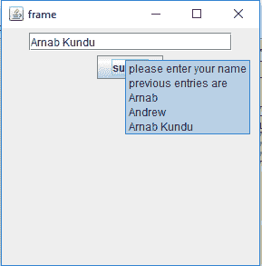

# 爪哇摇摆|工具提示

> 原文:[https://www.geeksforgeeks.org/tooltip-java-swing/](https://www.geeksforgeeks.org/tooltip-java-swing/)

我们可以使用以下方法将工具提示文本添加到 Java Swing 的几乎所有组件中。此方法将组件的工具提示设置为指定的字符串。当光标进入该组件的边界时，会出现一个弹出窗口并显示文本。

**使用的方法:**

1.  getToolTipText():返回该组件的工具提示文本。
2.  设置工具提示文本:设置组件的工具提示文本。
3.  getToolTipText(MouseEvent e):返回与 getToolTipText()返回的值相同的值。多部分组件，如 JTabbedPane、JTable 和 JTree，会重写此方法，以返回与鼠标事件位置相关联的字符串。
4.  getToolTipLocation(MouseEvent e):返回组件工具提示左上角出现的位置(在接收组件的坐标系中)。

**以下程序将说明 tooltiptext** 的使用

**1。程序创建一个文本区和单行工具提示文本给它**

## Java 语言(一种计算机语言，尤用于创建网站)

```java
// java Program to create a textarea and
// single line tool tip text to it
import javax.swing.event.*;
import java.awt.*;
import javax.swing.*;
class solve extends JFrame {

    // frame
    static JFrame f;

    // text areas
    static JTextArea t1;

    // main class
    public static void main(String[] args)
    {
        // create a new frame
        f = new JFrame("frame");

        // create a object
        solve s = new solve();

        // create a panel
        JPanel p = new JPanel();

        // create a text area
        t1 = new JTextArea(20, 20);

        // set tooltip text
        t1.setToolTipText("this is a text Area");

        // add text area
        p.add(t1);

        // add panel
        f.add(p);

        // set the size of frame
        f.setSize(300, 300);

        f.show();
    }
}
```



**2。程序创建一个文本区域，并向其中添加多行工具提示文本。**

## Java 语言(一种计算机语言，尤用于创建网站)

```java
// java Program to create a text area and add
// multiple line tooltip text to it.
import javax.swing.event.*;
import java.awt.*;
import javax.swing.*;
class solve extends JFrame {

    // frame
    static JFrame f;

    // text areas
    static JTextArea t1;

    // main class
    public static void main(String[] args)
    {
        // create a new frame
        f = new JFrame("frame");

        // create a object
        solve s = new solve();

        // create a panel
        JPanel p = new JPanel();

        // create a text area
        t1 = new JTextArea(20, 20);

        // create a multi line string using html using break tags
        String s1 = "<html> this is a text area <br> please add text to it <br> it has 20 rows <br> it has 20 columns </html> ";

        // set tooltip text
        t1.setToolTipText(s1);

        // add text area
        p.add(t1);

        // add panel
        f.add(p);

        // set the size of frame
        f.setSize(300, 300);

        f.show();
    }
}
```

**输出:**



**3。程序使用 JTextField 提交名称，工具提示文本显示了前面的条目。(使用 getToolTipText 函数)**

## Java 语言(一种计算机语言，尤用于创建网站)

```java
// java Program to submit name using JTextField and the tooltip
// text shows the previous entries.(using
// getToolTipText function)
import java.awt.event.*;
import java.awt.*;
import javax.swing.*;
class solve extends JFrame implements ActionListener {

    // frame
    static JFrame f;

    // text areas
    static JTextField t1;

    // buttons
    static JButton b;

    // main class
    public static void main(String[] args)
    {
        // create a new frame
        f = new JFrame("frame");

        // create a object
        solve s = new solve();

        // create a panel
        JPanel p = new JPanel();

        // create a text area
        t1 = new JTextField(20);

        // create a button
        b = new JButton("submit");

        // add actionlistener
        b.addActionListener(s);

        // create a multi line string using html using break tags
        String s1 = "<html> please enter your name <br> previous entries are <br>     </html>";

        // set tooltip text
        t1.setToolTipText(s1);

        // add text area and button
        p.add(t1);
        p.add(b);

        // add panel
        f.add(p);

        // set the size of frame
        f.setSize(300, 300);

        f.show();
    }

    // if a button is performed
    public void actionPerformed(ActionEvent e)
    {
        // if submit button is pressed add the name to the list of entries
        // exclude the closing html tag by taking its substring
        // add the name to the list of entries
        // and add the html tag to the end of it

        // get the tooltip text
        String s = t1.getToolTipText();

        t1.setToolTipText(s.substring(0, s.length() - 8) + t1.getText() + "<br>      <html");
    }
}
```

**输出:**

 

**注意:以下程序可能无法在联机编译器中运行，请使用联机 IDE。**