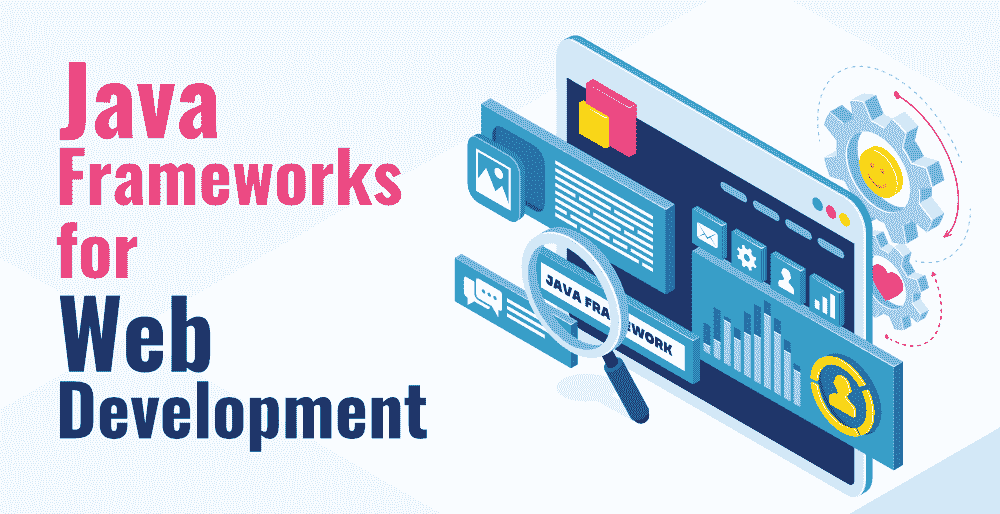

# 十大最受欢迎的网络开发 Java 框架

> 原文:[https://www . geesforgeks . org/top-10-最受欢迎的 Java-framework-for-web-development/](https://www.geeksforgeeks.org/top-10-most-popular-java-frameworks-for-web-development/)

你知道 5000 多万个网站，包括一些最受欢迎的网站，如谷歌、领英、易贝、亚马逊和 Stack Overflow，都是用哪种语言编写的吗？答案无非是最流行的 Java。Java 刚刚达到它的银周年纪念日，但仍然以“旧是金”的可靠性统治着软件行业。Allrounder Java 在安卓、云计算、大数据和机器学习项目上提供了大量应用程序，但在网络开发方面，Java 是任何级别开发人员的最佳选择。

框架是具有预写代码的工具，充当模板或框架，只需根据需要填充您的代码，就可以重用它们来创建应用程序，这使开发人员能够对他们的应用程序进行编程，而无需从头开始一次又一次地创建每一行代码。现在，如果您正在寻找市场上最好的工具来帮助您更容易、更快、更好地开发网站，那么 Java 总是为您提供大量框架，最重要的是，大多数 Java 框架都是免费和开源的。

### [1。弹簧:](https://spring.io/)

Spring 是一个强大的、轻量级的、最受欢迎的框架，它使 Java 使用起来更快、更容易、更安全。该框架因其速度、简单性和生产力而在开发人员中非常受欢迎，这有助于轻松创建企业级 web 应用程序。Spring MVC 和 Spring Boot 让 Java 变得现代化、反应式和云就绪，以构建高性能的复杂 web 应用程序，因此被许多科技巨头使用，包括网飞、亚马逊、谷歌、微软等。

*   使用 Spring 灵活而全面的第三方库，您可以构建任何您可以想象的 web 应用程序。
*   在几秒钟内启动一个新的 Spring 项目，默认情况下具有快速启动、快速关闭和优化执行。
*   Spring 提供了一个轻量级容器，可以在没有 web 服务器或应用服务器的情况下触发。
*   它为您的项目提供了向后兼容性和易测试性。
*   它支持 JDBC，提高生产力，尽可能减少误差
*   它支持模块化以及基于 XML 和注释的配置
*   Spring Boot 有一个庞大的生态系统和社区，有大量的文档和多个 Spring 教程

### [2。Grails:](https://grails.org/)

它是一个基于 MVC 设计模式的动态全栈 Java 框架。容易学习，最适合初学者。Grails 是一种面向对象的语言，可以提高开发人员的工作效率。虽然是用 Groovy 编写的，但它可以在 Java 平台上运行，并且与 Java 语法完全兼容。

*   易于为视图创建标签，
*   对 RESTful APIs 的内置支持，
*   您可以使用 Grails 混合使用 Groovy 和 Java，
*   最适合快速发展，
*   配置功能是动态的，无需重启服务器。

### [3。谷歌网络工具包(GWT):](http://www.gwtproject.org/overview.html)

它是一个非常流行的开源 Java 框架，被世界各地的大量开发人员用于构建和优化复杂的基于浏览器的应用程序。该框架用于高性能复杂 web 应用程序的生产性开发，而不需要成为 JavaScript 或响应设计等前端技术的专家。它将 Java 代码转换成 JavaScript 代码，这是 GWT 的一个显著特点。像 AdSense 和 AdWords 这样受欢迎的谷歌应用程序就是用这个框架编写和使用的。

*   谷歌应用程序接口广泛应用于 GWT 应用程序。
*   开源的和开发者友好的。
*   在没有大量前端脚本语言知识的情况下，轻松创建漂亮的 ui。
*   创建易于调试的优化 web 应用程序。
*   将 Java 源代码编译成可以在所有主要浏览器上运行的 JavaScript 文件。

### [4。支柱](https://struts.apache.org/)

这是一个非常有用的框架，一个开源的 MVC 框架，用于创建现代企业级的 Java web 应用程序，这些应用程序更喜欢约定而不是配置，并且减少了整体开发时间。它附带了支持 REST、AJAX 和 JSON 的插件，可以很容易地与其他 Java 框架(如 Spring 和 Hibernate)集成。

*   超级灵活，对初学者友好，
*   可靠，基于 MVC 设计模式。
*   与 REST、JSON 和 AJAX 的集成。
*   创意主题和模板使开发任务更快。
*   扩展复杂开发的能力，
*   减少开发时间和工作量，使开发更加容易和有趣。

### [**5。JavaServer face(JSF)**](https://javaee.github.io/javaserverfaces-spec/)

它与 Struts 非常相似，Struts 是一个由甲骨文技术维护的免费网络应用程序开发框架，通过在页面中组装可重用的用户界面组件，简化了服务器端应用程序的用户界面构建。JSF 是一个基于组件的 MVC 框架，它封装了各种客户端技术，并且更侧重于表示层，允许 web 开发人员只需拖放即可创建 UI。

*   丰富的库和可重用的用户界面组件，
*   易于使用的前端工具，无需太多编码，
*   Jsf 有助于提高生产率和一致性，
*   通过为验证和方法调用添加 Ajax 事件来丰富用户体验。
*   它提供了一个表示和管理用户界面组件的应用编程接口，JSF 没有使用 Java，而是使用 XML 进行视图处理。

### [6。冬眠](https://hibernate.org/)

一个稳定、轻量级的 ORM Java 框架，可以轻松地与任何数据库进行通信，并且在处理多个数据库时更加方便。使用强大的 API 和几个有用的工具，如映射编辑器、向导和逆向工程，使用 Hibernate 很有趣。包括 Platform、DAILY HOTEL、IBM 和戴尔在内的许多大公司都在其技术堆栈中使用 Hibernate，

*   重量轻，易于扩展、修改和配置。
*   编码更少的复杂数据操作。
*   高生产率和便携性，
*   用于关系数据库管理系统和 NoSQL 数据库。
*   令人敬畏的命令行工具和集成开发环境插件使您的体验令人愉快。

### [7。播放](https://www.playframework.com/)

一种独特的框架类型，它使得使用 Java 构建 web 应用程序变得更加容易，并且遵循惯例而不是配置的方法。它基于无状态、网络友好和轻量级的架构，即 MVC 模式。它为高度可扩展的现代移动和网络应用程序提供了最小的资源消耗(CPU 和内存)。

*   异步处理带来的高性能
*   反应原理提高了开发者的生产力，
*   大多数错误都是在编译时捕获的，从而在开发生命周期的早期节省了大量错误。
*   轻松快速地重新加载配置中的任何更改，
*   容易创建简单的 JAR 文件。

### [8 个。我要求 T1](https://vaadin.com/docs/v8/framework/introduction/intro-overview.html)

开源客户端-服务器框架，拥有活跃的全球社区，允许您使用预先设计的用户界面组件创建复杂而动态的网络应用程序。用普通的 Java 编写 UI，甚至不用麻烦 JS、HTML 和 CSS。您也可以使用可视化设计器而不是 HTML 来创建布局。Vaadin 提供了一个服务器端架构，帮助开发人员为 web 创建动态的交互界面。使用 Vaadin 直接从 Java 虚拟机访问 DOM。更新后的组件可以与其他前端 JavaScript 技术(如 React 和 Vue)结合使用，甚至可以与普通 JavaScript 结合使用。

*   开发人员生产率高，开发速度快；
*   基于网络组件标准，
*   提供许多组件和不同的侦听器，
*   自动化客户端-服务器通信和路由，
*   拥有良好的文档和活跃的社区。

### [9。检票口](https://wicket.apache.org/)

Wicket 是一个非常简单的 Java web 框架，具有面向组件的结构，您只需要知道 Java 和 HTML，没有 XMLs 或配置文件。以前使用 JSP 的经验使得使用 Wicket 变得轻而易举。Wicket 的主要特点是它的 POJO 模型，其中组件是具有面向对象特性的简单(普通旧的)Java 对象。这些组件作为可重用的包捆绑在一起，这样开发人员就可以使用图像、按钮、表单、链接、页面、容器、行为等对它们进行定制。

*   轻量级超快速框架。
*   使用 Wicket 进行单元测试非常容易。
*   零个 XML 配置文件，
*   没有后退按钮问题，
*   易于创建可书签的项目。

### [10。Dropwizard](https://www.dropwizard.io/en/latest/)

一个支持高级配置的轻量级 Java 框架，让您以最快的方式完成应用程序。这是一个神奇的框架，具有出色的集成库，如 Jetty、Guava、Jersey、Jackson 和 Metrics，用于所有配置、安全和性能相关的任务。开发人员只需要在没有额外开销的情况下构建您的业务逻辑。任何初学者都可以使用 Dropwizard 非常容易地创建高性能的 RESTful 网络应用程序。

*   易于执行快速原型制作，
*   支持开源和独立库，
*   快速项目引导，
*   易于设置，对初学者友好
*   构建高性能、稳定和可靠的 web 应用程序。

因此，如果您想开发一个令人惊叹和可靠的 web 应用程序，那么您可以使用这些顶级 Java 框架中的任何一个，因为这些框架将满足您的业务需求，并提供一定程度的灵活性以及最佳的性能和安全性。使用正确的框架让网络开发变得有趣，所以明智地选择你的框架，享受 Java 提供的所有功能。