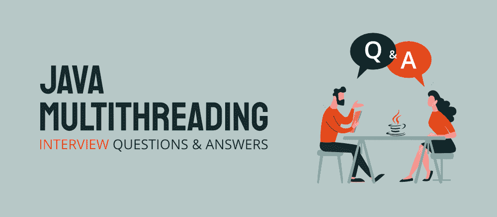
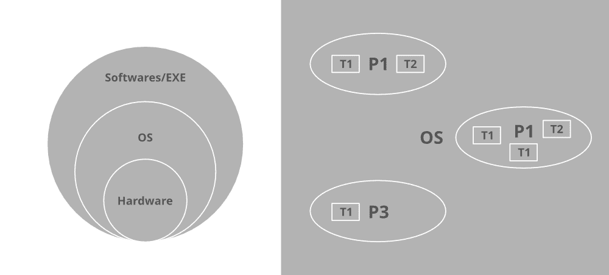
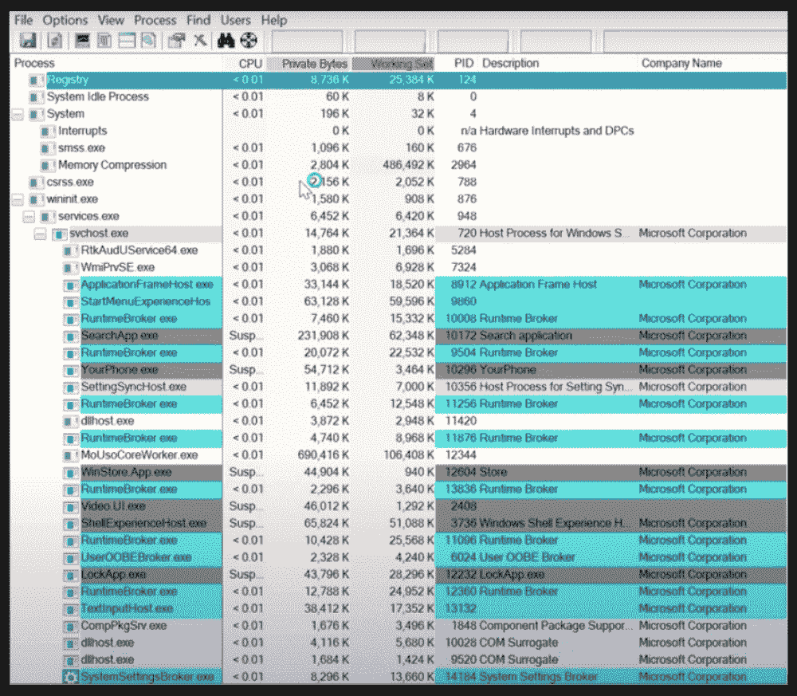
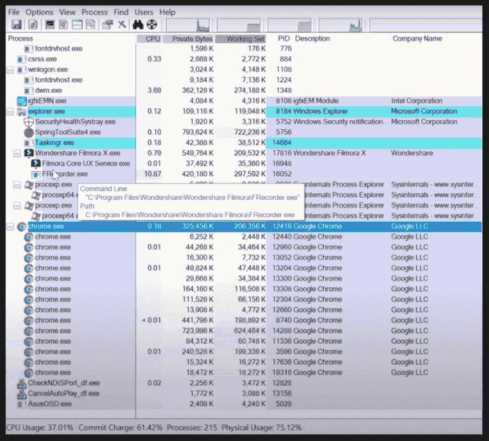
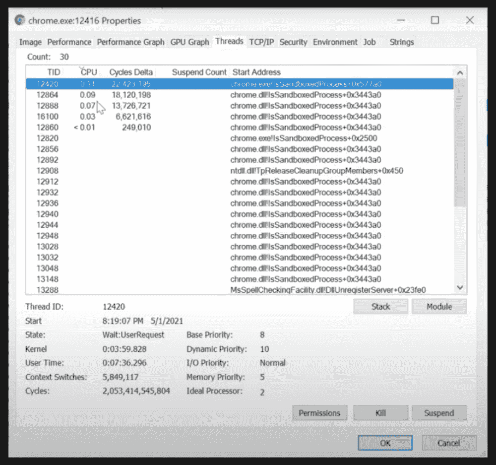
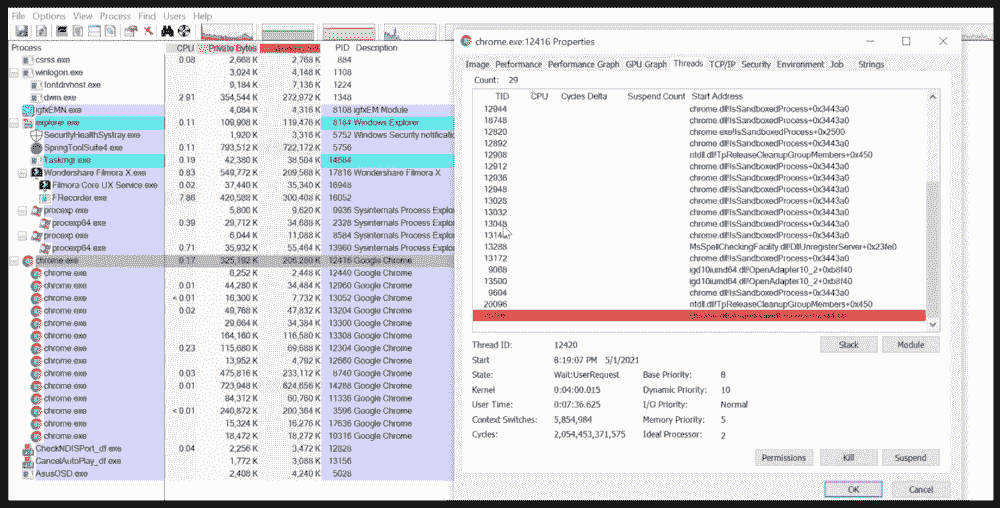
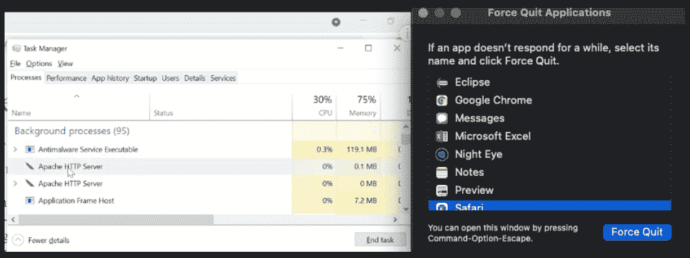
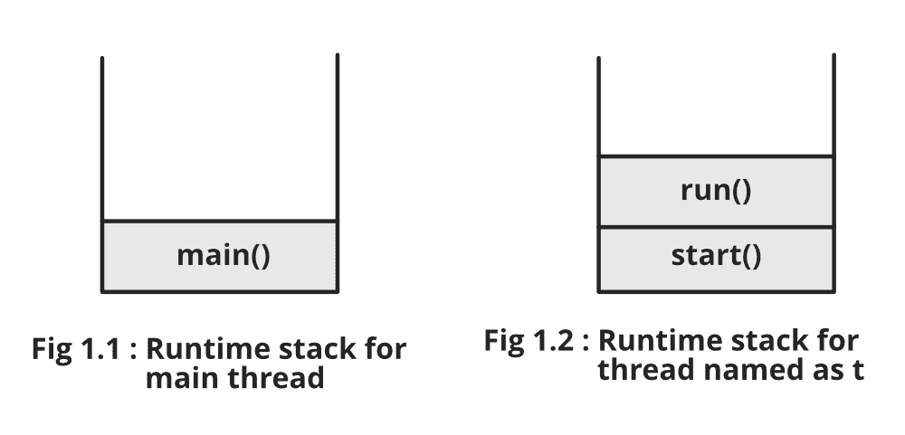

# 20 大 Java 多线程面试问题&回答

> 原文:[https://www . geesforgeks . org/top-20-Java-多线程-面试-问题-答案/](https://www.geeksforgeeks.org/top-20-java-multithreading-interview-questions-answers/)

Java 在 TIOBE 流行编程开发人员中被评为第一名，有超过 1000 万开发人员和超过 150 亿支持 Java 的设备在使用它。它被用于创建应用程序，将大数据等趋势技术应用到手机和 DTH 盒子等家用设备上，在当今的信息时代，它无处不在。



从采访的角度来看，核心 Java(J2SE)中的多线程是一个非常重要的话题。它可以带领你成为***【java 开发人员】【Java 测试工程师】【Java 架构师】【首席分析师】【Java 顾问】*** 最重要的是成为一名真正优秀的 Java 程序员，让你有信心潜心于代表 Java 进取版的 J2EE 编程，或者用外行语言让你适合直接在企业领域工作流。在印度，基于智力水平，Java 开发人员的额外津贴从 30 万到 2500 万不等。

因此，让我们从最常见的 Java 多线程面试问题及其详细答案开始。

**Q-1 什么是多任务处理？**

多任务操作系统是一种操作系统，它让您感觉到同时运行着两个或更多的任务/作业/进程。它通过在这些任务/作业/进程之间划分系统资源，并在任务/作业/进程反复执行时在它们之间切换来实现这一点。通常，中央处理器一次只处理一个任务，但切换速度如此之快，以至于看起来中央处理器一次执行多个进程。它们可以支持抢占式多任务处理，即操作系统为应用程序提供时间(几乎所有现代操作系统)，也可以支持协作式多任务处理，即操作系统等待程序返回控制权(Windows 3.x、Mac OS 9 和更早版本)，从而导致挂起和崩溃。也称为分时，多任务是多道程序设计的逻辑扩展。

多任务编程有两种类型，如下所示:

1.  基于流程的多任务处理
2.  基于线程的多任务处理



> **注意:**一次执行多个任务在 java 中被称为多线程，它有两种类型，即基于 Process 的多线程和基于 Thread 的多线程。

**Q-2 如何识别流程？**

任何处于工作状态的程序都被称为进程。这些进程确实有作为单个可调度单元的线程。

**Q-3 怎么看线程？**

为了查看线程状态，让我们将 windows 作为一个操作系统，它说明了我们将拥有 ProcessExplorer，您可以看到下面显示的 windows 操作系统的图形用户界面。

```java
This PC > OS > Users > GeeksforGeeks > Downloads > ProcessExplorer
```

**视窗操作系统中的进程浏览器**如下图所示



> **注:**上述介质中列出的所有进程都是如上所示的进程，其中许多进程同时相互并行运行，这说明了 Jwindows 操作系统中的多处理。

正如我们已经看到的，线程确实驻留在一个进程中，因此我们必须深入到一个特定的进程中去查看它们，以便向用户展示多线程是如何在后端的计算机中进行的。例如:让我们从上面由各种进程组成的媒体中选择一个随机进程，称之为“chrome”。现在我们需要右键单击流程，然后单击属性菜单。



从上面的媒体中，可以清楚地看到 **chrome** 是一个进程，在继续执行步骤以弄清楚运行在 chrome 进程内部的线程之后，我们转到进程属性“chrome”下面，将生成图形输出来表示运行在 chrome 进程中的线程。



> **注意:**如果我们从上往下看滚动方式，那么它会看到一些颜色与其中的一些线程相对应。这里，绿色线程被关联为新创建的线程，而红色关联线程代表关闭的线程。



> **注意:**所以对于 chrome 来说，通过减少响应时间来提高性能，这被称为基于线程的多任务处理。

**Q-4 什么是多线程，它与多任务有何不同？**

多线程是多任务处理的一种特殊形式。**基于进程的多任务**是指同时执行几个任务，其中每个任务都是一个独立的进程，是基于进程的多任务。

示例:同时运行 Java IDE 和运行 TextEdit。基于流程的多任务处理由下图表示，如下所示:



**基于线程的多任务**是指同时执行几个任务，其中每个任务都是同一个程序的独立部分，称为线程。例如， **JUnits** 使用线程并行运行测试用例。此后，基于进程的多任务处理是一个更大的场景处理过程，其中线程处理细节。它已经用视觉辅助进行了更深入的讨论。

***详见***[Java 中基于进程和基于线程的多任务](https://www.geeksforgeeks.org/process-based-and-thread-based-multitasking/)

**Q-5 哪种多任务处理更好，为什么？**

基于线程的多任务处理更好，因为与进程多任务处理相比，线程的多任务处理需要更少的开销，因为进程是重量级的，进而需要它们自己在内存中的独立地址空间，而线程是非常轻的进程，并且共享与重量级进程协作共享的相同地址空间。

切换是第二个原因，因为进程间通信既昂贵又有限。从一个进程到另一个进程的上下文切换成本很高，而线程间通信成本很低，从一个线程到另一个线程的上下文切换成本更低。

> **注意:**然而 java 程序利用了基于进程的多任务环境，但是在多线程完成的同时，这个特性并不直接受 Java 的直接控制。

**Q-6 什么是线程？**

线程是进程中的轻量级进程。在 java 中，有两种创建线程的方式，即通过 Thread 类和通过 Runnable 接口。


欲知详情，请参考 Java 中的[线程类，Java](https://www.geeksforgeeks.org/java-lang-thread-class-java/) 中的 [Runnable 接口](https://www.geeksforgeeks.org/runnable-interface-in-java/)

**Q-7 一个线程有哪些不同的状态，或者说什么是线程生命周期？**

Java 中的线程在任何时间点都处于以下任何一种状态。线程在任何时刻都只处于所示状态之一:

1.  新的
2.  可追捕的
3.  堵塞的
4.  等待
5.  定时等待
6.  终止的


要了解更多信息，请参考 Java 中的[线程的生命周期和状态](https://www.geeksforgeeks.org/lifecycle-and-states-of-a-thread-in-java/)

**Q-8 主线任务是什么？**

所有的 Java 程序都至少有一个线程，称为**主**线程，当主线程调用 main()方法时，JVM 会在程序启动时创建该线程，如伪代码图中的输出所示。

插图:

```java
System.out.println(“Mayank Solanki”);
Output: Mayank Solanki
```

```java
System.out.println(Thread.getname().currentthread()); 
Output: main
```

**Q-9 Java 中有哪些不同类型的线程？**

java 中有以下两种类型的线程:

*   用户线程
*   守护线程

用户线程由 java 开发人员创建，例如 Main 线程。默认情况下，在 main()方法中创建的所有线程都是非守护线程，因为“main”线程是非守护线程。**守护线程**是一个低优先级线程，在后台运行，执行垃圾收集等任务。当所有用户线程完成执行时，它们不会阻止守护程序线程退出。当所有非守护线程完成它们的执行时，JVM 终止自己。JVM 不关心一个线程是否在运行，如果 JVM 发现一个正在运行的守护线程，它会终止这个线程，然后自己关闭。

**Q-10 如何创建用户线程？**

如前所述，当 JVM 启动时，它会创建一个主线程，在该主线程上运行程序，除非用户没有创建额外的线程。“Main”线程首先寻找“*公共静态 void main(String [] args)* ”方法来调用它，因为它充当程序的入口点。在 main 中创建的所有其他线程都充当“Main”线程的子线程。

用户线程可以通过以下两种方式实现:

1.  通过扩展[使用线程类。](https://www.geeksforgeeks.org/java-lang-thread-class-java/)
2.  通过实现使用[可运行接口](https://www.geeksforgeeks.org/runnable-interface-in-java/)。

**Q-11 如何设置线程的名称？**

我们可以通过使用一个已经在上面被称为 [***的方法来命名一个线程，用 setName()***](https://www.geeksforgeeks.org/naming-thread-fetching-name-current-thread-java/)**替换默认的命名方式，比如“线程-0”，“线程-1”，等等。**

```java
thread_class_object.setName("Name_thread_here");
```

****Q-12 什么是线程优先级？****

****线程中的优先级**是一个概念，其中每个线程都有一个优先级，用外行人的语言来说，这里可以说每个对象都有优先级，用 1 到 10 的数字来表示。**

*   **默认优先级按预期设置为 5。**
*   **最低优先级设置为 0。**
*   **最大优先级设置为 10。**

**这里定义了 3 个常数，即:**

1.  **公共静态 int NORM_PRIORITY**
2.  **公共静态 int MIN_PRIORITY**
3.  **公共静态 int MAX_PRIORITY**

**要了解更多信息，请参考 Java 多线程中的[线程优先级](https://www.geeksforgeeks.org/java-thread-priority-multithreading/)**

****Q-13 死锁在多线程中是如何发挥重要作用的？****

**如果我们确实在操作系统中引入了线程，那么我们可以发现操作系统中的进程调度算法在很大程度上是在与**甘特图**中引入线程的相同概念上深入工作的。下面列出了几个最受欢迎的例子，这些例子总结了所有的例子，并在软件开发中得到实际应用。**

****

*   **先进先出**
*   **后进先出**
*   **循环调度**

**现在想象一下操作系统 **和线程**中的**死锁的概念，如果你对它们有一个总体的了解，那么现在如何在内部计算切换。****

****

****Q-14 为什么输出不排序？****

**线程调度涉及两个边界调度，**

*   **应用程序开发人员通过轻量级进程(LWP)将用户级线程(ULT)调度到内核级线程(KLT)。**
*   **系统调度程序对内核级线程的调度，以执行不同的独特操作系统功能。**

****

**如果多个线程正在等待执行，那么线程执行由“线程调度器”决定，线程调度器是 JVM 的一部分，因此依赖于供应商，导致输出顺序的意外执行。**

> ****注:****
> 
> *   **在多线程中，在我们可以预测可能的输出但不能精确预测一个输出的情况下，对顺序的保证非常少。**
> *   **此外，请注意，当与多线程结合使用时，只需使用关键字“synchronized”，同步确实会影响我们想要的输出。**

**如下图所示:**

****

****Q-15 什么是 Java 中的守护线程，并说明它们的属性？****

**守护线程是一个低优先级线程，在后台运行，执行垃圾收集等任务。它确实具有如下所列的某些特性:**

*   **当所有用户线程完成执行时，它们不能阻止 JVM 退出。**
*   **当所有用户线程完成它们的执行时，JVM 终止自己**
*   **如果 JVM 发现一个正在运行的守护进程线程，它会终止该线程，然后自己关闭。JVM 不关心守护线程是否在运行。**
*   **这是一个极低优先级的线程**

> ****注意:**用户线程和守护线程的主要区别在于，JVM 在等待用户线程的同时，不等待守护线程退出。**

**要了解更多信息，请参考 Java 中的[守护线程](https://www.geeksforgeeks.org/daemon-thread-java/)**

****Q-16 如何让用户线程变成守护线程？****

**它是借助于名为***【setDaemon()】***和 ***的【线程类】中列出的两种方法进行的。***首先，setDaemon()方法将用户线程转换为守护线程，反之亦然。此方法只能在启动线程前使用 ***start()方法调用*** 否则在启动线程后调用 wit 将抛出**illegalthreadstatexception**之后，使用 isDaemon()方法，如果线程是守护进程，则返回布尔值 true 如果是非守护进程线程，则返回 false。**

****Q-17****start()方法的任务是什么？****

***start()方法*的主要任务是向线程调度器注册线程，这样就可以知道应该执行什么子线程，何时执行，以及如何调度它，这是由**线程调度器**处理的。次要任务是调用相应的 run()方法获取线程。**

****Q-18 start()和 run()方法有什么区别？****

**首先**、**两种方法一般都是在螺纹上操作。所以如果我们使用 threadT1.start()，那么这个方法将寻找 ***run()方法*** 来创建一个新的线程。而在这种情况下，方法将由“主”线程执行，而不创建任何新的线程。**

> ****注意:**如果我们用 run()方法替换 start()方法，那么整个程序由‘main’线程执行。**

****Q-19 我们可以重载 run()方法吗？如果我们不重写 run()方法呢？****

****

**是的，可以通过向 run()传递参数并检查 run()方法的注释@override 来重载 run()。**

**它应该像线程一样好，在线程中我们没有任何参数，所以重载的做法是对重载的 run()方法的调用进行注释。现在，我们需要确认输出是否相同，如果没有过载的话。**

**如果我们重载了 run()方法，那么我们将观察到输出总是主要的方法，这可以从上图的堆栈调用中感知到。这是因为如果我们调试下面链接中提供的代码，一旦再次调用 start()方法，就会调用 run()，因为我们没有重写 run()方法。**

**有关更多信息，请参考如何重载 run()方法的[实现部分](https://practice.geeksforgeeks.org/problems/can-we-overload-run-method-while-using-threads-in-java)**

> ****结论:**我们可以重载 run()方法，但是 start()方法将只调用无参数 run()。因此，这对我们没有任何帮助，被认为是不良做法。**

**编译器将简单地执行 Thread 类的 run()方法，检查 Thread 类的 run()方法必须有空的实现。因此，它导致没有对应于线程的输出。正如我们在上面已经讨论过的，如果我们尝试这样做，那么线程类 run()方法将被调用，我们将永远得不到我们想要的输出。**

> ****注意:** Geek 最初我们请求为我们创建一个线程，后来同样的线程没有为我们做任何我们已经创建的事情。因此，通过向代码片段写入不需要的操作，它对我们来说变得完全没有意义。因此，不重写 run()方法是没有用的。**

****Q-20 我们可以覆盖 start()方法吗？****

**即使我们覆盖了自定义类中的 start()方法，线程类也不会为我们进行初始化。run()方法也不会被调用，甚至不会创建新的线程。**

> ****注意:**我们不能再次重启同一个线程，因为我们将从 java.lang 包中获得[illegalthreadstatexception](https://www.geeksforgeeks.org/daemon-thread-java/)。此外，我们不能通过使用“super.start()”方法间接做到这一点。**