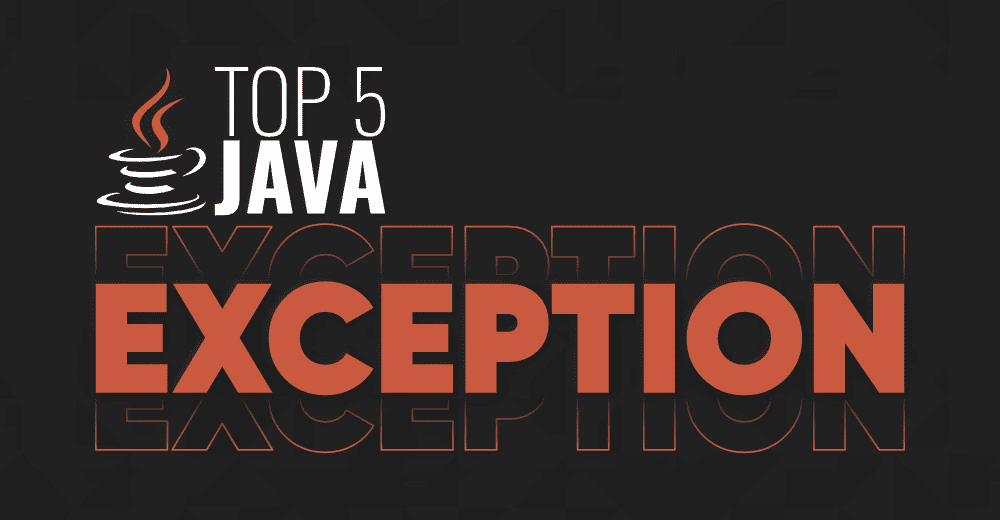
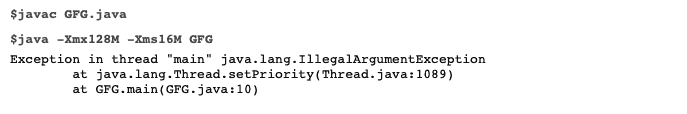
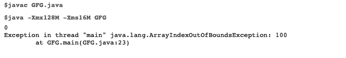
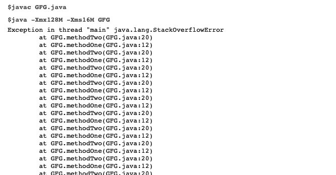
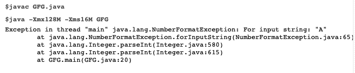
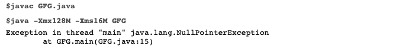

# Java 中的前 5 个异常示例

> 原文:[https://www . geeksforgeeks . org/top-5-带示例的 java 异常/](https://www.geeksforgeeks.org/top-5-exceptions-in-java-with-examples/)

运行时编译后干扰程序正常执行的意外事件称为异常。为了应对程序的这种突然执行，[异常处理](https://www.geeksforgeeks.org/java-gq/exception-handling-2-gq/)是程序的正常终止。



**说明:**考虑一个现实生活中的例子

> 假设运行时德里图书馆有图书需求，但由于某些运输问题，德里图书馆无法提供图书。然后德里图书馆建议从印多尔图书馆拿书继续我们剩下的工作。这种定义备选项的方式只不过是异常处理。

***例外划分如下:***

1.  [已检查异常](https://www.geeksforgeeks.org/checked-vs-unchecked-exceptions-in-java/):这些是程序执行时编译器可以检测到的异常，并显示警告信息。

2.  [未检查的异常](https://www.geeksforgeeks.org/checked-vs-unchecked-exceptions-in-java/):这些是编译器检查遗漏的异常，会产生突然流。不会显示警告消息，因为编译器不会检测到这些异常。

现在，上面两种类型的异常分类如下:

1.  **泛型编程异常:**泛型编程异常是指程序员(或)应用编程接口开发人员明确提出的异常，称为编程异常。示例包括*IllegalArgumentException(IAE)*
2.  **JVM 异常:**异常是指每当特定事件发生时，由 [JVM (Java 虚拟机)](https://www.geeksforgeeks.org/jvm-works-jvm-architecture/)自动引发的异常。例如*arrayindexoofboundxception*和 *NullPointException(NPE)。*

最常发生的 5 个例外如下:

1.  [非法引数异常](https://www.geeksforgeeks.org/built-exceptions-java-examples/)
2.  [ArrayOutOfBoundException](https://www.geeksforgeeks.org/understanding-array-indexoutofbounds-exception-in-java/)
3.  [StackOverflowException](https://www.geeksforgeeks.org/stackoverflowerror-in-java-with-examples/)
4.  NumberFormatException
5.  [空指针异常](https://www.geeksforgeeks.org/null-pointer-exception-in-java/)

**1 .illegal arguments exception(iae)**

抛出表示数组被非法索引访问。索引为负，或者大于或等于数组的大小。

**示例:**

## Java 语言(一种计算机语言，尤用于创建网站)

```
// IllegalArgumentException in Java

// Class
public class GFG {

    // Main driver method
    public static void main(String[] args)
    {

        // Creating a new thread
        Thread t = new Thread();

        // valid in thread
        t.setPriority(10);

        // invalid(IllegalArgumentException(IAE))
        t.setPriority(100);
    }
}
```

**输出:**



**2 .array index outofboundsexception**

ArrayIndexOutOfBoundsException 是一个只在运行时抛出的运行时异常。Java 编译器在编译程序时不会检查这个错误。

**示例:**

## Java 语言(一种计算机语言，尤用于创建网站)

```
// ArrayIndexOutOfBoundsException in Java

// Importing all classes of
// java.util package
import java.util.*;

public class GFG {

    // Main driver method
    public static void main(String[] args)
    {
        // Size of array is 10
        // Indexes ranging [00 - 09]
        int[] a = new int[10];

        // Case 1: Custom index within array size
        // Valid
        System.out.println(a[0]);

        // Case 2: Index greater than the size of the array
        // Invalid
        // ArrayIndexOutOfBoundsException
        System.out.println(a[100]);

        // ArrayIndexOutOfBoundsException
        System.out.println(a[-100]);
    }
}
```

**输出:**



**3.StackOverFlowError**

StackOverflowError 是 Java 不允许捕捉的错误，例如，堆栈空间不足，因为这是最常见的运行时错误之一。StackOverflowError 的主要原因是我们没有为我们的[递归函数](https://www.geeksforgeeks.org/recursive-functions/)或模板提供合适的终止条件，这意味着它将变成一个[无限循环](https://www.geeksforgeeks.org/infinite-loop-puzzles-java/)。

**示例:**

## Java 语言(一种计算机语言，尤用于创建网站)

```
// StackOverflowException in Java

// Importing all classes of 
// java.util package
import java.util.*;

// Class
public class GFG {

    // Method1()
    public static void methodOne()

    {
        // Defining Method2() in Method1()
        methodTwo();
    }

    // Method2()
    public static void methodTwo()

    {
        // Calling method1 in methos2()
        methodOne();
    }

    // Main driver method
    public static void main(String[] args)
    {

        // Calling method1() in main()
        methodOne();
    }
}
```

**输出:**



**4 .NumberFormatException:**

当强制字符串转换为数值但不支持输入字符串的格式时，将引发此异常。例如，将一个字符串解析为一个整数，其中在引发未检查异常的字符串中分配了空值。

**示例:**

## Java 语言(一种计算机语言，尤用于创建网站)

```
// NumberFormatException in Java

// Importing input output java classes
import java.io.*;

// Class
public class GFG {

    // Main driver method
    public static void main(String[] args)
    {

        // ParseInt() takes integer value as parameter
        // other values

        // valid
        int i = Integer.parseInt("50");

        // invalid
        // forInputString(A)
        // NumberFormatException will be thrown
        int j = Integer.parseInt("A");

        // invalid
        // forInputString(five)
        // NumberFormatException will be thrown
        int k = Integer.parseInt("five");
    }
}
```

**输出:**



**5。空指针异常**

Null 是 Java 中使用的特殊值。主要用于表示没有给引用变量赋值。这是一个运行时异常，其中可以为对象引用分配一个特殊的空值。当程序试图使用具有空值的对象引用时，会引发 NullPointerException。

**示例:**

## Java 语言(一种计算机语言，尤用于创建网站)

```
// NullPointerException in Java

// Importing all classes of
// java.util package
import java.util.*;

// Class
public class GFG {

    // Main driver method
    public static void main(String[] args)
    {
        // Assigning null to string
        String str = null;

        // Calculating length of string

        // Forcefully printing length which throws
        // NullPointerException
        System.out.println(str.length());
    }
}
```

**输出:**



> **注:**:还有两个例外确实经常发生
> 
> 1.  [noclassedeffind](https://www.geeksforgeeks.org/classnotfoundexception-vs-noclassdeffounderror-java/)对应类的定义缺失
> 2.  [ClassCastException](https://www.geeksforgeeks.org/built-exceptions-java-examples/) 是一个运行时异常，其中一个类被不正确地从一种类型转换为另一种类型。