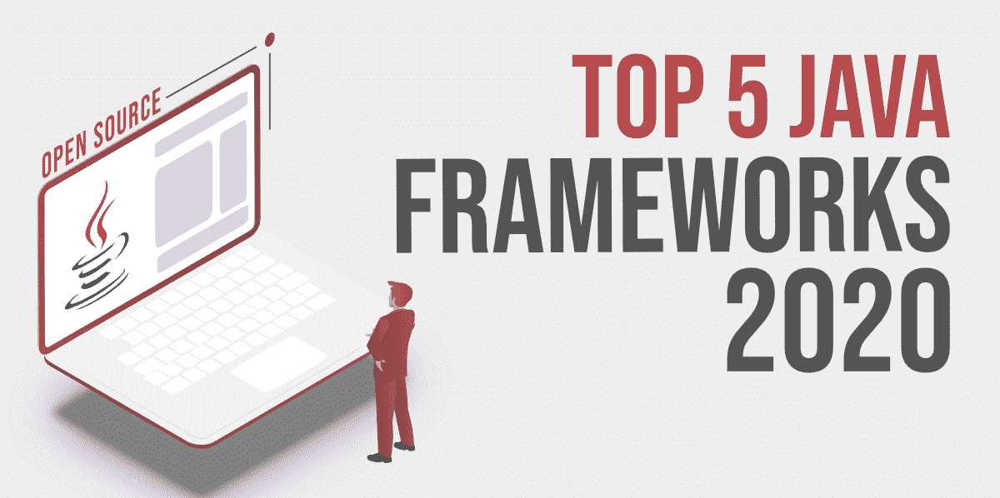

# 2020 年 5 大开源 Java 框架

> 原文:[https://www . geesforgeks . org/top-5-开源-Java-framework-in-2020/](https://www.geeksforgeeks.org/top-5-open-source-java-frameworks-in-2020/)

25 年了，仍然统治着软件行业，多年来 Java 凭借众多的应用，包括后端开发项目、大数据和[机器学习](https://www.geeksforgeeks.org/machine-learning/)项目，显然还有 Web 和 Android 开发，位列全球最受欢迎的编程语言前三名。现在，如果您是一名开发人员，正在寻找工具来帮助您更容易、更快、更好地开发软件解决方案，那么不要担心，Java 总是为您提供大量框架，这些框架可以为您提供任何领域的最佳解决方案，如网络开发、应用程序开发、云计算、机器学习、大数据、信息技术等。

框架的基本原则是“打破轮子”，通过帮助开发人员专注于业务逻辑，而不是担心代码的公共部分，让他们的生活变得更轻松。框架附带了一组预先编写的代码，您可以将这些代码附加到自己的代码中，通过调用其方法、继承、侦听器或模式的其他实现来创建自定义的问题解决方案。现在，如果你想用 Java 构建你的下一个项目，那么你应该使用一个合适的 [Java](https://www.geeksforgeeks.org/java/) web 框架。但是你对选择正确的一个感到困惑吗？那么本文将为您提供一个最流行的用于 web 开发的 Java web 框架列表，从而消除您所有的疑虑。

### [**1。**春天](https://spring.io/)

它是 Java 框架的真正领导者，使 Java 使用起来更快、更容易、更安全。Spring 因其速度、简单性和生产力而非常受欢迎，这有助于 Java 开发人员轻松创建企业级 web 和移动应用程序。Spring 使 Java 变得现代、被动和云就绪，这使它成为世界上最受欢迎的 Java 框架。Spring MVC 和 Spring Boot 在开发人员中非常流行，用于构建高性能的复杂 web 应用程序。如果你是一名 Java 开发人员，那么你应该了解 Spring。许多科技巨头都在使用 Spring，包括阿里巴巴、亚马逊、谷歌、微软等等。

*   使用 spring 灵活而全面的扩展集和第三方库构建几乎任何可以想象的应用程序，
*   使用联合 Spring Boot 和 Spring Cloud 丰富的支持库、服务器、模式和模板，以创纪录的时间将整个基于微服务的架构安全部署到云中。
*   在几秒钟内启动一个新的 Spring 项目，Spring 非常关心性能，默认情况下快速启动、快速关闭和优化执行。
*   它有快速负责地处理安全问题的记录。持续测试和报告漏洞，并密切监控第三方依赖关系。提供定期更新，尽可能保证您的数据和应用程序的安全。
*   它有一个庞大的、全球性的、多样化的社区，可以随时通过资源快速入门、指南、视频、会议、支持，甚至正式的培训和认证来帮助您更上一层楼。

### **2。GWT**

谷歌网络工具包(GWT)是一个由谷歌开发的开源 Java 框架，被世界各地成千上万的开发人员用于构建和优化复杂的基于浏览器的应用程序。该框架用于高性能 web 应用程序的生产性开发和客户端开发，如 JavaScript，因为它将 Java 代码转换为 Javascript 代码，这是 GWT 的一个非常有用的特性。像 AdSense、Google Wallet 和 AdWords 等流行的谷歌产品都是使用这个框架编写和广泛使用的。

*   GWT 包含用于创建优化 web 应用程序的强大工具。
*   将 Java 源代码编译成优化的独立 JavaScript 文件，这些文件可以在所有主要浏览器上运行，包括安卓和 iPhone 手机浏览器。
*   易于制作漂亮的 ui，对前端脚本语言知之甚少，专注于业务逻辑，提高生产力。
*   与 Eclipse IDE、Maven 和 Junit 兼容。
*   广泛的小部件库允许您用 Java 编写 AJAX 应用程序。
*   在您最喜欢的 IDE 中轻松调试 AJAX 应用程序。

### [**3。**冬眠](http://hibernate.org/)

它是一个稳定的、开源的对象关系映射(ORM) Java 框架，可以非常容易地与任何数据库进行通信，并且在处理多个数据库时非常方便。这是一个轻量级的 java ORM，用于克服 JDBC 的几个限制，如果您总是使用关系数据库，这将非常有帮助。使用 APIs 和查询语言使用 Hibernate 非常简单和有趣。它还有几个有用的工具，如映射编辑器、向导和逆向工程，这使得使用 Hibernate 更加愉快。许多大公司在其技术堆栈中使用 Hibernate，包括 Platform、DAILY HOTEL、IBM 和戴尔。

*   它非常轻，易于扩展、修改和配置。
*   数据丢失风险低，能够以更少的编码处理复杂而强大的数据。
*   非常适合同时需要高生产力和可移植性的 OOP 类型项目。
*   专门为关系数据库管理系统开发，但最新版本也支持 NoSQL 数据库。
*   令人敬畏的命令行工具和集成开发环境插件，让您的体验更加轻松愉快。

### [4。支柱](https://struts.apache.org/)

Apache Struts 是一个自由、开源的 MVC 框架，用于创建优雅而现代的企业级 Java web 应用程序。它更倾向于约定而不是配置，并通过成功地组织 Java、JSP 和 Action 类来帮助减少总体开发时间。该框架附带了支持 REST、AJAX 和 JSON 的插件，并且可以很容易地与其他 Java 框架集成，如用于依赖注入的 Spring 插件和用于对象关系映射的 Hibernate 插件。

*   灵活易用，基于 MVC 设计模式。
*   通过插件与其他 Java 技术集成，与 REST、JSON 和 AJAX 配合良好。
*   支持创造性的主题和模板，并使用 struts 更快地完成开发任务。
*   带来您已经在使用的东西，并将功能扩展到那些已经在 Struts 中的东西。
*   大大减少了开发工作和所需时间，使您能够快速制作更多的应用程序。

### [5。JavaServer face(JSF)](https://javaee.github.io/javaserverfaces-spec/)

JavaServer Faces 是由 Oracle 技术开发和维护的基于 Java 的 web 应用程序框架，它简化了为 JavaServer 应用程序构建用户界面。它主要用于通过在页面中组装可重用的用户界面组件来开发基于服务器的网络应用程序。JSF 与 Struts 非常相似，是由 Oracle 作为 Java 企业版 7 的一部分开发的。它是一个基于组件的 MVC 框架，用于简化基于 web 的用户界面的开发集成。JSF 背后的主要思想是封装各种客户端技术，并更多地关注表示层，以允许开发人员创建用户界面，只需拖放，而无需深入了解这些技术。

*   丰富的库和可重用的用户界面组件，
*   后端开发人员有大量的前端工具可以使用，而不需要太多的编码，
*   Jsf 有助于提高生产率和一致性，
*   通过为验证和方法调用添加 Ajax 事件来丰富用户体验。
*   它提供了一个表示和管理用户界面组件的应用编程接口，JSF 没有使用 Java，而是使用 XML 进行视图处理。
*   清晰的架构区分了应用程序逻辑和表示。

Java 框架就像开发人员最好的朋友，让他们的任务变得简单而快速。现在看完这篇文章，你可以根据你的项目需求选择最合适的。在这里，我试图列出最有前途和最有用的框架，但市场上也有一些出色的 Java 框架，其中一些值得一提的是 [Grails、](https://grails.org/) [Play](https://www.playframework.com/) 、 [Vaadin、](https://vaadin.com/) [Spark](http://sparkjava.com/) 和 [Blade。](https://github.com/lets-blade)