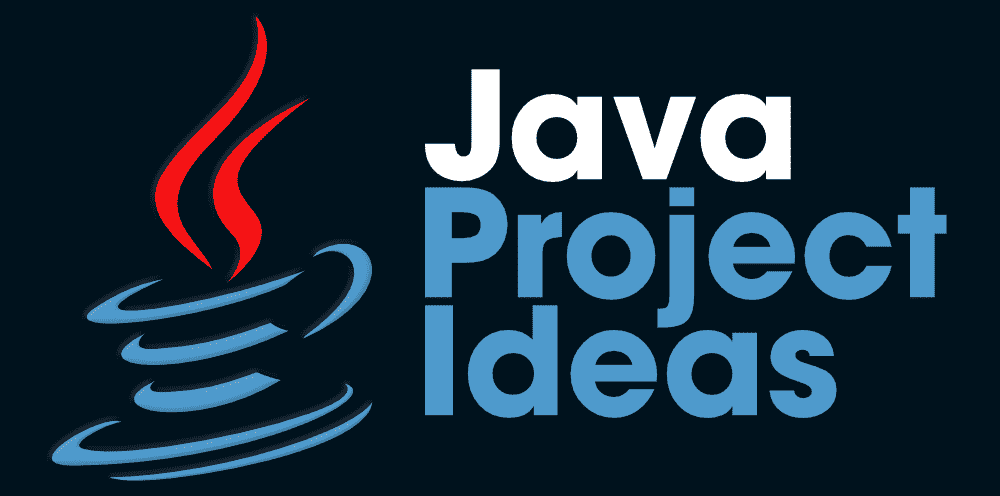

# 提升编程技能的 7 大 Java 项目创意

> 原文:[https://www . geesforgeks . org/top-7-Java-project-ideas-to-enhanced-programming-skills/](https://www.geeksforgeeks.org/top-7-java-project-ideas-to-enhance-programming-skills/)

*你知道吗，尽管经历了无数的讲座、笔记、培训等。，并且涵盖了所有必需的概念，大多数程序员仍然没有用他们的编程技能获得足够的信心和专业知识？*

***想知道背后的主要原因是……？？**T3】*

好吧，这是由于缺乏项目建设，也就是说，你需要有一些实际项目的实践经验，帮助你将你所有的理论学习和知识应用到实际世界中。甚至可以说，项目构建是获得最大实际接触[**【JAVA】**](https://www.geeksforgeeks.org/java/)或任何其他编程语言的唯一途径。此外，从你的职业角度来看，从事现实项目也是必要的，因为几乎每个雇主都更强调你的项目组合，以评估你的编程技能。

如果我们特别讨论 JAVA，那么在构建项目时，该语言还有很多需要探索的地方。面向对象语言遵循 WORA(写一次运行在任何地方)的概念，即编译后的 JAVA 代码可以在与该语言兼容的任何平台上运行，而无需重新编译。这种语言广泛应用于各种项目开发，如*网络应用程序、安卓应用程序、桌面应用程序、科学应用程序、软件工具、游戏、*和其他各种应用程序。**优步****Pinterest****Airbnb**等各种知名机构。在各自的平台上使用 JAVA。这种语言的巨大流行背后有几个突出的原因，例如*平台独立性、面向对象、安全的&可移植性、robus* t 等等。

当涉及到用 JAVA 开发真实世界的项目时，建议您选择 Eclipse 或 NetBeans 作为您的 JAVA IDE，因为它们的功能易于使用。尽管如此，您也可以使用其他几个 ide，如 Blue J、JDeveloper 等。根据你的要求和方便。现在，在不浪费太多时间的情况下，让我们来看看 ***7 个可以帮助你提升编程技能的最佳 JAVA 项目创意*** :

### 1.JAVA 中的蛇游戏

作为初学者，强烈建议您从这款经典的 Snake 游戏开始您的项目构建之旅，因为它将帮助您在整个项目中保持兴趣和好奇心。[蛇游戏](https://www.geeksforgeeks.org/design-snake-game/)可以用不同的方式&用不同的规则来创建——但是，你可以选择构建不太复杂的游戏。这个游戏的主题是用代币(食物)喂蛇，这样它就不会被触碰到边界。玩家每次被蛇吃掉代币都会获得积分，游戏结束后会显示最终分数。您可以使用 OOPs 概念、Swing 等在 JAVA 中高效地开发 Snake 游戏。

### 2.JAVA 中的计费系统

计费系统也是提升你的 JAVA 编程技能的首选项目之一。该计费系统项目的主要目标是自动计算账单，即无需任何人工计算。您可以选择用一个简单的界面开始构建这个项目，该界面要求用户输入项目名称、单位价格和数量。根据这些详细信息，系统将生成一个账单，列出需要支付的总金额。用 JAVA 开发一个计费系统项目的最好的部分是，你可以根据你的技能和需求将项目的级别从初级切换到高级。比如你可以**开发更高级的项目**，像[披萨店计费系统](https://www.geeksforgeeks.org/pizza-shop-billing-system-using-java-swing/)，电费计费系统等等。

### 3.JAVA 中的学校管理系统

名单上的下一个项目是学校/学院管理系统。该项目涉及与学生、教师和其他工作人员相关的机构所有数据和记录的管理。在这个项目中，您将需要对数据库概念以及 JAVA 编程技能有一个很好的了解。通过集成其他功能，如考勤管理、公交跟踪等，该项目可以扩展到更高级的水平。您可以为管理员、教师、学生和其他工作人员等主要 4 种类型的用户创建项目界面，以便每个人都可以使用有效的用户名/密码登录系统，可以查看他们的详细信息，并可以执行各自的操作。

### 4.JAVA 中的在线学习门户

你也可以选择用 JAVA 建立一个在线学习门户来磨练你的编程技能。这个项目的主题是为用户创建一个平台，他们可以在这里注册自己，并可以从各种选项中选择相关课程进行学习。该项目的界面将包括一个登录屏幕，用户需要在注册课程之前在该屏幕上注册。此外，应该有一个管理面板，以及监测所有的活动，并满足用户的要求。此外，在线课程或其他学习材料将优先添加到门户网站，以便用户在成功注册后可以轻松访问资源。

### 5.JAVA 中的交通控制系统

交通控制系统项目推荐给初级和中级 JAVA 程序员。这个项目是关于交通控制管理自动系统的开发。在这个项目中将有几个模块来执行各种操作，例如交通灯操作的管理、交通路线管理、特定区域的交通警察管理等。此外，您可以使用 JSPs 和 MySQL 在 JAVA 中构建交通控制器系统项目，并对其他概念(如 OOPs、Servlets 等)有充分的了解。您还可以通过添加一些更复杂的功能并使用 Spring、Hibernate 等将项目扩展到高级级别。

### 6.数据可视化软件

尽管如此，如果你是 JAVA 编程或项目构建的初学者，建议你先接触上述项目，然后再转向这些项目。此外，由于数据可视化涉及图形或图片格式的数据的可视化表示，数据可视化软件倾向于使用户理解以图表或图形格式而不是报告页面表示的信息变得高效和方便。数据可视化软件项目将以数据可视化的形式显示网络中的节点连通性。这个项目的主要目标应该是使用图形和图像的方式进行有效的信息交流，功能性和美观性都很好，将重要的见解有效地传达给复杂的数据集和信息等。

### 7.JAVA 中的社交网络平台

与前一个项目一样，社交网络平台项目也更推荐给中级和高级 JAVA 程序员。你可以更喜欢用 JAVA 构建一个社交网络平台，它有所有的基本功能，比如聊天框、呼叫功能、帖子图片、喜欢/评论和分享帖子、好友请求模块等。您也可以选择在项目中添加任何其他独特的特性或功能。同时，您可以使用 JAVA 提供的各种 API 来使事情变得更容易和方便。然而，在构建社交网络平台项目时，您需要彻底了解其他几个主题，如计算机网络、数据库和其他各种主题，并熟练掌握 JAVA 语言。

因此，这是几个最推荐的 JAVA 项目，您可以根据自己的技能和方便程度选择开发。这些项目不仅会提高你的编程技能，还会通过提供实践机会让你为科技行业做好准备。现在，你还在等什么？继续做上面提到的项目，建立你强大的 JAVA 档案！！