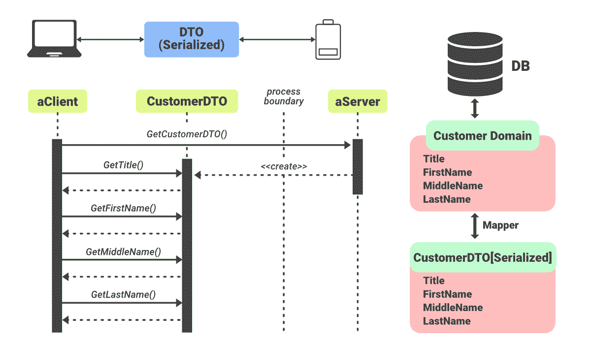

# Java 中的转移对象模式

> 原文:[https://www . geesforgeks . org/transfer-object-pattern-in-Java/](https://www.geeksforgeeks.org/transfer-object-pattern-in-java/)

当我们想要在一个镜头内将具有多个属性的数据从客户端传递到服务器时，就会用到它。Transfer Object 是一个简单的 [POJO](https://www.geeksforgeeks.org/pojo-vs-java-beans/) 类，具有 getter/setter 方法，并被序列化，以便可以通过网络进行传输。服务器端业务类通常从数据库中获取数据，填充 POJO，并将其发送给客户端或通过值传递。对于客户端，传输对象是只读的。客户端可以创建自己的传输对象，并将其传递给服务器，一次性更新数据库中的值。

以下是这种设计模式的实体:

<figure class="table">

| [transfer object] | Simple POJO only has methods to set/get attributes. |
| business object | Fill the transfer object with data. |
| client | Or request to send the transfer object to the business object. |

</figure>



**进场:**

*   **步骤 1:** 创建转移对象
*   **步骤 2:** 创建业务对象。
*   **步骤 3:** 使用 StudentBO 演示转移对象设计模式
*   **步骤 4:** 验证输出。

### 程序:

**步骤 1:** 创建转移对象

**例**

## Java 语言(一种计算机语言，尤用于创建网站)

```
// Transfer Object Pattern - Design Pattern

// Step 1
// Creating a Transfer Object
// randomly be named it 'StudentVO.java'

// Class StudentVO
public class StudentVO {

  // Member variables of class
   private String name;
   private int rollNo;

  // Creating a constructor of above class
  StudentVO(String name, int rollNo) {

    // This keyword for assignment
    // to same memory block created
    // for every name and roll number of student
    this.name = name;
      this.rollNo = rollNo;
   }

  // Getting name of student
   public String getName() {
      return name;
   }

  // Setting name of Student
   public void setName(String name) {
      this.name = name;
   }

  // Getting roll number of student
   public int getRollNo() {
      return rollNo;
   }

  // Setting roll number of student
   public void setRollNo(int rollNo) {
      this.rollNo = rollNo;
   }
}
```

**步骤 2:** 创建业务对象

**例**

## Java 语言(一种计算机语言，尤用于创建网站)

```
// Transfer Object Pattern - Design Pattern

// Step 2
// Creating a Busines object
// randomly be named it 'StudentBO.java'

// Importing List and ArrayList classes of
// java.util package
import java.util.ArrayList;
import java.util.List;

// Class StudentBO
public class StudentBO {

   // List is working as a database
   List<StudentVO> students;
   public StudentBO() {

      students = new ArrayList<StudentVO>();

     // Adding custom inputs
      StudentVO student1 = new StudentVO("Robert",0);
      StudentVO student2 = new StudentVO("John",1);
      students.add(student1);
      students.add(student2);       
   }

   public void deleteStudent(StudentVO student) {
      students.remove(student.getRollNo());
      System.out.println("Student: Roll No " + student.getRollNo() + ", deleted from database");
   }

   //retrieve list of students from the database
   public List<StudentVO> getAllStudents() {
      return students;
   }

   public StudentVO getStudent(int rollNo) {
      return students.get(rollNo);
   }

   public void updateStudent(StudentVO student) {
      students.get(student.getRollNo()).setName(student.getName());
      System.out.println("Student: Roll No " + student.getRollNo() +", updated in the database");
   }
}
```

**步骤 3:** 使用 StudentBO 演示转移对象设计模式

**实现:**列表在这里充当数据库，如演示转移对象设计模式所示。

**例**

## Java 语言(一种计算机语言，尤用于创建网站)

```
// Transfer Object Pattern - Design Pattern
// Step 3

// Use the StudentBO to demonstrate Transfer Object Design Pattern
// randomly be named it 'TransferObjectPatternDemo.java'

public class TransferObjectPatternDemo {

  // Main driver method
   public static void main(String[] args) {

      StudentBO studentBusinessObject = new StudentBO();

     // Print all students
      for (StudentVO student : studentBusinessObject.getAllStudents()) {
         System.out.println("Student: [RollNo : " + student.getRollNo() + ", Name : " + student.getName() + " ]");
      }

      // Update student
      StudentVO student = studentBusinessObject.getAllStudents().get(0);

     // Custom input 
     student.setName("Michael");
      studentBusinessObject.updateStudent(student);

     // Getting the student
      student = studentBusinessObject.getStudent(0);
      System.out.println("Student: [RollNo : " + student.getRollNo() + ", Name : " + student.getName() + " ]");
   }
}
```

**步骤 4:** 验证输出

```
Student : [RollNo : 0, Name : Robert ]
Student : [RollNo : 1, Name : John ]
Student : Roll No 0, updated in the database
Student : [RollNo : 0, Name : Michael ]
```