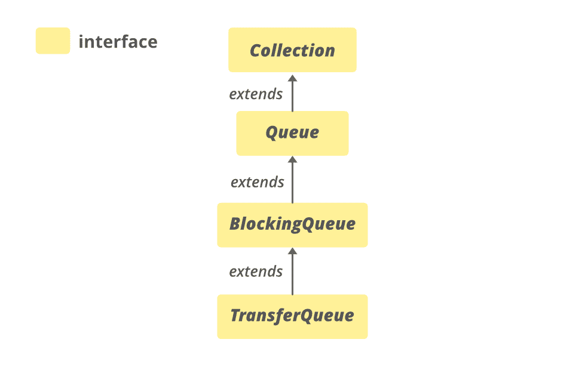

# Java 中的 TransferQueue 接口

> 原文:[https://www . geesforgeks . org/transfer queue-interface-in-Java/](https://www.geeksforgeeks.org/transferqueue-interface-in-java/)

**传输队列**接口是 [Java 集合框架](https://www.geeksforgeeks.org/collections-in-java-2/)的成员。在 JDK 1.7 推出，属于 **java.util.concurrent** 包。传输队列是一个阻塞队列，其中发送线程(生产者)可以等待接收线程(消费者)接收元素。TransferQueue 用在消息传递应用程序中。消息将从生产者线程传递到消费者线程有两个方面。

*   **put(E e)** :如果生产者想在不等待消费者的情况下将元素入队，则使用该方法。但是，如果队列已满，它会一直等到空间可用。
*   **transfer(E e)** :这个方法一般是把一个元素传递给一个正在等待接收的线程，如果没有线程在等待，那么就会等到一个线程进入等待状态，等待的线程一到元素就会传入其中。

也可以通过 **hasWaitingConsumer()** 查询 TransferQueue 是否有线程在等待项，这与 peek 操作相反。

**申报**

```
public interface TransferQueue<E> extends BlockingQueue<E>

```

这里， **E** 是集合中存储的元素类型。

**传输队列的层次结构**



它扩展了[blocking Queue<E>T1、**Collection<E>T3、**Iterable<E>T5、****](https://www.geeksforgeeks.org/blockingqueue-interface-in-java/)****[Queue<E>T7】接口。](https://www.geeksforgeeks.org/queue-interface-java/)****

**示例:**

## Java 语言(一种计算机语言，尤用于创建网站)

```
// Java Program Demonstrate TransferQueue

import java.util.concurrent.*;
import java.util.*;

public class TransferQueueDemo {
    public static void main(String[] args)
        throws InterruptedException
    {
        // create object of TransferQueue
        // using LinkedTransferQueue() constructor
        TransferQueue<Integer> TQ
            = new LinkedTransferQueue<Integer>();

        // Add numbers to end of queue
        TQ.add(7855642);
        TQ.add(35658786);
        TQ.add(5278367);
        TQ.add(74381793);

        // print Queue
        System.out.println("Queue1: " + TQ);

        // create object of TransferQueue
        // using LinkedTransferQueue(Collection c)
        // constructor
        TransferQueue<Integer> TQ2
            = new LinkedTransferQueue<Integer>(TQ);

        // print Queue
        System.out.println("Queue2: " + TQ2);
    }
}
```

**Output**

```
Queue1: [7855642, 35658786, 5278367, 74381793]
Queue2: [7855642, 35658786, 5278367, 74381793]
```

**实现类**

传输队列有一个实现类[链接传输队列](https://www.geeksforgeeks.org/linkedtransferqueue-in-java-with-examples/)。**链接传输队列**是基于链接节点的传输队列接口的无界实现。LinkedTransferQueue 中的元素按 FIFO 顺序排列，头部指向在队列中时间最长的元素，尾部指向在队列中时间最短的元素。

由于其异步特性，size()遍历整个集合，因此它不是 O(1)时间操作。如果这个集合在遍历过程中被修改，它也可能给出不准确的大小。像添加全部、删除全部、保留全部、包含全部、等于和到数组这样的批量操作不能保证自动执行。例如，与 addAll 操作同时操作的迭代器可能只观察到一些添加的元素。

**语法:**

```
TransferQueue<E> objectName = new LinkedTransferQueue<E>();

```

### 基本操作

**1。添加元素**

LinkedTransferQueue 提供了各种方法的实现来添加或插入元素。分别是**加(E e)** 、**放(E e)** 、**献(E e)** 、**转(E e)** 。当 transfer()等待一个或多个接收线程时，add、put 和 offer 方法不关心其他线程是否访问队列。

## Java 语言(一种计算机语言，尤用于创建网站)

```
// Java Program Demonstrate adding
// elements to TransferQueue

import java.util.concurrent.*;

class AddingElementsExample {
    public static void main(String[] args) throws Exception
    { 

        // Initializing the queue
        TransferQueue<Integer> queue
            = new LinkedTransferQueue<Integer>();

        // Adding elements to this queue
        for (int i = 10; i <= 14; i++)
            queue.add(i);

        // Add the element using offer() method
        System.out.println("adding 15 "
            + queue.offer(15, 5, TimeUnit.SECONDS));

        // Adding elements to this queue
        for (int i = 16; i <= 20; i++)
            queue.put(i);

        // Printing the elements of the queue
        System.out.println(
            "The elements in the queue are:");
        for (Integer i : queue)
            System.out.print(i + " ");

        System.out.println();

        // create another queue to demonstrate transfer
        // method
        TransferQueue<String> g
            = new LinkedTransferQueue<String>();

        new Thread(new Runnable() {
            public void run()
            {
                try {
                    System.out.println("Transferring"
                                       + " an element");

                    // Transfer a String element
                    // using transfer() method
                    g.transfer("is a computer"
                               + " science portal.");
                    System.out.println(
                        "Element "
                        + "transfer is complete");
                }
                catch (InterruptedException e1) {
                    System.out.println(e1);
                }
                catch (NullPointerException e2) {
                    System.out.println(e2);
                }
            }
        })
            .start();

        try {

            // Get the transferred element
            System.out.println("Geeks for Geeks "
                               + g.take());
        }
        catch (Exception e) {
            System.out.println(e);
        }
    }
}
```

**Output**

```
adding 15 true
The elements in the queue are:
10 11 12 13 14 15 16 17 18 19 20 
Transferring an element
Element transfer is complete
Geeks for Geeks is a computer science portal.
```

**2。拆卸元件**

LinkedTransferQueue 提供的 **remove()** 方法实现用于移除该队列中存在的元素。

## Java 语言(一种计算机语言，尤用于创建网站)

```
// Java Program Demonstrate removing
// elements of TransferQueue

import java.util.concurrent.*;

class RemoveElementsExample {
    public static void main(String[] args)
    {
        // Initializing the queue
        TransferQueue<Integer> queue
            = new LinkedTransferQueue<Integer>();

        // Adding elements to this queue
        for (int i = 1; i <= 5; i++)
            queue.add(i);

        // Printing the elements of the queue
        System.out.println(
            "The elements in the queue are:");
        for (Integer i : queue)
            System.out.print(i + " ");

        // remove() method will remove the specified
        // element from the queue
        queue.remove(1);
        queue.remove(5);

        // Printing the elements of the queue
        System.out.println("\nRemaining elements in queue : ");
        for (Integer i : queue)
            System.out.print(i + " ");
    }
}
```

**Output**

```
The elements in the queue are:
1 2 3 4 5 
Remaining elements in queue : 
2 3 4
```

**3。迭代**

LinkedTransferQueue 提供的**迭代器()**方法实现用于以正确的顺序返回该队列中元素的迭代器。

## Java 语言(一种计算机语言，尤用于创建网站)

```
// Java Program Demonstrate 
// iterating over TransferQueue

import java.util.Iterator;
import java.util.concurrent.*;

class IteratingExample {
    public static void main(String[] args)
    {

        // Initializing the queue
        TransferQueue<String> queue
            = new LinkedTransferQueue<String>();

        // Adding elements to this queue
        queue.add("Gfg");
        queue.add("is");
        queue.add("fun!!");

        // Returns an iterator over the elements
        Iterator<String> iterator = queue.iterator();

        // Printing the elements of the queue
        while (iterator.hasNext())
            System.out.print(iterator.next() + " ");
    }
}
```

**Output**

```
Gfg is fun!! 
```

### 转移队列的方法

<figure class="table">

| 

方法

 | 

描述

 |
| --- | --- |
| getWaitingConsumerCount() | 返回等待通过 [BlockingQueue.take()](https://www.google.com/url?client=internal-element-cse&cx=009682134359037907028:tj6eafkv_be&q=https://www.geeksforgeeks.org/blockingqueue-take-method-in-java-with-examples/&sa=U&ved=2ahUKEwjXrPSu35_sAhU47HMBHUoCB94QFjABegQICBAC&usg=AOvVaw2WjhMfaYolKmeXegiBdK0s) 或定时轮询接收元素的消费者数量的估计值。 |
| hasWaitingConsumer() | 如果至少有一个使用者等待通过 [BlockingQueue.take()](https://www.google.com/url?client=internal-element-cse&cx=009682134359037907028:tj6eafkv_be&q=https://www.geeksforgeeks.org/blockingqueue-take-method-in-java-with-examples/&sa=U&ved=2ahUKEwjXrPSu35_sAhU47HMBHUoCB94QFjABegQICBAC&usg=AOvVaw2WjhMfaYolKmeXegiBdK0s) 或定时轮询接收元素，则返回 true。 |
| 转让 | 将元素传递给使用者，必要时等待。 |
| tryTransfer(和 e) | 如果可能，立即将元素传输给等待的使用者。 |
| 尝试转移(例如，长超时，时间单位单位) | 如果有可能在超时之前将元素传输给使用者，则将元素传输给使用者。 |

</figure>

### 接口 Java . util . concurrent . blockingqueue 中声明的方法

<figure class="table">

| 方法 | 描述 |
| --- | --- |
| [加(E e)](https://www.geeksforgeeks.org/blockingqueue-add-in-java-with-examples/#:~:text=The%20add(E%20e)%20method,insertion%2C%20it%20returns%20an%20IllegalStateException.) | 如果可以在不违反容量限制的情况下立即将指定的元素插入到该队列中，成功时返回 true，如果当前没有可用空间，则抛出 IllegalStateException。 |
| [包含(对象 o)](https://www.geeksforgeeks.org/blockingqueue-contains-method-in-java-with-examples/#:~:text=The%20contains(Object%20o)%20method,it%20returns%20a%20false%20value.) | 如果此队列包含指定的元素，则返回 true。 |
| [沥水图(收藏<？超 E > c)](https://www.google.com/url?client=internal-element-cse&cx=009682134359037907028:tj6eafkv_be&q=https://www.geeksforgeeks.org/blockingqueue-drainto-method-in-java-with-examples/&sa=U&ved=2ahUKEwjXrPSu35_sAhU47HMBHUoCB94QFjAEegQIBRAC&usg=AOvVaw1pRDuIj3Mx_n9gIbRLxSrk) | 从此队列中移除所有可用元素，并将它们添加到给定集合中。 |
| [沥水图(收藏<？超 E > c，int maxElements)](https://www.google.com/url?client=internal-element-cse&cx=009682134359037907028:tj6eafkv_be&q=https://www.geeksforgeeks.org/blockingqueue-drainto-method-in-java-with-examples/&sa=U&ved=2ahUKEwjXrPSu35_sAhU47HMBHUoCB94QFjAEegQIBRAC&usg=AOvVaw1pRDuIj3Mx_n9gIbRLxSrk) | 从该队列中最多移除给定数量的可用元素，并将它们添加到给定集合中。 |
| [报价(E e)](https://www.google.com/url?client=internal-element-cse&cx=009682134359037907028:tj6eafkv_be&q=https://www.geeksforgeeks.org/blockingqueue-offer-method-in-java-with-examples/&sa=U&ved=2ahUKEwjXrPSu35_sAhU47HMBHUoCB94QFjADegQIBxAC&usg=AOvVaw2TttRuNuQqaDFtkBS2q4Qa) | 如果可以在不违反容量限制的情况下立即将指定的元素插入到该队列中，则在成功时返回 true，如果当前没有可用空间，则返回 false。 |
| [报价(E e，长超时，时间单位单位)](https://www.google.com/url?client=internal-element-cse&cx=009682134359037907028:tj6eafkv_be&q=https://www.geeksforgeeks.org/blockingqueue-offer-method-in-java-with-examples/&sa=U&ved=2ahUKEwjXrPSu35_sAhU47HMBHUoCB94QFjADegQIBxAC&usg=AOvVaw2TttRuNuQqaDFtkBS2q4Qa) | 将指定的元素插入到该队列中，如果需要空间变得可用，等待指定的等待时间。 |
| [轮询(长超时，时间单位单位)](https://www.google.com/url?client=internal-element-cse&cx=009682134359037907028:tj6eafkv_be&q=https://www.geeksforgeeks.org/blockingqueue-poll-method-in-java-with-examples/&sa=U&ved=2ahUKEwjXrPSu35_sAhU47HMBHUoCB94QFjACegQICRAB&usg=AOvVaw1nH_yS65h1rfSxcEd0850h) | 检索并删除该队列的头，如果需要某个元素变得可用，则等待指定的等待时间。 |
| [放(E e)](https://www.google.com/url?client=internal-element-cse&cx=009682134359037907028:tj6eafkv_be&q=https://www.geeksforgeeks.org/blockingqueue-put-method-in-java-with-examples/&sa=U&ved=2ahUKEwjXrPSu35_sAhU47HMBHUoCB94QFjAFegQIABAC&usg=AOvVaw3WQNhBQcLBDyVLLqq-6OM1) | 将指定的元素插入到该队列中，必要时等待空间变得可用。 |
| [剩余容量()](https://www.google.com/url?client=internal-element-cse&cx=009682134359037907028:tj6eafkv_be&q=https://www.geeksforgeeks.org/blockingqueue-remainingcapacity-method-in-java-with-examples/&sa=U&ved=2ahUKEwjXrPSu35_sAhU47HMBHUoCB94QFjAGegQIAhAC&usg=AOvVaw3_umhbUjlC7yWToMYUL8gq) | 返回该队列在没有阻塞的情况下(在没有内存或资源限制的情况下)可以理想地接受的附加元素的数量，或整数。如果没有内在限制，则为最大值。 |
| [移除(物体 o)](https://www.geeksforgeeks.org/blockingqueue-remove-method-in-java-with-examples/) | 从该队列中移除指定元素的单个实例(如果存在)。 |
| [取()](https://www.google.com/url?client=internal-element-cse&cx=009682134359037907028:tj6eafkv_be&q=https://www.geeksforgeeks.org/blockingqueue-take-method-in-java-with-examples/&sa=U&ved=2ahUKEwjXrPSu35_sAhU47HMBHUoCB94QFjABegQICBAC&usg=AOvVaw2WjhMfaYolKmeXegiBdK0s) | 检索并移除该队列的头，如有必要，等待直到某个元素变得可用。 |

</figure>

### 接口 java.util.Collection 中声明的方法

<figure class="table">

| 方法 | 描述 |
| --- | --- |
| [addAll(收藏<？延伸 E > c)](https://www.google.com/url?client=internal-element-cse&cx=009682134359037907028:tj6eafkv_be&q=https://www.geeksforgeeks.org/collection-addall-method-in-java-with-examples/&sa=U&ved=2ahUKEwj2kvL3ypDsAhWLyzgGHebcCqQQFjAJegQIARAC&usg=AOvVaw1FcRDwFOLz51AegAx0Xepb) | 将指定集合中的所有元素添加到此集合中(可选操作)。 |
| [晴()](https://www.geeksforgeeks.org/collection-clear-method-in-java-with-examples/) | 从此集合中移除所有元素(可选操作)。 |
| 包含所有(集合> c) | 如果此集合包含指定集合中的所有元素，则返回 true。 |
| 等于(对象 0) | 将指定的对象与此集合进行比较，看是否相等。 |
| hashCode() | 返回此集合的哈希代码值。 |
| [【isempty()](https://www.google.com/url?client=internal-element-cse&cx=009682134359037907028:tj6eafkv_be&q=https://www.geeksforgeeks.org/collection-isempty-method-in-java-with-examples/&sa=U&ved=2ahUKEwiHudyFy5DsAhU2zjgGHRHlDE84KBAWMAF6BAgJEAI&usg=AOvVaw1rPgxw1I3ESYyWXlSrhOtI) | 如果此集合不包含元素，则返回 true。 |
| 迭代器() | 返回集合中元素的迭代器。 |
| 并行流() | 以此集合为源返回一个可能并行的流。 |
| 移除所有(集合> c) | 移除此集合中也包含在指定集合中的所有元素(可选操作)。 |
| 移除 If(谓词 super E>过滤器) | 移除此集合中满足给定谓词的所有元素。 |
| 零售(集合> c) | 仅保留此集合中包含在指定集合中的元素(可选操作)。 |
| 大小() | 返回此集合中的元素数量。 |
| 拆分器() | 在此集合中的元素上创建一个[拆分器](https://www.geeksforgeeks.org/java-util-interface-spliterator-java8/)。 |
| 流() | 返回以此集合为源的顺序流。 |
| toarray() | 返回包含此集合中所有元素的数组。 |
| toArray (IntFunction <t>生成器)</t> | 使用提供的生成器函数分配返回的数组，返回包含此集合中所有元素的数组。 |
| toaarray(t[]a) | 返回包含此集合中所有元素的数组；返回数组的运行时类型是指定数组的运行时类型。 |

</figure>

### 在接口 java.lang.Iterable 中声明的方法

<figure class="table">

| 方法 | 描述 |
| --- | --- |
| [forEach(消费者<？超 T >动作)](https://www.geeksforgeeks.org/iterable-foreach-method-in-java-with-examples/) | 对 Iterable 的每个元素执行给定的操作，直到所有元素都被处理完或者该操作引发异常。 |

</figure>

### 接口 java.util.Queue 中声明的方法

<figure class="table">

| 方法 | 描述 |
| --- | --- |
| [元素()](https://www.geeksforgeeks.org/queue-element-method-in-java/) | 检索但不移除该队列的头。 |
| [peek()](https://www.geeksforgeeks.org/queue-peek-method-in-java/) | 检索但不移除该队列的头，如果该队列为空，则返回 null。 |
| [投票()](https://www.geeksforgeeks.org/queue-poll-method-in-java/) | 检索并删除该队列的头，如果该队列为空，则返回 null。 |
| [移除()](https://www.geeksforgeeks.org/queue-remove-method-in-java/#:~:text=The%20remove()%20method%20of,when%20the%20Queue%20is%20empty.) | 检索并删除该队列的头。 |

</figure>

**参考:**[https://docs . Oracle . com/en/Java/javase/11/docs/API/Java . base/Java/util/concurrent/transfer queue . html](https://docs.oracle.com/en/java/javase/11/docs/api/java.base/java/util/concurrent/TransferQueue.html)