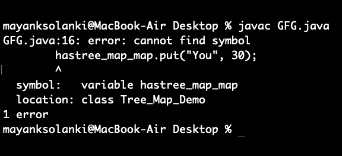

# 树形图包含 Java 中的 Value()方法，示例

> 原文:[https://www . geesforgeks . org/tree map-contains value-method-in-Java-with-examples/](https://www.geeksforgeeks.org/treemap-containsvalue-method-in-java-with-examples/)

在 Java 中， *containsValue()方法[树图类](https://www.geeksforgeeks.org/treemap-in-java/)的*用于检查树图中的任何键是否映射了特定的值。它将该值作为参数，如果该值由映射中的任何键映射，则返回 True。

```
--> java.util Package 
    --> TreeMap class
        --> containsValue() Method  
```

**语法:**

```
Tree_Map.containsValue(*Object Value*)
```

**参数:**对象类型的 v *值*，是指其映射应该由映射内的任何键检查的值。(只有一个参数)

**返回类型:**布尔值，如果检测到值的映射，则为真，否则为假。

> **注意**:在 java 中，当返回布尔值时，只返回 true 和 false，而不是 0 和 1，因为这是不允许的，这样做会在编译时引发错误。

**示例 1:** 将字符串值映射到整数键。

## Java 语言(一种计算机语言，尤用于创建网站)

```
// Java Program to Illustrate containsValue() Method
// of TreeMap class

// Importing required classes
import java.util.*;

// Main class
public class GFG {

    // main driver method
    public static void main(String[] args)
    {
        // Creating an empty TreeMap by
        // declaring object of integer and string pairs
        TreeMap<Integer, String> tree_map
            = new TreeMap<Integer, String>();

        // Mapping string values to int keys
        // using put() method
        tree_map.put(10, "Geeks");
        tree_map.put(15, "4");
        tree_map.put(20, "Geeks");
        tree_map.put(25, "Welcomes");
        tree_map.put(30, "You");

        // Printing the elements of TreeMap
        System.out.println("Initial Mappings are: "
                           + tree_map);

        // Checking for custom value in map
        // using containsValue() method

        // Say for the Value 'Geeks'
        System.out.println(
            "Is the value 'Geeks' present? "
            + tree_map.containsValue("Geeks"));

        // Checking for the Value 'World'
        System.out.println(
            "Is the value 'World' present? "
            + tree_map.containsValue("World"));
    }
}
```

**Output**

```
Initial Mappings are: {10=Geeks, 15=4, 20=Geeks, 25=Welcomes, 30=You}
Is the value 'Geeks' present? true
Is the value 'World' present? false
```

**示例 2:** 将整数值映射到字符串键。

## Java 语言(一种计算机语言，尤用于创建网站)

```
// Java Program  to illustrate containsValue() Method
// of TreeMap class

// Importing required classes
import java.util.*;

// Main class
public class GFG {

    // Main driver method
    public static void main(String[] args)
    {
        // Creating an empty TreeMap by
        // declaring object of string, integer pairs
        TreeMap<String, Integer> tree_map
            = new TreeMap<String, Integer>();

        // Mapping int values to string keys
        // using put() method
        tree_map.put("Geeks", 10);
        tree_map.put("4", 15);
        tree_map.put("Geeks", 20);
        tree_map.put("Welcomes", 25);
        hastree_map_map.put("You", 30);

        // Printing the elements of TreeMap
        System.out.println("Initial Mappings are: "
                           + tree_map);

        // Checking for the Value '10'
        // using containsValue() method
        System.out.println("Is the value '10' present? "
                           + tree_map.containsValue(10));

        // Checking for the Value '30'
        System.out.println("Is the value '30' present? "
                           + tree_map.containsValue(30));

        // Checking for the Value '40'
        System.out.println("Is the value '40' present? "
                           + tree_map.containsValue(40));
    }
}
```

**输出:**



> **注意:**类似地，相同的操作可以用不同数据类型的变化和组合的任何类型的映射来执行。