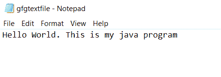
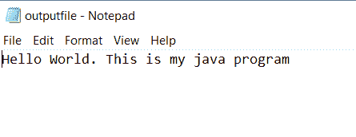

# Java 中的资源试用功能

> 原文:[https://www . geesforgeks . org/试用资源-java 中的功能/](https://www.geeksforgeeks.org/try-with-resources-feature-in-java/)

在 Java 中， **Try-with-resources** 语句是一个 Try 语句，它声明了其中的一个或多个资源。资源是一个对象，一旦您的程序使用完它，就必须关闭它。例如，文件资源或套接字连接资源。try-with-resources 语句确保在语句执行结束时关闭每个资源。如果我们不关闭资源，它可能会构成资源泄漏，并且程序可能会耗尽可用的资源。

您可以将任何对象作为实现 *java.lang.AutoCloseable* 的资源传递，这包括实现 java.io.Closeable 的所有对象。

这样，现在我们不需要为了传递资源的结束语句而额外增加一个[final block](https://www.geeksforgeeks.org/g-fact-24-finalfinally-and-finalize-in-java/)。一旦 try-catch 块被执行，资源将被关闭。

**语法:**试用资源

```java
try(declare resources here) {
    // use resources
}
catch(FileNotFoundException e) {
    // exception handling
}
```

**异常:**

说到异常，try-catch-finally 块和 try-with-resources 块是有区别的。如果在 try 块和 final 块中都引发了异常，则该方法返回在 final 块中引发的异常。

对于 try-with-resources，如果在 try 块和 try-with-resources 语句中引发异常，则该方法返回在 try 块中引发的异常。资源尝试引发的异常被抑制，也就是说，我们可以说资源尝试块引发了被抑制的异常。

现在，让我们讨论两种可能的情况，下面以一个例子演示如下:

*   **案例 1** :单一资源
*   **案例 2:** 多个资源

**示例 1:** 试用具有单个资源的资源

## Java 语言(一种计算机语言，尤用于创建网站)

```java
// Java Program for try-with-resources
// having single resource

// Importing all input output classes
import java.io.*;

// Class
class GFG {

    // Main driver method
    public static void main(String[] args)
    {
        // Try block to check for exceptions
        try (

            // Creating an object of FileOutputStream
            // to write stream or raw data

            // Adding resource
            FileOutputStream fos
            = new FileOutputStream("gfgtextfile.txt")) {

            // Custom string input
            String text
                = "Hello World. This is my java program";

            // Converting string to bytes
            byte arr[] = text.getBytes();

            // Text written in the file
            fos.write(arr);
        }

        // Catch block to handle exceptions
        catch (Exception e) {

            // Display message for the occured exception
            System.out.println(e);
        }

        // Display message for successful execution of
        // program
        System.out.println(
            "Resource are closed and message has been written into the gfgtextfile.txt");
    }
}
```

**输出:**

```java
Resource are closed and message has been written into the gfgtextfile.txt
```



**示例 2:** 尝试具有多个资源的资源

## Java 语言(一种计算机语言，尤用于创建网站)

```java
// Java program for try-with-resources
// having multiple resources

// Importing all input output classes
import java.io.*;

// Class
class GFG {

    // Main driver method
    public static void main(String[] args)
    {
        // Try block to check for exceptions

        // Writing data to a file using FileOutputStream
        // by passing input file as a parameter
        try (FileOutputStream fos
             = new FileOutputStream("outputfile.txt");

             // Adding resouce

             // Reading the stream of character from
             BufferedReader br = new BufferedReader(
                 new FileReader("gfgtextfile.txt"))) {

            // Declaring a string holding the
            // stream content of the file
            String text;

            // Condition check using readLine() method
            // which holds true till there is content
            // in the input file
            while ((text = br.readLine()) != null) {

                // Reading from input file passed above
                // using getBytes() method
                byte arr[] = text.getBytes();

                // String converted to bytes
                fos.write(arr);

                // Copying the content of passed input file
                // 'inputgfgtext' file to outputfile.txt
            }

            // Display message when
            // file is successfully copied
            System.out.println(
                "File content copied to another one.");
        }

        // Catch block to handle generic exceptions
        catch (Exception e) {

            // Display the exception on the
            // console window
            System.out.println(e);
        }

        // Display message for successful execution of the
        // program
        System.out.println(
            "Resource are closed and message has been written into the gfgtextfile.txt");
    }
}
```

**输出:**

```java
File content copied to another one.
Resource are closed and message has been written into the gfgtextfile.txt
```

