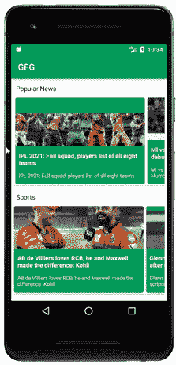

# 安卓中的二维循环视图，示例

> 原文:[https://www . geeksforgeeks . org/二维-recycle view-in-Android-with-example/](https://www.geeksforgeeks.org/two-dimensional-recyclerview-in-android-with-example/)

在许多情况下，我们必须以这样一种方式显示水平滚动列表，即我们还必须在上面显示标题，以指示列表属于哪个类别。为此，我们必须在我们的应用程序中创建一个二维的 RecyclerView。在本文中，我们将在我们的应用程序中创建一个二维回收视图。

### 我们将在本文中构建什么？

我们将构建一个简单的应用程序，其中我们将显示两个[回收视图](https://www.geeksforgeeks.org/android-recyclerview/)。一个是垂直的，一个是水平的。在我们的垂直回收视图中，我们将显示新闻类别，在这些类别中，我们将以水平可滚动的格式显示属于该类别的不同新闻。下面给出了一个示例 GIF，以了解我们将在本文中做什么。请注意，我们将使用 **Java** 语言来实现这个项目。



### **分步实施**

**第一步:创建新项目**

要在安卓工作室创建新项目，请参考[如何在安卓工作室创建/启动新项目](https://www.geeksforgeeks.org/android-how-to-create-start-a-new-project-in-android-studio/)。注意选择 **Java** 作为编程语言。

**步骤 2:在你的 build.gradle 文件中添加下面的依赖项，并在清单文件**中添加互联网权限

下面是凌空的依赖，我们将使用它从应用编程接口获取数据。要添加此依赖项，请导航至**应用程序>渐变脚本> build.gradle(应用程序)**，并在依赖项部分添加以下依赖项。我们已经使用了毕加索从网址图像加载依赖。

```java
// below line is used for volley library
implementation ‘com.android.volley:volley:1.1.1’

// below line is used for image loading library
implementation ‘com.squareup.picasso:picasso:2.71828’
```

另外，在清单文件中添加 internet 权限

```java
<uses-permission android:name="android.permission.INTERNET" /> 
```

**步骤 3:使用 activity_main.xml 文件**

导航到**应用程序> res >布局> activity_main.xml** 并将下面的代码添加到该文件中。下面是 **activity_main.xml** 文件的代码。

## 可扩展标记语言

```java
<?xml version="1.0" encoding="utf-8"?>
<RelativeLayout 
    xmlns:android="http://schemas.android.com/apk/res/android"
    xmlns:tools="http://schemas.android.com/tools"
    android:layout_width="match_parent"
    android:layout_height="match_parent"
    tools:context=".MainActivity">

    <!--recycler view for displaying categories-->
    <androidx.recyclerview.widget.RecyclerView
        android:id="@+id/idRVCategories"
        android:layout_width="match_parent"
        android:layout_height="match_parent" />

</RelativeLayout>
```

**第四步:创建一个模态类来存储我们的新闻**

导航到**应用> java >你的应用的包名>右键点击>新建> Java 类**并命名为**新闻模式**并添加下面的代码。下面是**NewsModal.java**文件的代码。代码中添加了注释，以更详细地理解代码。

## Java 语言(一种计算机语言，尤用于创建网站)

```java
public class NewsModal {

    // string for news title,image and description.
    private String newsTitle;
    private String newsDesc;
    private String newsImg;

    // on below line we have created a constructor.
    public NewsModal(String newsTitle, String newsDesc, String newsImg) {
        this.newsTitle = newsTitle;
        this.newsDesc = newsDesc;
        this.newsImg = newsImg;
    }

    public String getNewsImg() {
        return newsImg;
    }

    public void setNewsImg(String newsImg) {
        this.newsImg = newsImg;
    }

    // creating a getter and setter.
    public String getNewsTitle() {
        return newsTitle;
    }

    public void setNewsTitle(String newsTitle) {
        this.newsTitle = newsTitle;
    }

    public String getNewsDesc() {
        return newsDesc;
    }

    public void setNewsDesc(String newsDesc) {
        this.newsDesc = newsDesc;
    }

}
```

**第五步:创建一个模态类来存储我们的新闻类别**

同样，创建另一个 Java 类，并将其命名为**类别模式**，并向其中添加以下代码。以下是**CategoriesModal.java**文件的代码。代码中添加了注释，以更详细地理解代码。

## Java 语言(一种计算机语言，尤用于创建网站)

```java
import java.util.ArrayList;

public class CategoriesModal {
    // creating variable for our category, 
    // news array list and expanded boolean.
    private String newsCategory;
    private ArrayList<NewsModal> newsModalArrayList;

    // creating a constructor.
    public CategoriesModal(String newsCategory, ArrayList<NewsModal> newsModalArrayList) {
        this.newsCategory = newsCategory;
        this.newsModalArrayList = newsModalArrayList;

    }

    public String getNewsCategory() {
        return newsCategory;
    }

    public void setNewsCategory(String newsCategory) {
        this.newsCategory = newsCategory;
    }

    public ArrayList<NewsModal> getNewsModalArrayList() {
        return newsModalArrayList;
    }

    public void setNewsModalArrayList(ArrayList<NewsModal> newsModalArrayList) {
        this.newsModalArrayList = newsModalArrayList;
    }
}
```

**第 6 步:为我们的新闻项目创建布局文件**

导航至 **app > res >布局>右键点击>新建>布局资源文件**并命名为 **news_rv_item** 并添加以下代码。下面是 **news_rv_item.xml** 文件的代码。

## 可扩展标记语言

```java
<?xml version="1.0" encoding="utf-8"?>
<androidx.cardview.widget.CardView 
    xmlns:android="http://schemas.android.com/apk/res/android"
    xmlns:app="http://schemas.android.com/apk/res-auto"
    android:layout_width="300dp"
    android:layout_height="200dp"
    android:layout_gravity="center"
    android:layout_margin="3dp"
    android:backgroundTint="@color/purple_200"
    app:cardCornerRadius="4dp">

    <RelativeLayout
        android:layout_width="wrap_content"
        android:layout_height="match_parent">

        <!--image view for displaying image-->
        <ImageView
            android:id="@+id/idIVnews"
            android:layout_width="match_parent"
            android:layout_height="wrap_content"
            android:layout_above="@id/idTVNewsTitle"
            android:src="@drawable/logo1" />

        <!--text view for displaying news title-->
        <TextView
            android:id="@+id/idTVNewsTitle"
            android:layout_width="match_parent"
            android:layout_height="wrap_content"
            android:layout_above="@id/idTVNewsDesc"
            android:layout_marginStart="4dp"
            android:layout_marginTop="8dp"
            android:padding="4dp"
            android:text="News Title"
            android:textAllCaps="false"
            android:textColor="@color/white"
            android:textStyle="bold" />

        <!--text view for displaying news description-->
        <TextView
            android:id="@+id/idTVNewsDesc"
            android:layout_width="match_parent"
            android:layout_height="wrap_content"
            android:layout_alignParentBottom="true"
            android:layout_marginStart="4dp"
            android:layout_marginTop="4dp"
            android:layout_marginBottom="8dp"
            android:maxLines="3"
            android:padding="4dp"
            android:text="News Desc"
            android:textColor="@color/white"
            android:textSize="12sp" />

    </RelativeLayout>

</androidx.cardview.widget.CardView>
```

**步骤 7:为新闻类别创建新的布局文件**

同样，创建另一个布局资源文件，并将其命名为 **news_categories_rv_item** ，并向其中添加以下代码。下面是**news _ categories _ RV _ item . XML**文件的代码。

## 可扩展标记语言

```java
<?xml version="1.0" encoding="utf-8"?>
<androidx.cardview.widget.CardView 
    xmlns:android="http://schemas.android.com/apk/res/android"
    xmlns:app="http://schemas.android.com/apk/res-auto"
    android:layout_width="match_parent"
    android:layout_height="wrap_content"
    android:layout_margin="4dp"
    app:cardCornerRadius="4dp">

    <LinearLayout
        android:layout_width="match_parent"
        android:layout_height="wrap_content"
        android:orientation="vertical">

        <!--text view for displaying news category-->
        <TextView
            android:id="@+id/idTVCategory"
            android:layout_width="match_parent"
            android:layout_height="wrap_content"
            android:padding="8dp"
            android:text="Category"
            android:textSize="15sp" />

        <androidx.cardview.widget.CardView
            android:id="@+id/idCVCategory"
            android:layout_width="match_parent"
            android:layout_height="wrap_content"
            android:elevation="0dp"
            app:cardElevation="0dp">

            <!--recycler view for displaying news recycler view-->
            <androidx.recyclerview.widget.RecyclerView
                android:id="@+id/idRVNews"
                android:layout_width="match_parent"
                android:layout_height="wrap_content" />

        </androidx.cardview.widget.CardView>

    </LinearLayout>

</androidx.cardview.widget.CardView>
```

**步骤 8:创建新的适配器类，用于在新闻回收视图**中设置数据

创建另一个新的 Java 类，并将其命名为**newsvadapter**，并向其中添加以下代码。下面是**NewsRVAdapter.java**文件的代码。代码中添加了注释，以更详细地理解代码。

## Java 语言(一种计算机语言，尤用于创建网站)

```java
import android.content.Context;
import android.view.LayoutInflater;
import android.view.View;
import android.view.ViewGroup;
import android.widget.ImageView;
import android.widget.TextView;

import androidx.annotation.NonNull;
import androidx.recyclerview.widget.RecyclerView;

import com.squareup.picasso.Picasso;

import java.util.ArrayList;

public class NewsRVAdapter extends RecyclerView.Adapter<NewsRVAdapter.ViewHolder> {

    // variables for array list and context.
    private ArrayList<NewsModal> newsModalArrayList;
    private Context context;

    // creating a constructor.
    public NewsRVAdapter(ArrayList<NewsModal> newsModalArrayList, Context context) {
        this.newsModalArrayList = newsModalArrayList;
        this.context = context;
    }

    @NonNull
    @Override
    public NewsRVAdapter.ViewHolder onCreateViewHolder(@NonNull ViewGroup parent, int viewType) {
        // passing our layout file for displaying our card item
        return new NewsRVAdapter.ViewHolder(LayoutInflater.from(context).inflate(R.layout.news_rv_item, parent, false));

    }

    @Override
    public void onBindViewHolder(@NonNull NewsRVAdapter.ViewHolder holder, int position) {
        // on below line we are setting data to our ui components.
        NewsModal modal = newsModalArrayList.get(position);
        holder.newsDescTV.setText(modal.getNewsDesc());
        holder.newsTitleTV.setText(modal.getNewsTitle());
        Picasso.get().load(modal.getNewsImg()).into(holder.newsIV);
    }

    @Override
    public int getItemCount() {
        // returning the size of array list
        return newsModalArrayList.size();
    }

    public class ViewHolder extends RecyclerView.ViewHolder {
        // creating variables for our text view.
        private TextView newsTitleTV, newsDescTV;
        private ImageView newsIV;

        public ViewHolder(@NonNull View itemView) {
            super(itemView);
            // initializing our text view
            newsIV = itemView.findViewById(R.id.idIVnews);
            newsTitleTV = itemView.findViewById(R.id.idTVNewsTitle);
            newsDescTV = itemView.findViewById(R.id.idTVNewsDesc);
        }
    }
}
```

**第 9 步:为我们的类别创建适配器类回收视图**

同样，创建另一个 Java 类名为 **CategoriesRVAdapter** 、，并添加下面的代码。下面是**CategoriesRVAdapter.java**文件的代码。代码中添加了注释，以更详细地理解代码。

## Java 语言(一种计算机语言，尤用于创建网站)

```java
import android.content.Context;
import android.view.LayoutInflater;
import android.view.View;
import android.view.ViewGroup;
import android.widget.TextView;

import androidx.annotation.NonNull;
import androidx.recyclerview.widget.LinearLayoutManager;
import androidx.recyclerview.widget.RecyclerView;

import java.util.ArrayList;

public class CategoriesRVAdapter extends RecyclerView.Adapter<CategoriesRVAdapter.ViewHolder> {

    // variables for array list and context.
    private ArrayList<CategoriesModal> categoriesModalArrayList;
    private Context context;

    // creating a constructor
    public CategoriesRVAdapter(ArrayList<CategoriesModal> categoriesModalArrayList, Context context) {
        this.categoriesModalArrayList = categoriesModalArrayList;
        this.context = context;
    }

    @NonNull
    @Override
    public CategoriesRVAdapter.ViewHolder onCreateViewHolder(@NonNull ViewGroup parent, int viewType) {
        // passing our layout file for displaying our card item
        return new CategoriesRVAdapter.ViewHolder(LayoutInflater.from(context).inflate(R.layout.news_categories_rv_item, parent, false));
    }

    @Override
    public void onBindViewHolder(@NonNull CategoriesRVAdapter.ViewHolder holder, int position) {
        // setting data to our views on below line.
        CategoriesModal modal = categoriesModalArrayList.get(position);
        holder.categoryTV.setText(modal.getNewsCategory());
        NewsRVAdapter adapter = new NewsRVAdapter(modal.getNewsModalArrayList(), context);
        // below line is for setting a layout manager for our recycler view.
        // here we are creating horizontal list so we will provide orientation as vertical
        LinearLayoutManager linearLayoutManager = new LinearLayoutManager(context, LinearLayoutManager.HORIZONTAL, false);
        holder.newsRV.setLayoutManager(linearLayoutManager);
        holder.newsRV.setAdapter(adapter);
    }

    @Override
    public int getItemCount() {
        // returning the size of array list on below line.
        return categoriesModalArrayList.size();
    }

    public class ViewHolder extends RecyclerView.ViewHolder {
        // creating new variables for our views.
        private RecyclerView newsRV;
        private TextView categoryTV;

        public ViewHolder(@NonNull View itemView) {
            super(itemView);
            // initializing our views.
            categoryTV = itemView.findViewById(R.id.idTVCategory);
            newsRV = itemView.findViewById(R.id.idRVNews);
        }
    }
}
```

**步骤 10:使用****MainActivity.java 文件**

转到**MainActivity.java**文件，参考以下代码。以下是**MainActivity.java**文件的代码。代码中添加了注释，以更详细地理解代码。

## Java 语言(一种计算机语言，尤用于创建网站)

```java
import android.os.Bundle;
import android.util.Log;
import android.widget.Toast;

import androidx.appcompat.app.AppCompatActivity;
import androidx.recyclerview.widget.LinearLayoutManager;
import androidx.recyclerview.widget.RecyclerView;

import com.android.volley.Request;
import com.android.volley.RequestQueue;
import com.android.volley.Response;
import com.android.volley.VolleyError;
import com.android.volley.toolbox.JsonObjectRequest;
import com.android.volley.toolbox.Volley;

import org.json.JSONArray;
import org.json.JSONException;
import org.json.JSONObject;

import java.util.ArrayList;

public class MainActivity extends AppCompatActivity {

    // creating array list for our categories,
    // different news and category recycler view.
    private RecyclerView categoriesRV;
    private ArrayList<CategoriesModal> categoriesModalArrayList;
    private ArrayList<NewsModal> popularNewsArrayList, sportsNews, techNews;
    private CategoriesRVAdapter adapter;

    @Override
    protected void onCreate(Bundle savedInstanceState) {
        super.onCreate(savedInstanceState);
        setContentView(R.layout.activity_main);
        categoriesRV = findViewById(R.id.idRVCategories);
        LinearLayoutManager manager = new LinearLayoutManager(this);
        categoriesRV.setLayoutManager(manager);
        categoriesModalArrayList = new ArrayList<>();
        sportsNews = new ArrayList<>();
        techNews = new ArrayList<>();
        popularNewsArrayList = new ArrayList<>();
        adapter = new CategoriesRVAdapter(categoriesModalArrayList, this);
        categoriesRV.setAdapter(adapter);
        getPopularNews(popularNewsArrayList, categoriesModalArrayList);
        getSportsNews(categoriesModalArrayList, sportsNews);
        getTechnews(categoriesModalArrayList, techNews);
        adapter.notifyDataSetChanged();

    }

    private void getSportsNews(ArrayList<CategoriesModal> categoriesModals, ArrayList<NewsModal> sportsNews) {
        Log.e("TAG", "SIZE IS " + categoriesModalArrayList.size());
        String url = "https://jsonkeeper.com/b/U1BV";
        // creating a new variable for our request queue
        RequestQueue queue = Volley.newRequestQueue(MainActivity.this);
        // in this case the data we are getting is in the form
        // of array so we are making a json array request.
        // below is the line where we are making an json array
        // request and then extracting data from each json object.
        JsonObjectRequest jsonObjectRequest = new JsonObjectRequest(Request.Method.GET, url, null, new Response.Listener<JSONObject>() {
            @Override
            public void onResponse(JSONObject response) {
                Log.e("TAG", "SPORTS RESPONSE IS " + response);
                try {
                    String category = response.getString("newsCategory");
                    JSONArray newsArray = response.getJSONArray("news");
                    for (int i = 0; i < newsArray.length(); i++) {
                        JSONObject newsObj = newsArray.getJSONObject(i);
                        String newsTitle = newsObj.getString("newsTitle");
                        String newsDesc = newsObj.getString("newsDesc");
                        String newsImg = newsObj.getString("newsImg");
                        sportsNews.add(new NewsModal(newsTitle, newsDesc, newsImg));
                    }
                    categoriesModals.add(new CategoriesModal(category, sportsNews));
                    Log.e("TAG", "MODALS = " + sportsNews.size() + "\n" + categoriesModals.size());
                    adapter.notifyDataSetChanged();
                } catch (JSONException e) {
                    e.printStackTrace();
                }
            }
        }, new Response.ErrorListener() {
            @Override
            public void onErrorResponse(VolleyError error) {
                Toast.makeText(MainActivity.this, "Fail to get Data", Toast.LENGTH_SHORT).show();
            }
        });
        queue.add(jsonObjectRequest);
    }

    private void getTechnews(ArrayList<CategoriesModal> categoriesModals, ArrayList<NewsModal> techNews) {
        // ArrayList<CategoriesModal> categoriesModals = null;
        String url = "https://jsonkeeper.com/b/ZCWD";
        // creating a new variable for our request queue
        RequestQueue queue = Volley.newRequestQueue(MainActivity.this);
        // in this case the data we are getting is in the form
        // of array so we are making a json array request.
        // below is the line where we are making an json array
        // request and then extracting data from each json object.
        JsonObjectRequest jsonObjectRequest = new JsonObjectRequest(Request.Method.GET, url, null, new Response.Listener<JSONObject>() {
            @Override
            public void onResponse(JSONObject response) {
                Log.e("TAG", "TECH RESPONSE IS " + response);
                try {
                    String category = response.getString("newsCategory");
                    JSONArray newsArray = response.getJSONArray("news");
                    for (int i = 0; i < newsArray.length(); i++) {
                        JSONObject newsObj = newsArray.getJSONObject(i);
                        String newsTitle = newsObj.getString("newsTitle");
                        String newsDesc = newsObj.getString("newsDesc");
                        String newsImg = newsObj.getString("newsImg");
                        techNews.add(new NewsModal(newsTitle, newsDesc, newsImg));
                    }
                    categoriesModals.add(new CategoriesModal(category, techNews));
                    adapter.notifyDataSetChanged();
                } catch (JSONException e) {
                    e.printStackTrace();
                }
            }
        }, new Response.ErrorListener() {
            @Override
            public void onErrorResponse(VolleyError error) {
                Toast.makeText(MainActivity.this, "Fail to get Data", Toast.LENGTH_SHORT).show();
            }
        });
        queue.add(jsonObjectRequest);
    }

    private void getPopularNews(ArrayList<NewsModal> popularNewsArrayList, ArrayList<CategoriesModal> categoriesModals) {
        String url = "https://jsonkeeper.com/b/ZCWD";
        // creating a new variable for our request queue
        RequestQueue queue = Volley.newRequestQueue(MainActivity.this);
        // in this case the data we are getting is in the form
        // of array so we are making a json array request.
        // below is the line where we are making an json array
        // request and then extracting data from each json object.
        JsonObjectRequest jsonObjectRequest = new JsonObjectRequest(Request.Method.GET, url, null, new Response.Listener<JSONObject>() {
            @Override
            public void onResponse(JSONObject response) {
                Log.e("TAG", "POPULAR NEWS RESPONSE IS " + response);
                try {
                    String category = response.getString("newsCategory");
                    JSONArray newsArray = response.getJSONArray("news");
                    for (int i = 0; i < newsArray.length(); i++) {
                        JSONObject newsObj = newsArray.getJSONObject(i);
                        String newsTitle = newsObj.getString("newsTitle");
                        String newsDesc = newsObj.getString("newsDesc");
                        String newsImg = newsObj.getString("newsImg");
                        popularNewsArrayList.add(new NewsModal(newsTitle, newsDesc, newsImg));
                    }
                    categoriesModals.add(new CategoriesModal(category, popularNewsArrayList));
                    adapter.notifyDataSetChanged();
                } catch (JSONException e) {
                    e.printStackTrace();
                }
            }
        }, new Response.ErrorListener() {
            @Override
            public void onErrorResponse(VolleyError error) {
                Toast.makeText(MainActivity.this, "Fail to get Data", Toast.LENGTH_SHORT).show();
            }
        });
        queue.add(jsonObjectRequest);
    }
}
```

现在运行您的应用程序，并查看应用程序的输出。

**输出:**

<video class="wp-video-shortcode" id="video-595544-1" width="640" height="360" preload="metadata" controls=""><source type="video/mp4" src="https://media.geeksforgeeks.org/wp-content/uploads/20210428103554/20210428_103451.mp4?_=1">[https://media.geeksforgeeks.org/wp-content/uploads/20210428103554/20210428_103451.mp4](https://media.geeksforgeeks.org/wp-content/uploads/20210428103554/20210428_103451.mp4)</video>