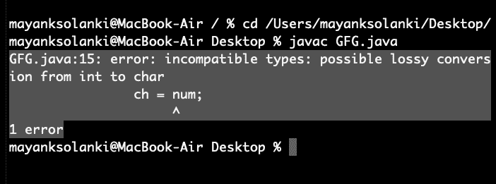

# Java 中的类型转换，示例

> 原文:[https://www . geesforgeks . org/type-conversion-Java-examples/](https://www.geeksforgeeks.org/type-conversion-java-examples/)

Java 提供了各种数据类型，就像任何其他动态语言一样，如布尔、char、int、无符号 int、有符号 int、float、double、long 等，总共提供了 7 种类型，其中每种数据类型在存储在内存中时都会获得不同的空间。当您将一种数据类型的值赋给另一种数据类型时，这两种类型可能不兼容。如果数据类型兼容，那么 Java 将自动执行转换，称为自动类型转换，如果不兼容，则需要显式转换。例如，给长变量赋值。

<figure class="table">

| data type | Bits obtained in memory |
| --- | --- |
| boolean type | one |
| byte | 8 (1 byte) |
| 茶 | 16(2 bytes) |
| short | 16(2 bytes) |

</figure>

## 加宽或自动类型转换

当自动转换两种数据类型时，会发生扩展转换。这种情况发生在:

*   这两种数据类型是兼容的。
*   当我们将较小数据类型的值赋给较大数据类型时。

例如，在 java 中，数字数据类型相互兼容，但是不支持从数字类型到 char 或 boolean 的自动转换。此外，char 和 boolean 彼此不兼容。


**示例:**

## Java 语言(一种计算机语言，尤用于创建网站)

```java
// Java Program to Illustrate Automatic Type Conversion

// Main class
class GFG {

    // Main driver method
    public static void main(String[] args)
    {
        int i = 100;

        // Automatic type conversion
        // Integer to long type
        long l = i;

        // Automatic type conversion
        // long to float type
        float f = l;

        // Print and display commands
        System.out.println("Int value " + i);
        System.out.println("Long value " + l);
        System.out.println("Float value " + f);
    }
}
```

**Output**

```java
Int value 100
Long value 100
Float value 100.0
```

## 缩小或显式转换

如果我们想将一个较大数据类型的值赋给一个较小的数据类型，我们执行显式类型转换或收缩。

*   这对于无法自动转换的不兼容数据类型非常有用。
*   这里，目标类型指定要将指定值转换为的所需类型。


字符和数字不兼容。让我们看看什么时候我们试着把一个转换成另一个。

## Java 语言(一种计算机语言，尤用于创建网站)

```java
// Java program to illustrate Incompatible data Type
// for Explicit Type Conversion

// Main class
public class GFG {

    // Main driver method
    public static void main(String[] argv)
    {

        // Declaring character variable
        char ch = 'c';
        // Declaringinteger variable
        int num = 88;
        // Trying to insert integer to character
        ch = num;
    }
}
```

**输出:**将产生错误



此错误是由于整数变量需要 4 个字节而字符数据类型需要 2 个字节而产生的。我们试图将数据从 4 字节绘制成 2 字节，这是不可能的。

**如何进行显式转换？**

## Java 语言(一种计算机语言，尤用于创建网站)

```java
// Java program to Illustrate Explicit Type Conversion

// Main class
public class GFG {

    // Main driver method
    public static void main(String[] args)
    {

        // Double datatype
        double d = 100.04;

        // Explicit type casting by forcefully getting
        // data from long datatype to integer type
        long l = (long)d;

        // Explicit type casting
        int i = (int)l;

        // Print statements
        System.out.println("Double value " + d);

        // While printing we will see that
        // fractional part lost
        System.out.println("Long value " + l);

        // While printing we will see that
        // fractional part lost
        System.out.println("Int value " + i);
    }
}
```

**Output**

```java
Double value 100.04
Long value 100
Int value 100
```

> **注意:**当给字节类型赋值时，小数部分丢失，并减少到模 256(字节范围)。

**示例:**

## Java 语言(一种计算机语言，尤用于创建网站)

```java
// Java Program to Illustrate Conversion of
// Integer and Double to Byte

// Main class
class GFG {

    // Main driver method
    public static void main(String args[])
    {
        // Declaring byte variable
        byte b;

        // Declaring and initializing integer and double
        int i = 257;
        double d = 323.142;

        // Display message
        System.out.println("Conversion of int to byte.");

        // i % 256
        b = (byte)i;

        // Print commands
        System.out.println("i = " + i + " b = " + b);
        System.out.println(
            "\nConversion of double to byte.");

        // d % 256
        b = (byte)d;

        // Print commands
        System.out.println("d = " + d + " b= " + b);
    }
}
```

**Output**

```java
Conversion of int to byte.
i = 257 b = 1

Conversion of double to byte.
d = 323.142 b= 67
```

## 表达式中的类型提升

在计算表达式时，中间值可能超过操作数的范围，因此表达式值将被提升。类型升级的一些条件是:

1.  在计算表达式时，Java 会自动将每个字节、短操作数或字符操作数提升为 int。
2.  如果一个操作数是 long、float 或 double，则整个表达式将分别提升为 long、float 或 double。

**示例:**

## Java 语言(一种计算机语言，尤用于创建网站)

```java
// Java program to Illustrate Type promotion in Expressions

// Main class
class GFG {

    // Main driver method
    public static void main(String args[])
    {

        // Declaring and initializing primitive types
        byte b = 42;
        char c = 'a';
        short s = 1024;
        int i = 50000;
        float f = 5.67f;
        double d = .1234;

        // The Expression
        double result = (f * b) + (i / c) - (d * s);

        // Printing the result obtained after
        // all the promotions are done
        System.out.println("result = " + result);
    }
}
```

**Output**

```java
result = 626.7784146484375
```

## 表达式中的显式类型转换

计算表达式时，结果会自动更新为操作数的较大数据类型。但是，如果我们将结果存储在任何较小的数据类型中，就会产生编译时错误，因此我们需要对结果进行类型转换。

**示例:**

## Java 语言(一种计算机语言，尤用于创建网站)

```java
// Java program to Illustrate Type Casting
// in Integer to Byte

// Main class
class GFG {

    // Main driver method
    public static void main(String args[])
    {

        // Declaring byte array
        byte b = 50;

        // Type casting int to byte
        b = (byte)(b * 2);

        // Display value in byte
        System.out.println(b);
    }
}
```

**Output**

```java
100
```

> **注意:**在单个操作数的情况下，结果被转换为 int，然后相应地进行类型转换，如上例所示。

本文由**阿普尔瓦**辛格供稿。如果你喜欢 GeeksforGeeks 并想投稿，你也可以使用[write.geeksforgeeks.org](https://write.geeksforgeeks.org)写一篇文章或者把你的文章邮寄到 review-team@geeksforgeeks.org。看到你的文章出现在极客博客主页上，帮助其他极客。如果你发现任何不正确的地方，或者你想分享更多关于上面讨论的话题的信息，请写评论。