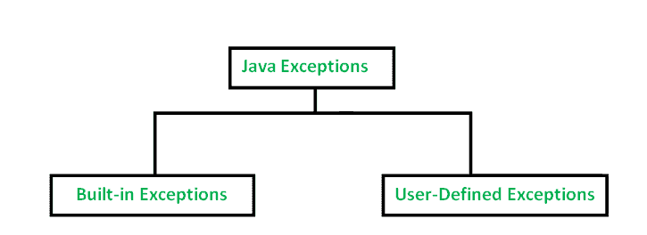

# Java 中异常的类型，示例

> 原文:[https://www . geesforgeks . org/Java 异常类型-带示例/](https://www.geeksforgeeks.org/types-of-exception-in-java-with-examples/)

Java 定义了几种与其不同类库相关的异常类型。Java 还允许用户定义自己的异常。



[**内置例外**](https://www.geeksforgeeks.org/built-exceptions-java-examples/)

内置异常是 Java 库中可用的异常。这些异常适用于解释某些错误情况。下面是 Java 中重要的内置异常列表。

1.  **算术异常**
    当算术运算中出现异常情况时抛出。
2.  **ArrayIndexOutOfBoundsException**
    它被抛出以指示一个数组被非法索引访问。索引为负，或者大于或等于数组的大小。
3.  **class notfoundexception**
    当我们试图访问一个没有找到定义的类时，会引发这个异常
4.  **文件未找到异常**
    当文件不可访问或未打开时，会引发此异常。
5.  **IOException**
    当输入输出操作失败或中断时抛出
6.  **中断异常**
    当线程正在等待、睡眠或进行某些处理时抛出，它被中断。
7.  **NoSuchFieldException**
    当类不包含指定的字段(或变量)时抛出
8.  **nosuchmethod exception**
    访问未找到的方法时抛出。
9.  **空指针异常**
    当引用空对象的成员时，会引发此异常。Null 不代表任何东西
10.  **NumberformatException**
    当方法无法将字符串转换为数字格式时，会引发此异常。
11.  **运行时异常**
    这代表运行时发生的任何异常。
12.  **StringIndexOutOfBoundsException**
    它由 String 类方法引发，用于指示索引为负或大于字符串的大小

**内置异常示例:**

*   **算术异常**

## Java 语言(一种计算机语言，尤用于创建网站)

```java
// Java program to demonstrate ArithmeticException
class ArithmeticException_Demo
{
    public static void main(String args[])
    {
        try {
            int a = 30, b = 0;
            int c = a/b;  // cannot divide by zero
            System.out.println ("Result = " + c);
        }
        catch(ArithmeticException e) {
            System.out.println ("Can't divide a number by 0");
        }
    }
}
```

**输出:**

```java
Can't divide a number by 0
```

*   **零点异常**

## Java 语言(一种计算机语言，尤用于创建网站)

```java
//Java program to demonstrate NullPointerException
class NullPointer_Demo
{
    public static void main(String args[])
    {
        try {
            String a = null; //null value
            System.out.println(a.charAt(0));
        } catch(NullPointerException e) {
            System.out.println("NullPointerException..");
        }
    }
}
```

**输出:**

```java
NullPointerException..
```

*   **StringIndexOutOfBound 异常**

## Java 语言(一种计算机语言，尤用于创建网站)

```java
// Java program to demonstrate StringIndexOutOfBoundsException
class StringIndexOutOfBound_Demo
{
    public static void main(String args[])
    {
        try {
            String a = "This is like chipping "; // length is 22
            char c = a.charAt(24); // accessing 25th element
            System.out.println(c);
        }
        catch(StringIndexOutOfBoundsException e) {
            System.out.println("StringIndexOutOfBoundsException");
        }
    }
}
```

**输出:**

```java
StringIndexOutOfBoundsException
```

*   档案发现异常

## Java 语言(一种计算机语言，尤用于创建网站)

```java
//Java program to demonstrate FileNotFoundException
import java.io.File;
import java.io.FileNotFoundException;
import java.io.FileReader;
 class File_notFound_Demo {

    public static void main(String args[])  {
        try {

            // Following file does not exist
            File file = new File("E://file.txt");

            FileReader fr = new FileReader(file);
        } catch (FileNotFoundException e) {
           System.out.println("File does not exist");
        }
    }
}
```

**输出:**

```java
File does not exist
```

*   **NumberFormat 异常**

## Java 语言(一种计算机语言，尤用于创建网站)

```java
// Java program to demonstrate NumberFormatException
class  NumberFormat_Demo
{
    public static void main(String args[])
    {
        try {
            // "akki" is not a number
            int num = Integer.parseInt ("akki") ;

            System.out.println(num);
        } catch(NumberFormatException e) {
            System.out.println("Number format exception");
        }
    }
}
```

**输出:**

```java
Number format exception
```

*   **ArrayIndexOutOfBounds 异常**

## Java 语言(一种计算机语言，尤用于创建网站)

```java
// Java program to demonstrate ArrayIndexOutOfBoundException
class ArrayIndexOutOfBound_Demo
{
    public static void main(String args[])
    {
        try{
            int a[] = new int[5];
            a[6] = 9; // accessing 7th element in an array of
                      // size 5
        }
        catch(ArrayIndexOutOfBoundsException e){
            System.out.println ("Array Index is Out Of Bounds");
        }
    }
}
```

**输出:**

```java
Array Index is Out Of Bounds
```

**用户自定义异常**
有时候，Java 中内置的异常并不能描述某一种情况。在这种情况下，用户还可以创建称为“用户定义的异常”的异常。

按照以下步骤创建用户定义的异常。

*   用户应该创建一个异常类作为异常类的子类。因为所有的异常都是异常类的子类，所以用户也应该使他的类成为它的子类。这是通过以下方式完成的:

```java
class MyException extends Exception
```

*   我们可以在他自己的异常类中编写一个默认构造函数。

```java
MyException(){}
```

*   我们还可以创建一个参数化的构造函数，用一个字符串作为参数。
    我们可以用这个来存储异常详细信息。我们可以从这里调用超类(异常)构造函数，并将字符串发送到那里。

```java
MyException(String str)
{
   super(str);
}
```

*   要引发用户定义类型的异常，我们需要为他的异常类创建一个对象，并使用 throw 子句抛出它，如下所示:

```java
MyException me = new MyException(“Exception details”);
throw me;
```

*   下面的程序演示了如何创建自己的异常类 MyException。
*   账号、客户名称和余额的详细信息采用三个数组的形式。
*   在 main()方法中，使用 for 循环显示详细信息。此时，检查任何账户中的余额是否少于该账户中的最低余额。
*   如果是这样的话，那么我的异常就会出现，并显示一条消息“余额较少”。

## Java 语言(一种计算机语言，尤用于创建网站)

```java
// Java program to demonstrate user defined exception

// This program throws an exception whenever balance
// amount is below Rs 1000
class MyException extends Exception
{
    //store account information
    private static int accno[] = {1001, 1002, 1003, 1004};

    private static String name[] =
                 {"Nish", "Shubh", "Sush", "Abhi", "Akash"};

    private static double bal[] =
         {10000.00, 12000.00, 5600.0, 999.00, 1100.55};

    // default constructor
    MyException() {    }

    // parameterized constructor
    MyException(String str) { super(str); }

    // write main()
    public static void main(String[] args)
    {
        try  {
            // display the heading for the table
            System.out.println("ACCNO" + "\t" + "CUSTOMER" +
                                           "\t" + "BALANCE");

            // display the actual account information
            for (int i = 0; i < 5 ; i++)
            {
                System.out.println(accno[i] + "\t" + name[i] +
                                               "\t" + bal[i]);

                // display own exception if balance < 1000
                if (bal[i] < 1000)
                {
                    MyException me =
                       new MyException("Balance is less than 1000");
                    throw me;
                }
            }
        } //end of try

        catch (MyException e) {
            e.printStackTrace();
        }
    }
}
```

运行时错误

```java
 MyException: Balance is less than 1000
    at MyException.main(fileProperty.java:36)
```

**输出:**

```java
ACCNO    CUSTOMER    BALANCE
1001    Nish    10000.0
1002    Shubh    12000.0
1003    Sush    5600.0
1004    Abhi    999.0
```

**相关文章:**

*   [Java 中已检查与未检查的异常](https://www.geeksforgeeks.org/checked-vs-unchecked-exceptions-in-java/)
*   [捕捉基类和派生类作为异常](https://www.geeksforgeeks.org/g-fact-60/)
*   [异常处理测验](https://www.geeksforgeeks.org/java-gq/exception-handling-2-gq/)

本文由 [**尼尚·夏尔马**](https://www.facebook.com/ChippingEye2766) 供稿。如果你喜欢 GeeksforGeeks 并想投稿，你也可以使用[write.geeksforgeeks.org](https://write.geeksforgeeks.org)写一篇文章或者把你的文章邮寄到 review-team@geeksforgeeks.org。看到你的文章出现在极客博客主页上，帮助其他极客。
如果发现有不正确的地方，或者想分享更多关于上述话题的信息，请写评论。