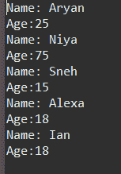
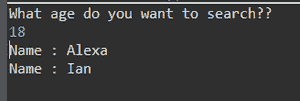
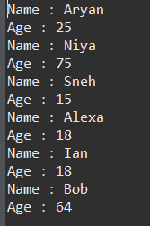

# JDBC 报表类型

> 原文:[https://www.geeksforgeeks.org/types-of-statements-in-jdbc/](https://www.geeksforgeeks.org/types-of-statements-in-jdbc/)

语句接口用于在 Java 中创建 SQL 基本语句。它提供了执行数据库查询的方法。JDBC 使用的语句有以下不同类型:

*   创建语句
*   准备的声明
*   可调用语句

**1。** **创建语句:**在连接界面，您可以为此界面创建对象。它通常用于对数据库的一般**–**目的访问，在运行时使用静态 SQL 语句时非常有用。

**语法:**

```java
Statement statement = connection.createStatement();
```

**实现:**语句对象一旦创建，就有三种执行方式。

*   ***布尔执行(字符串 SQL):*** 如果检索到 ResultSet 对象，则返回 true，否则返回 false。用于执行 [SQL DDL](https://www.geeksforgeeks.org/sql-ddl-dql-dml-dcl-tcl-commands/) 语句或动态 SQL。
*   **int execute Update(String SQL):**返回受语句执行影响的行数，在需要 INSERT、DELETE 或 UPDATE 语句的行数时使用。
*   ***结果集执行查询(字符串 SQL):*** 返回结果集对象。与在 SQL 中使用 SELECT 类似。

**示例:**

## Java 语言(一种计算机语言，尤用于创建网站)

```java
// Java Program illustrating Create Statement in JDBC

// Importing Database(SQL) classes
import java.sql.*;

// Class
class GFG {

    // Main driver method
    public static void main(String[] args)
    {

        // Try block to check if any exceptions occur
        try {

            // Step 2: Loading and registering drivers

            // Loading driver using forName() method
            Class.forName("com.mysql.cj.jdbc.Driver");

            // Registering driver using DriverManager
            Connection con = DriverManager.getConnection(
                "jdbc:mysql:///world", "root", "12345");

            // Step 3: Create a statement
            Statement statement = con.createStatement();
            String sql = "select * from people";

            // Step 4: Execute the query
            ResultSet result = statement.executeQuery(sql);

            // Step 5: Process the results

            // Condition check using hasNext() method which
            // holds true till there is single element
            // remaining in List
            while (result.next()) {

                // Print name an age
                System.out.println(
                    "Name: " + result.getString("name"));
                System.out.println(
                    "Age:" + result.getString("age"));
            }
        }

        // Catching database exceptions if any
        catch (SQLException e) {

            // Print the exception
            System.out.println(e);
        }

        // Catching generic ClassNotFoundException if any
        catch (ClassNotFoundException e) {

            // Print and display the line number
            // where exception occurred
            e.printStackTrace();
        }
    }
}
```

**输出:**姓名和年龄如随机输入所示



**2。准备好的语句**代表重新编译的 SQL 语句，可以多次执行。这接受参数化的 SQL 查询。在这种情况下，“？”，则可以在运行时使用 PREPARED STATEMENT 的方法动态传递参数。

插图:

考虑到在人员数据库中是否需要插入一些值，使用如下 SQL 语句:

```java
INSERT INTO people VALUES ("Ayan",25);
INSERT INTO people VALUES("Kriya",32);
```

要在 Java 中做到这一点，可以使用准备好的语句，并在？准备好的报表的持有人 setXXX()如下所示:

```java
String query = "INSERT INTO people(name, age)VALUES(?, ?)";
Statement pstmt = con.prepareStatement(query);
pstmt.setString(1,"Ayan");
ptstmt.setInt(2,25);
// where pstmt is an object name
```

**实现:**一旦创建了 PreparedStatement 对象，有三种方法可以执行它:

*   ***execute():*** 这将返回一个布尔值，并执行准备好的语句对象中存在的静态 SQL 语句。
*   [***execute query()***](https://www.geeksforgeeks.org/establishing-jdbc-connection-in-java/)***:***从当前准备好的语句中返回一个 ResultSet。
*   [***【execute update()】***](https://www.geeksforgeeks.org/how-to-insert-records-to-a-table-using-jdbc-connection/)***:***返回当前准备语句中受 DML 语句影响的行数，如 INSERT、DELETE 等。

**示例:**

## Java 语言(一种计算机语言，尤用于创建网站)

```java
// Java Program illustrating Prepared Statement in JDBC

// Step 1: Importing DB(SQL here) classes
import java.sql.*;
// Importing Scanner class to
// take input from the user
import java.util.Scanner;

// Main clas
class GFG {

    // Main driver method
    public static void main(String[] args)
    {
        // try block to check for exceptions
        try {

            // Step 2: Establish a connection

            // Step 3: Load and register drivers

            // Loading drivers using forName() method
            Class.forName("com.mysql.cj.jdbc.Driver");

            // Scanner class to take input from user
            Scanner sc = new Scanner(System.in);

            // Display message for ease for user
            System.out.println(
                "What age do you want to search?? ");

            // Reading age an primitive datatype from user
            // using nextInt() method
            int age = sc.nextInt();

            // Registering drivers using DriverManager
            Connection con = DriverManager.getConnection(
                "jdbc:mysql:///world", "root", "12345");

            // Step 4: Create a statement
            PreparedStatement ps = con.prepareStatement(
                "select name from world.people where age = ?");

            // Step 5: Execute the query
            ps.setInt(1, age);
            ResultSet result = ps.executeQuery();

            // Step 6: Process the results

            // Condition check using next() method
            // to check for element
            while (result.next()) {

                // Print and display elements(Names)
                System.out.println("Name : "
                                   + result.getString(1));
            }

            // Step 7: Closing the connections
            // (Optional but it is recommended to do so)
        }

        // Catch block to handle database exceptions
        catch (SQLException e) {

            // Display the DB exception if any
            System.out.println(e);
        }

        // Catch block to handle class exceptions
        catch (ClassNotFoundException e) {

            // Print the line number where exception occurred
            // using printStackTrace() method if any
            e.printStackTrace();
        }
    }
}
```

**输出:**



**3。Callable Statement** 是存储过程，是我们在数据库中为某个任务编译的一组语句，当我们处理多个具有复杂场景的表时&是有益的，我们可以将****所需的数据发送给存储过程&降低数据库服务器本身执行的逻辑，而不是发送多个查询给数据库。JDBC 应用编程接口提供的可调用语句接口有助于执行存储过程。****

******语法:**准备调用状态****

```java
**CallableStatement cstmt = con.prepareCall("{call Procedure_name(?, ?}");**
```

******实现:**一旦创建了可调用语句对象****

*   *******execute()*** 用于执行语句的执行。****

******示例:******

## ****Java 语言(一种计算机语言，尤用于创建网站)****

```java
**// Java Program illustrating Callable Statement in JDBC

// Step 1: Importing DB(SQL) classes
import java.sql.*;

// Main class
class GFG {

    // Main driver method
    public static void main(String[] args)
    {
        // Try block to check if any exceptions occurs
        try {

            // Step 2: Establish a connection

            // Step 3: Loading and registering drivers

            // Loading driver using forName() method
            Class.forName("com.mysql.cj.jdbc.Driver");

            // Registering driver using DriverManager
            Connection con = DriverManager.getConnection(
                "jdbc:mysql:///world", "root", "12345");

            // Step 4: Create a statement
            Statement s = con.createStatement();

            // Step 5: Execute the query
            // select * from people

            CallableStatement cs
                = con.prepareCall("{call peopleinfo(?,?)}");
            cs.setString(1, "Bob");
            cs.setInt(2, 64);
            cs.execute();
            ResultSet result
                = s.executeQuery("select * from people");

            // Step 6: Process the results

            // Condition check using next() method
            // to check for element
            while (result.next()) {

                // Print and display elements (Name and Age)
                System.out.println("Name : "
                                   + result.getString(1));
                System.out.println("Age : "
                                   + result.getInt(2));
            }
        }

        // Catch statement for DB exceptions
        catch (SQLException e) {

            // Print the exception
            System.out.println(e);
        }

        // Catch block for generic class exceptions
        catch (ClassNotFoundException e) {

            // Print the line number where exception occurred
            e.printStackTrace();
        }
    }
}**
```

******输出:****** 

********