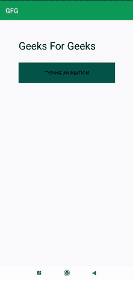

# 安卓中打字动画效果

> 原文:[https://www . geesforgeks . org/打字-动画-安卓特效/](https://www.geeksforgeeks.org/typing-animation-effect-in-android/)

在本文中，我们将实现一个与 TextView 相关的非常重要的特性。此功能可用于在应用程序中显示重要公告或通知。甚至我们可以添加这个功能来为用户显示重要的链接，因为这样可以吸引用户的注意力。所以在这里，我们将学习如何实现这个特性。下面给出了一个 GIF 示例，来了解一下我们将在本文中做什么。注意，我们将使用 **Java** 语言来实现这个项目。



### **分步实施**

**第一步:创建新项目**

要在安卓工作室创建新项目，请参考[如何在安卓工作室创建/启动新项目](https://www.geeksforgeeks.org/android-how-to-create-start-a-new-project-in-android-studio/)。注意选择 **Java** 作为编程语言。

**步骤 2:使用 activity_main.xml 文件**

导航到**应用程序> res >布局> activity_main.xml** 并将下面的代码添加到该文件中。下面是 **activity_main.xml** 文件的代码。

## 可扩展标记语言

```java
<?xml version="1.0" encoding="utf-8"?>
<LinearLayout 
    xmlns:android="http://schemas.android.com/apk/res/android"
    xmlns:tools="http://schemas.android.com/tools"
    android:layout_width="match_parent"
    android:layout_height="match_parent"
    android:layout_margin="20dp"
    android:orientation="vertical"
    android:padding="20dp"
    tools:context=".MainActivity">

    <TextView
        android:id="@+id/typingt"
        android:layout_width="wrap_content"
        android:layout_height="wrap_content"
        android:layout_alignParentTop="true"
        android:layout_centerHorizontal="true"
        android:layout_margin="15dp"
        android:text="Geeks For Geeks"
        android:textColor="@color/black"
        android:textSize="30dp" />

    <Button
        android:id="@+id/typingb"
        android:layout_width="match_parent"
        android:layout_height="wrap_content"
        android:layout_margin="15dp"
        android:background="@color/purple_500"
        android:padding="20dp"
        android:text="Typing Animation" />

</LinearLayout>
```

**第三步:使用****MainActivity.java 文件**

转到**MainActivity.java**文件，参考以下代码。

```java
// Here we are adding the first letter
new Handler().postDelayed(new Runnable() {
                    @Override
                    public void run() {
                        typingt.setText("G");
                    }
                },300);
                // After that we will be appending the next
                // letter after some time interval
                new Handler().postDelayed(new Runnable() {
                    @Override
                    public void run() {
                        typingt.append("e");
                    }
                },400);
```

以下是**MainActivity.java**文件的完整代码。

## Java 语言(一种计算机语言，尤用于创建网站)

```java
import android.os.Bundle;
import android.os.Handler;
import android.view.View;
import android.widget.Button;
import android.widget.TextView;

import androidx.appcompat.app.AppCompatActivity;

public class MainActivity extends AppCompatActivity {

    TextView typingt;
    Button typingb;

    @Override
    protected void onCreate(Bundle savedInstanceState) {
        super.onCreate(savedInstanceState);
        setContentView(R.layout.activity_main);

        typingb = findViewById(R.id.typingb);
        typingt = findViewById(R.id.typingt);

        typingb.setOnClickListener(new View.OnClickListener() {
            @Override
            public void onClick(View v) {
                new Handler().postDelayed(new Runnable() {
                    @Override
                    public void run() {
                        typingt.setText("G");
                    }
                }, 300);
                new Handler().postDelayed(new Runnable() {
                    @Override
                    public void run() {
                        typingt.append("e");
                    }
                }, 400);
                new Handler().postDelayed(new Runnable() {
                    @Override
                    public void run() {
                        typingt.append("e");
                    }
                }, 500);
                new Handler().postDelayed(new Runnable() {
                    @Override
                    public void run() {
                        typingt.append("k");
                    }
                }, 600);
                new Handler().postDelayed(new Runnable() {
                    @Override
                    public void run() {
                        typingt.append("s");
                    }
                }, 700);
                new Handler().postDelayed(new Runnable() {
                    @Override
                    public void run() {
                        typingt.append("f");
                    }
                }, 800);
                new Handler().postDelayed(new Runnable() {
                    @Override
                    public void run() {
                        typingt.append("o");
                    }
                }, 900);
                new Handler().postDelayed(new Runnable() {
                    @Override
                    public void run() {
                        typingt.append("r");
                    }
                }, 1000);
                new Handler().postDelayed(new Runnable() {
                    @Override
                    public void run() {
                        typingt.append("G");
                    }
                }, 1100);
                new Handler().postDelayed(new Runnable() {
                    @Override
                    public void run() {
                        typingt.append("e");
                    }
                }, 1200);
                new Handler().postDelayed(new Runnable() {
                    @Override
                    public void run() {
                        typingt.append("e");
                    }
                }, 1300);
                new Handler().postDelayed(new Runnable() {
                    @Override
                    public void run() {
                        typingt.append("k");
                    }
                }, 1400);
                new Handler().postDelayed(new Runnable() {
                    @Override
                    public void run() {
                        typingt.append("s");
                    }
                }, 1500);
            }
        });
    }
}
```

**输出:**

<video class="wp-video-shortcode" id="video-591625-1" width="640" height="360" preload="metadata" controls=""><source type="video/mp4" src="https://media.geeksforgeeks.org/wp-content/uploads/20210410223048/typinganimate.mp4?_=1">[https://media.geeksforgeeks.org/wp-content/uploads/20210410223048/typinganimate.mp4](https://media.geeksforgeeks.org/wp-content/uploads/20210410223048/typinganimate.mp4)</video>