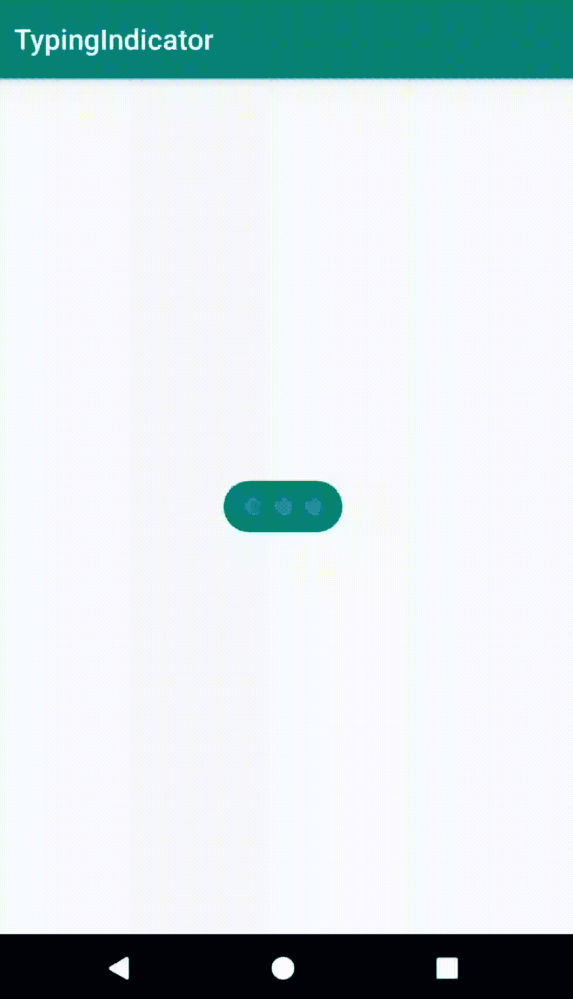

# 安卓中的打字指示灯

> 原文:[https://www.geeksforgeeks.org/typing-indicator-in-android/](https://www.geeksforgeeks.org/typing-indicator-in-android/)

**打字指示器**已经出现在 Instagram、Facebook Messenger 等各种应用程序中。建立一个聊天应用**打字指示器**将有助于实现更好的用户界面。人们也可以在应用程序中创建一个**打字指示器**，但是为此，我们必须为它设计一个布局，并且我们还必须注意指示器动画和指示器之间的色差。所以最好添加一个依赖项，这样可以节省很多时间。



#### 方法

*   **第一步:**在 **[build.gradle](https://www.geeksforgeeks.org/android-build-gradle/)** 文件中添加支持库，并在依赖项部分添加依赖项。

    ```
    implementation 'com.qifan.typingIndicator:typingIndicator:0.1.0'      
    ```

*   **步骤 2:** 在可绘制文件夹中创建**指示器 _background.xml** ，并添加以下代码。

    ## 指示器 _ 背景。xml

    ```
    <?xml version="1.0" encoding="utf-8"?>
    <shape 
        xmlns:android="http://schemas.android.com/apk/res/android"
        android:shape="rectangle">
        <!-- It make the corner round --> 
        <corners android:radius="20dp"/>
        <!-- Add color to the background --> 
        <solid android:color="#ACACAC"/>
    </shape>    
    ```

*   **第三步:**在 **activity_main.xml** 文件中添加以下代码。在该文件中，在布局中添加**聊天指示器视图**，在**聊天指示器视图**的背景中添加**指示器 _ 背景**。

    ## activity _ main . XML

    ```
    <?xml version="1.0" encoding="utf-8"?>
    <androidx.constraintlayout.widget.ConstraintLayout
        xmlns:android="http://schemas.android.com/apk/res/android"
        xmlns:tools="http://schemas.android.com/tools"
        xmlns:app="http://schemas.android.com/apk/res-auto"
        android:layout_width="match_parent"
        android:layout_height="match_parent"
        tools:context=".MainActivity"
        android:orientation="vertical">

        <com.qifan.library.ChatTypingIndicatorView
            android:id="@+id/indicatorView"
            android:layout_width="wrap_content"
            android:layout_height="wrap_content"
            android:minHeight="36dp"
            android:padding="10dp"
            android:background="@drawable/indicator_background"
            app:dotSize="10dp"
            app:layout_constraintBottom_toBottomOf="parent"
            app:layout_constraintLeft_toLeftOf="parent"
            app:layout_constraintRight_toRightOf="parent"
            app:layout_constraintTop_toTopOf="parent"/>

        <Button
            android:id="@+id/button"
            android:layout_width="wrap_content"
            android:layout_height="wrap_content"
            android:layout_marginBottom="192dp"
            android:text="Message Received"
            android:textAllCaps="false"
            app:layout_constraintBottom_toBottomOf="parent"
            app:layout_constraintEnd_toEndOf="parent"
            app:layout_constraintHorizontal_bias="0.498"
            app:layout_constraintStart_toStartOf="parent" />

    </androidx.constraintlayout.widget.ConstraintLayout>
    ```

*   **第四步:**在**MainActivity.java**文件中增加以下代码。在该文件中，将 **`setOnClickListner()`** 添加到隐藏消息指示器的按钮。

    ## MainActivity.java

    ```
    package org.geeksforgeeks.messageIndicator;          

    import android.os.Bundle;
    import android.view.View;
    import android.widget.Button;
    import androidx.annotation.Nullable;
    import androidx.appcompat.app.AppCompatActivity;
    import com.qifan.library.ChatTypingIndicatorView;

    public class MainActivity extends AppCompatActivity {

        Button message;
        ChatTypingIndicatorView indicatorView;

        @Override
        protected void onCreate(@Nullable Bundle savedInstanceState) {
            super.onCreate(savedInstanceState);
            setContentView(R.layout.activity_main);

            message = findViewById(R.id.button);
            indicatorView = findViewById(R.id.indicatorView);

            // whenever user clicks on the Message Received 
            // button this function get invoked 
            // automaicaly.
            message.setOnClickListener(
                    new View.OnClickListener() {
                @Override
                public void onClick(View v) {
                    // hide the indicator view
                    indicatorView.setVisibility(
                                  View.INVISIBLE);
                }
            });
        }
    }
    ```

    #### 输出:在模拟器上运行

    <video class="wp-video-shortcode" id="video-460691-1" width="320" height="540" preload="metadata" controls=""><source type="video/mp4" src="https://media.geeksforgeeks.org/wp-content/uploads/20200719214952/Record_2020-07-19-21-19-36_69fa71ed7e998de6cab47c8740bea3c11.mp4?_=1">[https://media.geeksforgeeks.org/wp-content/uploads/20200719214952/Record_2020-07-19-21-19-36_69fa71ed7e998de6cab47c8740bea3c11.mp4](https://media.geeksforgeeks.org/wp-content/uploads/20200719214952/Record_2020-07-19-21-19-36_69fa71ed7e998de6cab47c8740bea3c11.mp4)</video>