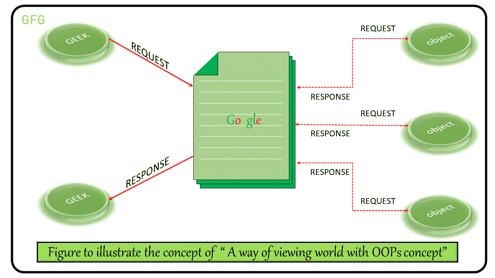
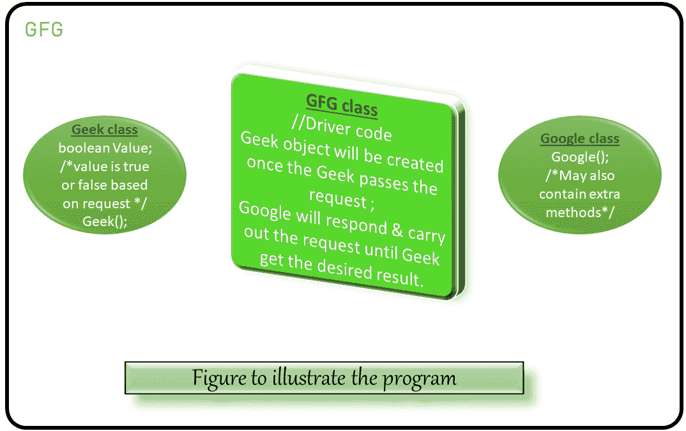

# 使用真实世界场景理解 OOPs 和抽象

> 原文:[https://www . geesforgeks . org/understanding-oops-and-abstraction-use-real-world-scenario/](https://www.geeksforgeeks.org/understanding-oops-and-abstraction-using-real-world-scenario/)

**面向对象编程:**顾名思义，[面向对象编程或 OOPs](https://www.geeksforgeeks.org/object-oriented-programming-oops-concept-in-java/) 是指在编程中使用对象的语言。面向对象编程的目标是在编程中实现真实世界的实体，如继承、隐藏、多态等。在本文中，我们将讨论这个面向对象的概念是如何在现实场景中实现的。

让我们考虑一个极客想要在线学习 [Java](https://www.geeksforgeeks.org/java/) 完整课程的例子。他选择其中一个来源来了解提供 Java 课程的各种平台。假设他选择谷歌，他搜索课程。一旦谷歌接受了请求，它将执行各种动作来执行请求，直到请求被送达。下图演示了执行的步骤:

[](https://media.geeksforgeeks.org/wp-content/uploads/20200509213119/A-way-of-viewing-world-with-OOPs-concept.png)

下面是演示类的实现，演示了上图中提到的步骤:

```
// Java Program to demonstrate
// the above steps

// Here, Geek is a class
class Geek {

    // Until no request the
    // value will be false
    boolean value = false;

    private String request = "";

    // Constructor of Geek
    Geek(String request)
    {
        // The value becomes true
        // once the constructor called
        // or when the object created
        value = true;

        this.request = request;

        System.out.println(
            "Geek Requested: "
            + request);
    }

    public String getRequest()
    {
        return this.request;
    }
}

// A google class
class Google {

    private String request;

    // Constructor of Google
    Google(String request)
    {
        this.request = request;
        System.out.println(
            "Google Searched: "
            + request);
    }

    // This class may also contains methods
    // through which the request passes
    // messages to further more objects
    // and also send back a response
}

// Demo class to understand
// A way of using abstraction
public class MainDemo2 {

    // Driver code
    public static void main(String[] args)
    {
        // Geek class object creation
        Geek g = new Geek("Java");

        // Checking whether Geek
        // has requested or not
        if (g.value) {

            // If the Geek requested
            // Google object created
            Google gl = new Google(g.getRequest());

            // Google performs some action
            // To satisfy the Geek with his
            // Desired result
        }
    }
}
```

**Output:**

```
Geek Requested: Java
Google Searched: Java

```

**上述程序的说明图:**
[](https://media.geeksforgeeks.org/wp-content/uploads/20200509220432/Program3.png)

从上面的例子中，让我们理解[面向对象设计](https://www.geeksforgeeks.org/oops-object-oriented-design/)中使用的不同术语:

1.  **Agents and Community:**
    1.  **agent:** 社区中的每个对象都充当一个 Agent(即从上面的例子中，我们可以说 Geek、Google 以及其他多余的对象都被称为 Agent。每个代理都执行一些操作，这些操作被社区的其他成员用来解决问题。
    2.  **社群:**由行动创造。在上面的例子中，我们可以说搜索引擎社区已经形成。

    因此，在上面的例子中:

    ```
    Agents: Geek, Google, and other objects
    Community: Search engine community

    ```

2.  **信息和方法:**
    1.  **消息:**每条消息都可能是正在传递给社区其他成员的请求或响应。
    2.  **方法**每个方法都是用来在社区中执行一个动作，那个动作会被社区的其他成员用来解决各种问题。
3.  **职责:**从上面的例子中，我们可以观察到，一旦 Geek 向 Google 传递了一个请求，它就会接受这个请求，并执行各种动作来给他想要的结果。这意味着如果请求被代理接受，则代理有责任执行请求，直到问题得到解决。

最后，我们可以得出结论，我们已经通过实现系统来实现数据的隐藏或，当极客传递请求时，谷歌执行的操作对他来说是隐藏的，以获得期望的结果。