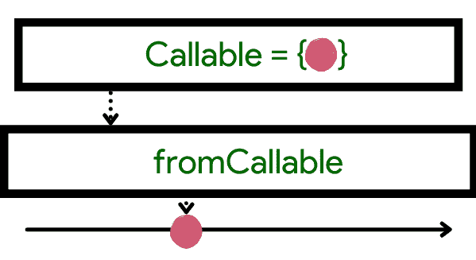

# 理解 RxJava 创建和 fromCallable 运算符

> 原文:[https://www . geesforgeks . org/understanding-rxjava-create-and-from callable-operator/](https://www.geeksforgeeks.org/understanding-rxjava-create-and-fromcallable-operator/)

在本文中，我们将学习 **RxJava** Create 和 fromCallable 运算符。我们可以根据所需技能在所需功能之间进行选择。我们经常在使用 RxJava 操作符时出错。让我们直说吧，这样我们就不会出错了。

**结合实例，我们来学习以下操作。**

*   创造
*   fromcallabel

### **1。创建**

应该创建 RxJava 操作符。


**图像 1。**RxJava 运算符。

**构建运算符:**使用函数从头开始创建一个可观察值。

使用创建操作符，我们可以完成一项工作，并一个接一个地发出值，直到操作完成。

**我们来看一个例子:**

## Java 语言(一种计算机语言，尤用于创建网站)

```
Observable.create<String> { shooter ->
    // do something
    if (!shooter.isDisposed) {
        shooter.onNext("GeeksforGeeks")
    }
    // do and emit
    if (!shooter.isDisposed) {
        shooter.onNext("GfG")
    }
    // on finish
    if (!shooter.isDisposed) {
        shooter.onComplete()
    }
}
.subscribeOn(Schedulers.io())
.subscribe { item ->
    Log.d("Android", "item : $item")
}
```

**输出:**

```
"GeeksforGeeks" "GfG"
```

这个操作符从零开始创建一个可观察值，但是即使在那之后，它一次只能拍摄一个项目，因此它返回一个项目！



图二。可调用的。

## Java 语言(一种计算机语言，尤用于创建网站)

```
Observable.fromCallable<String> {
    // perform a task and then return
    return@fromCallable "Geeks for Geeks"
}
```

**输出:**

```
Geeks for Geeks
```

这并不意味着 fromCallable 等同于 Single。我们将在以后看到它真正的变化。他们两个都将继续推迟行动，除非他们做一些观察。这意味着它使任务变得“懒惰”

因此，以下是创建和从可调用操作符之间的主要区别:

1.  Create 可以产生几个东西，而 fromCallable 只能产生一个。
2.  没有简单的方法可以看出 fromCallable 中的**是否像在 Create 中一样存在。因此，如果它在一个项目被处理掉之后触发它，那么这个可抛出的项目将被处理到全局错误处理程序中。这意味着申请将被终止。**

### 结论

我们可以在这里使用 RxJava Create 来解决这个问题，希望这篇文章能消除任何可能出现的疑问，并消除知识的迷雾。