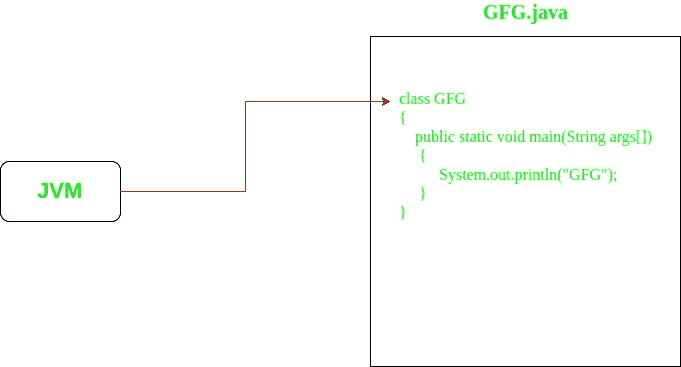
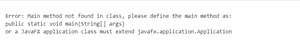

# 理解 Java 中“公共静态虚空主”中的“静态”

> 原文:[https://www . geesforgeks . org/understanding-static-in-public-static-void-main-in-Java/](https://www.geeksforgeeks.org/understanding-static-in-public-static-void-main-in-java/)

以下几点说明了 main()方法中什么是“静态”:

*   **main()方法**:main()方法，在 Java 中是 JVM(Java Virtual Machine)进入 Java 程序的入口点。JVM 通过调用 main()方法启动 java 程序。



*   [Static 是一个关键词](https://www.geeksforgeeks.org/static-keyword-java/)。在任何实体之前添加静态的作用是使该实体成为类实体。这意味着在方法和变量之前添加静态使它们分别成为类方法和类变量，而不是实例方法和实例变量。
    因此，静态方法和变量可以在类的帮助下直接访问，这意味着不需要创建对象来访问静态方法或变量。

```java
// Making a function as static
static void func()
{}

// Making a variable as static
static int var;

```

*   [**静态方法:**](https://www.geeksforgeeks.org/static-methods-vs-instance-methods-java/) 用 Static 关键字声明一个方法时，称为静态方法。如上所述，任何静态成员都可以在创建其类的任何对象之前被访问，并且不引用任何对象。

```java
// Making a static function
class GfG
{
    static void func()
    {}
}

// Calling a static function
GfG.func();

```

*   **Static main()方法:**在 main()方法的函数定义中加入 Static 关键字时，则称为 Static main()方法。

```java
class GfG
{
    // Making a static main function
    public static void main(String[] args)
    {}
}

```

**main()方法中需要静态**:由于 main()方法是任何 Java 应用程序的入口点，因此将 main()方法设为静态是强制性的，原因如下:

*   静态 main()方法让 JVM 调用它**来启动 Java 应用程序**非常清楚。否则，需要为每个 Java 应用程序构建指定入口函数，以便 JVM 启动应用程序。
*   该方法是静态的，因为否则会有**模糊不清**应该调用哪个构造函数。
    举例，如果班级长这样:

```java
public class GfG{
  protected GfG(int g){}
  public void main(String[] args){
  }
}

```

*   JVM 现在进入模糊状态，决定是否应该调用新的 GfG(int)？如果是，那么 g 应该传递什么？如果没有，那么 JVM 应该实例化 GfG 而不执行任何构造函数方法吗？
    像这样的边缘情况和歧义太多了，JVM 在调用入口点之前必须实例化一个类是没有意义的。这就是为什么 main 是静态的。
*   main()方法是静态的，因为它对 JDK 很方便。考虑一个场景，在这个场景中，main()方法不是强制静态的。那么在这种情况下，这就使得各种 IDEs 更难自动检测项目中的“可启动”类。因此，将条目方法“main()”设置为“public static void main(String[]args)”是很方便的。

**如果我们不在主方法之前写“静态”呢:**如果我们不在主方法之前写“静态”，那么我们的程序将被编译而没有任何编译错误。但是在执行时，JVM 搜索主方法，它是公共的、静态的，以返回类型和字符串数组作为参数。如果没有找到这样的方法，那么在运行时会产生一个错误。

## Java 语言(一种计算机语言，尤用于创建网站)

```java
/*package whatever //do not write package name here */

import java.io.*;

class GFG {
    public void main (String[] args) {
        System.out.println("GFG!");
    }
}
```

**输出:**将显示如下错误信息

