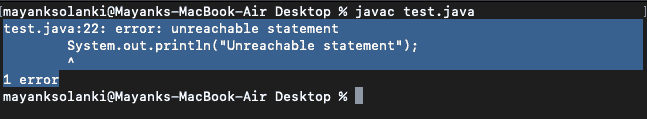

# 在 Java 中使用最终和非最终变量的不可达语句

> 原文:[https://www . geesforgeks . org/reachable-statement-use-final-and-non-final-variable-in-Java/](https://www.geeksforgeeks.org/unreachable-statement-using-final-and-non-final-variable-in-java/)

Java 中的不可达语句是指那些在程序执行过程中不会被执行的语句集，称为不可达语句。这些语句可能无法到达，原因如下:

*   他们面前有一份申报表
*   在他们面前有一个无限循环
*   在他们面前，死刑被强行终止

**例 1**

## Java 语言(一种计算机语言，尤用于创建网站)

```java
// Java program to Illustrate Unreachable Statement
// Throwing Exception
// Using Final Variable

// Class 1
// Main class
class UnreachableUsingFinal {

    // Declaring and initializing final variable
    final int a = 14, b = 16;

    // Method of this class
    void compare()
    {

        // Checking if number is lesser or not
        while (a < b) {

            // First print statement
            System.out.println(
                "Hello i am in infinite loop");

            // last print statement, in this case
            // unreachable
            System.out.println("Unreachable statement");
        }
    }
}

// Class 2
// Main class
class GFG {

    // Main driver method
    public static void main(String args[])
    {

        // Creating object of class 1 inside main()
        UnreachableUsingFinal uuf
            = new UnreachableUsingFinal();

        // Calling the method of class 1
        uuf.compare();
    }
}
```

**输出:**



**输出解释:**

这是因为语句*‘system . out . println(“不可达语句”)，*永远不会被执行，java 不支持不可达语句。将这些变量[设为最终的](https://www.geeksforgeeks.org/java-gq/final-keyword-gq/)也将它们设为**常量变量**，在 java 或任何其他编程语言中，常量变量的值都不能更改。因此，在程序的整个生命周期中，while 循环不会出现任何条件。
这又使得第二条语句不可达，即 JVM 在程序生命周期内无法到达该语句。所以，它给出了一个“不可达语句”错误。在这里，如果从编码的角度来看，程序是正确的，但是 JVM 实际上认为，如果在任何情况下一条语句没有被执行，那么使用该语句的需求是什么？所以，尽量避免这种情况。

**上面的 syso 语句被注释了怎么办？**

极客你可能同样想知道，如果它被注释掉或删除，那么预期的输出会是什么。是的，你是对的，持有并思考它，因为所需的代码也将满足包含不可达语句的条件。程序如下所示:

**例 2**

## Java 语言(一种计算机语言，尤用于创建网站)

```java
// Java program to Illustrate Unreachable Statement
// Running Into Infinite Loop
// Using Final Variable

// Class 1
// Main class
class UnreachableUsingFinal {

    // Declaring and initializing final variable
    final int a = 14, b = 16;

    // Method of this class
    void compare()
    {

        // Checking if number is lesser or not
        while (a < b) {

            // First print statement
            System.out.println(
                "Hello i am in infinite loop");
        }
    }
}

// Class 2
// Main class
class GFG {

    // Main driver method
    public static void main(String args[])
    {

        // Creating object of class 1 inside main()
        UnreachableUsingFinal uuf
            = new UnreachableUsingFinal();

        // Calling the method of class 1
        uuf.compare();
    }
}
```

**输出:**

<video class="wp-video-shortcode" id="video-218520-1" width="640" height="360" preload="metadata" controls=""><source type="video/mp4" src="https://media.geeksforgeeks.org/wp-content/uploads/20210824090912/unreachable_infinite.mp4?_=1">[https://media.geeksforgeeks.org/wp-content/uploads/20210824090912/unreachable_infinite.mp4](https://media.geeksforgeeks.org/wp-content/uploads/20210824090912/unreachable_infinite.mp4)</video>

**如果最后一个关键字本身被去掉了怎么办？**

**例 3**

## Java 语言(一种计算机语言，尤用于创建网站)

```java
// Java program to Illustrate unreachable Statement
// Without using final variable

// Class 1
// Helper class
class UnreachableWithoutUsingFinal {

    // Initialisation of variable
    int a = 14, b = 16;

    // Method of this class
    void compare()
    {

        // Checking if two numbers are equal or not
        while (a < b) {

            // First print statement
            System.out.println(
                "Hello i am in infinite loop");
        }

        // Last print statement, in this case reachable
        System.out.println("Unreachable statement");
    }
}

// Class 2
// Main class
class GFG {

    // Main driver method
    public static void main(String args[])
    {

        // Creating object of class 1
        UnreachableWithoutUsingFinal uwuf
            = new UnreachableWithoutUsingFinal();

        // Calling method of class 1
        uwuf.compare();
    }
}
```

**输出:**

<video class="wp-video-shortcode" id="video-218520-2" width="640" height="360" preload="metadata" controls=""><source type="video/mp4" src="https://media.geeksforgeeks.org/wp-content/uploads/20210824090912/unreachable_infinite.mp4?_=2">[https://media.geeksforgeeks.org/wp-content/uploads/20210824090912/unreachable_infinite.mp4](https://media.geeksforgeeks.org/wp-content/uploads/20210824090912/unreachable_infinite.mp4)</video>

**输出解释:**

在这里，一件有趣的事情发生了。删除最后一个关键字会打印输出。但是在这种情况下，最后一个 print 语句也是不可到达的。
因此，在程序中有可能将变量声明为**非最终变量。**所以，这些变量的值可以在程序中改变。JVM 认为在任何时间点都有可能改变 a 和 b 的值，最后一条语句可能会被执行，所以第二个程序不会出错。这意味着第二个程序遇到了无限循环，但有机会(因为变量被声明为非最终的)循环可能会终止，最后一条语句可能会被执行。

> **注意:**在第二个程序中，当执行时，输出将是 TLE，因为 while 循环没有终止。