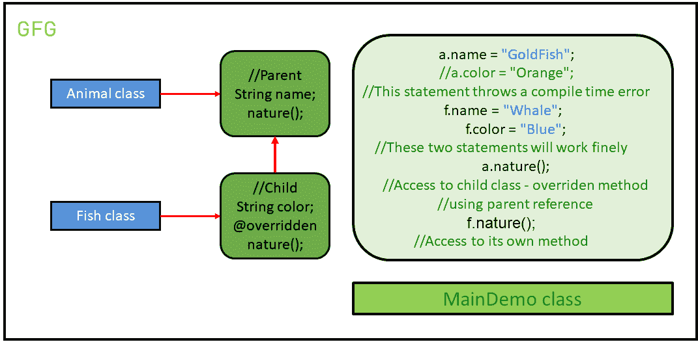

# 用示例在 Java 中向上转换

> 原文:[https://www . geeksforgeeks . org/upcasting-in-Java-with-examples/](https://www.geeksforgeeks.org/upcasting-in-java-with-examples/)

[继承](https://www.geeksforgeeks.org/inheritance-in-Java/)是 [OOP(面向对象编程)](https://www.geeksforgeeks.org/object-oriented-programming-oops-concept-in-Java/)的重要支柱。这是 Java 中允许一个类继承另一个类的特性([字段](https://www.geeksforgeeks.org/what-is-the-difference-between-field-variable-attribute-and-property-in-java/)和[方法](https://www.geeksforgeeks.org/methods-in-java/))的机制。

继承父类和子类的属性时，有两种方法可以初始化对象。它们是:

1.  **Child c = new Child():** 这个初始化的用途是访问父类和子类中存在的所有成员，因为我们正在继承属性。
2.  **Parent p = new Child():** 这种类型的初始化仅用于访问父类中存在的成员和子类中被覆盖的方法。这是因为父类被向上转换为子类。

<u>**什么是上播？**</u>
上推是将子对象的 **[类型化为父对象的](https://www.geeksforgeeks.org/type-conversion-java-examples/)。向上转换可以隐式完成。Upcasting 为我们提供了访问父类成员的灵活性，但是使用这个特性不可能访问所有的子类成员。我们可以访问子类的一些指定成员，而不是所有成员。例如，我们可以访问[被覆盖的方法](https://www.geeksforgeeks.org/overriding-in-java/)。**

**例:**设**动物**类。可以有许多不同种类的动物。其中一类就是**鱼**。所以，让我们假设**鱼类扩展了动物类**。因此，在这种情况下，这两种继承方式被实现为:

让我们理解下面的代码来找出区别:

```
// Java program to demonstrate
// the concept of upcasting

// Animal Class
class Animal {

    String name;

    // A method to print the
    // nature of the class
    void nature()
    {
        System.out.println("Animal");
    }
}

// A Fish class which extends the
// animal class
class Fish extends Animal {

    String color;

    // Overriding the method to
    // print the nature of the class
    @Override
    void nature()
    {
        System.out.println("Aquatic Animal");
    }
}

// Demo class to understand
// the concept of upcasting
public class GFG {

    // Driver code
    public static void main(String[] args)
    {
        // Creating an object to represent
        // Parent p = new Child();
        Animal a = new Fish();

        // The object 'a' has access to
        // only the parent's properties.
        // That is, the colour property
        // cannot be accessed from 'a'
        a.name = "GoldFish";

        // This statement throws
        // a compile-time error
        // a.color = "Orange";

        // Creating an object to represent
        // Child c = new Child();
        Fish f = new Fish();

        // The object 'f' has access to
        // all the parent's properties
        // along with the child's properties.
        // That is, the colour property can
        // also be accessed from 'f'
        f.name = "Whale";
        f.color = "Blue";

        // Printing the 'a' properties
        System.out.println("Object a");
        System.out.println("Name: " + a.name);

        // This statement will not work
        // System.out.println("Fish1 Color" +a.color);

        // Access to child class - overriden method
        // using parent reference
        a.nature();

        // Printing the 'f' properties
        System.out.println("Object f");
        System.out.println("Name: " + f.name);
        System.out.println("Color: " + f.color);
        f.nature();
    }
}
```

**Output:**

```
Object a
Name: GoldFish
Aquatic Animal
Object f
Name: Whale
Color: Blue
Aquatic Animal

```

**程序示意图:**

[](https://media.geeksforgeeks.org/wp-content/uploads/20200503053045/illustration2.png)

*   从上面的例子可以清楚地理解，我们不能使用父类引用来访问子类成员，即使它是子类型的。即:

    ```
    // This statement throws
    // a compile-time error
    a.color = "Orange";

    ```

*   从上面的例子中，我们还可以观察到，我们能够使用同一个父类引用对象来访问父类成员和子类的重写方法。即:

    ```
    // Access to child class
    // overridden method 
    a.nature();

    ```

*   因此，我们可以得出结论，使用这两种不同语法的主要目的是在访问类中的各个成员时获得变化。