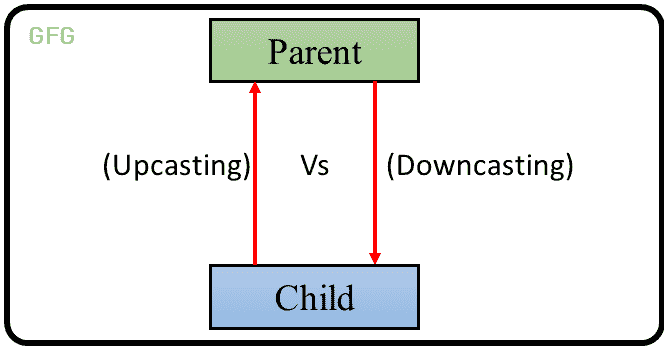
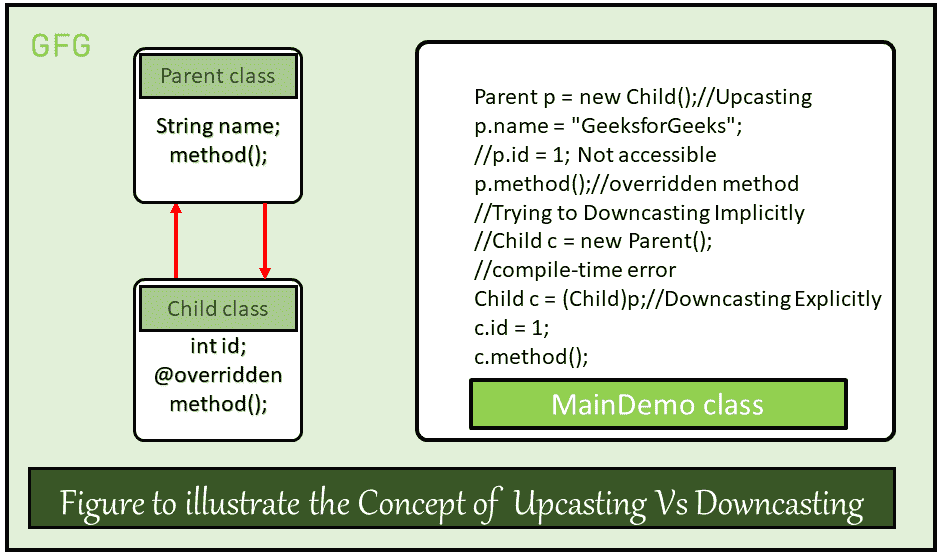

# Java 中的向上转换与向下转换

> 原文:[https://www . geesforgeks . org/up casting-vs-down casting-in-Java/](https://www.geeksforgeeks.org/upcasting-vs-downcasting-in-java/)

类型转换是最重要的概念之一，它主要处理隐式或显式地将一种数据类型转换为另一种数据类型。本文讨论了对象类型转换的概念。
和数据类型一样，对象也可以进行类型化。然而，在对象中，只有两种类型的对象，即父对象和子对象。因此，对象的类型转换基本上意味着一种类型的对象是另一种类型的子对象或父对象。有两种类型的类型转换。它们是:

1.  **上播:**上播是将子对象的[类型化为父对象的](https://www.geeksforgeeks.org/type-conversion-java-examples/)**。向上转换可以隐式完成。Upcasting 为我们提供了访问父类成员的灵活性，但是使用这个特性不可能访问所有的子类成员。我们可以访问子类的一些指定成员，而不是所有成员。例如，我们可以访问被覆盖的方法。**
2.  ****向下转换:**类似地，向下转换意味着将**父对象类型转换为子对象**。向下转换不能是隐式的。**

**下图说明了向上投射和向下投射的概念:** 

****

****例:**假设有一个父类。一个家长可以有很多孩子。让我们考虑其中一个孩子。子代继承父代的属性。因此，孩子和父母之间存在着“是-是”的关系。因此，孩子可以被隐含地**投射到父母身上**。但是，父代可能会也可能不会继承子代的属性。然而，我们可以强行将父母投射到孩子身上，这就是所谓的**向下投射**。在我们显式定义这种类型的转换之后，编译器会在后台检查这种类型的转换是否可能。如果不可能，编译器抛出 [ClassCastException](https://www.geeksforgeeks.org/built-exceptions-java-examples/) 。
我们来理解下面的代码，了解一下区别:** 

## **Java 语言(一种计算机语言，尤用于创建网站)**

```
// Java program to demonstrate
// Upcasting Vs Downcasting

// Parent class
class Parent {
    String name;

    // A method which prints the
    // signature of the parent class
    void method()
    {
        System.out.println("Method from Parent");
    }
}

// Child class
class Child extends Parent {
    int id;

    // Overriding the parent method
    // to print the signature of the
    // child class
    @Override void method()
    {
        System.out.println("Method from Child");
    }
}

// Demo class to see the difference
// between upcasting and downcasting
public class GFG {

    // Driver code
    public static void main(String[] args)
    {
        // Upcasting
        Parent p = new Child();
        p.name = "GeeksforGeeks";

        //Printing the parentclass name
        System.out.println(p.name);
        //parent class method is overriden method hence this will be executed
        p.method();

        // Trying to Downcasting Implicitly
        // Child c = new Parent(); - > compile time error

        // Downcasting Explicitly
        Child c = (Child)p;

        c.id = 1;
        System.out.println(c.name);
        System.out.println(c.id);
        c.method();
    }
}
```

****Output**

```
GeeksforGeeks
Method from Child
GeeksforGeeks
1
Method from Child
```** 

****上述程序的说明图:**** 

****

****从上面的例子我们可以观察到以下几点:**** 

1.  ****上播语法:**** 

```
Parent p = new Child();
```

1.  **向上转换将在内部完成，由于向上转换，对象只允许访问父类成员和子类指定的成员(被覆盖的方法等)。)但不是所有成员。** 

```
// This variable is not 
// accessible
p.id = 1; 
```

1.  ****向下转换的语法:**** 

```
Child c = (Child)p;
```

1.  **向下转换必须在外部完成，由于向下转换，子对象可以获得父对象的属性。** 

```
c.name = p.name;
i.e., c.name = "GeeksforGeeks"
```