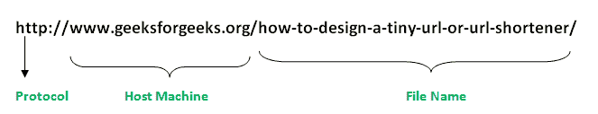

# Java 中的 URL 类，带示例

> 原文:[https://www.geeksforgeeks.org/url-class-java-examples/](https://www.geeksforgeeks.org/url-class-java-examples/)

URL 类是互联网上任何可用资源的网关。类网址代表统一资源定位符，它是指向万维网上“资源”的指针。资源可以指向一个简单的文件或目录，也可以指向一个更复杂的对象，例如对数据库或搜索引擎的查询

**什么是 URL？**
正如你们中的许多人一定知道的那样，统一资源定位符是一串识别互联网上所有资源的文本，告诉我们资源的地址，如何与它通信以及从它那里检索什么。
一个简单的网址看起来像:



**网址的组成部分:-**
网址可以有多种形式。然而最普遍的是三组分体系

1.  **协议:**这里的协议是 HTTP
2.  **主机名:**资源所在机器的名称。
3.  **文件名:**机器上文件的路径名。
4.  **端口号:**要连接的端口号(通常是可选的)。

**URL 类的部分构造函数:-**

1.  **URL(字符串地址)抛出 MalformedURLException:** 它从指定的字符串创建一个 URL 对象。
2.  **URL(字符串协议、字符串主机、字符串文件):**根据指定的协议、主机和文件名创建 URL 对象。
3.  **URL(字符串协议、字符串主机、int 端口、字符串文件):**根据协议、主机、端口和文件名创建 URL 对象。
4.  **URL(URL 上下文，字符串规范):**通过在给定上下文中解析给定规范来创建 URL 对象。

5.  **URL(字符串协议、字符串主机、int 端口、字符串文件、URLStreamHandler 处理程序):-**
    根据指定的协议、主机、端口号、文件和处理程序创建 URL 对象。
6.  **网址(网址上下文、字符串规范、网址流处理程序):-**
    通过在指定的上下文中用指定的处理程序解析给定的规范来创建网址。

**示例程序:**

## Java 语言(一种计算机语言，尤用于创建网站)

```
// Java program to demonstrate working of URL
import java.net.MalformedURLException;
import java.net.URL;

public class URLclass1
{
    public static void main(String[] args)
                  throws MalformedURLException
    {

        // creates a URL with string representation.
        URL url1 =
        new URL("https://www.google.co.in/?gfe_rd=cr&ei=ptYq" +
                "WK26I4fT8gfth6CACg#q=geeks+for+geeks+java");

        // creates a URL with a protocol,hostname,and path
        URL url2 = new URL("http", "www.geeksforgeeks.org",
                         "/jvm-works-jvm-architecture/");

        URL url3 = new URL("https://www.google.co.in/search?"+
                           "q=gnu&rlz=1C1CHZL_enIN71" +
                           "4IN715&oq=gnu&aqs=chrome..69i57j6" +
                           "9i60l5.653j0j7&sourceid=chrome&ie=UTF" +
                           "-8#q=geeks+for+geeks+java");

        // print the string representation of the URL.
        System.out.println(url1.toString());
        System.out.println(url2.toString());
        System.out.println();
        System.out.println("Different components of the URL3-");

        // retrieve the protocol for the URL
        System.out.println("Protocol:- " + url3.getProtocol());

        // retrieve the hostname of the url
        System.out.println("Hostname:- " + url3.getHost());

        // retrieve the default port
        System.out.println("Default port:- " +
                                        url3.getDefaultPort());

        // retrieve the query part of URL
        System.out.println("Query:- " + url3.getQuery());

        // retrieve the path of URL
        System.out.println("Path:- " + url3.getPath());

        // retrieve the file name
        System.out.println("File:- " + url3.getFile());

        // retrieve the reference
        System.out.println("Reference:- " + url3.getRef());
    }
}
```

**输出:**

```
https://www.google.co.in/?gfe_rd=cr&ei=ptYqWK26I4fT8gfth6CACg#q=geeks+for+geeks+java
https://www.geeksforgeeks.org/jvm-works-jvm-architecture/

Different components of the URL3-
Protocol:- https
Hostname:- www.google.co.in
Default port:- 443
Query:- q=gnu&rlz=1C1CHZL_enIN714IN715&oq=gnu&aqs=chrome..69i57j69i60l5.653j0j7&sourceid=chrome&ie=UTF-8
Path:- /search
File:- /search?q=gnu&rlz=1C1CHZL_enIN714IN715&oq=gnu&aqs=chrome..69i57j69i60l5.653j0j7&sourceid=chrome&ie=UTF-8
Reference:- q=geeks+for+geeks+java
```

上述程序中使用的一些方法解释如下

1.  **公共字符串 toString():** 与任何类一样，toString()返回给定 URL 对象的字符串表示形式。
2.  **public String getAuthority():**返回 URL 的权限部分，如果为空则返回 null。
3.  **public String getPath():** 返回 URL 的路径，如果为空则返回 null。
4.  **public String getQuery():** 返回 URL 的查询部分。查询是“？”后面的部分在网址中。每当使用逻辑显示结果时，URL 中都会有一个查询字段。这类似于查询数据库。
5.  **公共字符串 getHost():** 以 IPv6 格式返回 URL 的主机名。
6.  **public String getFile():** 返回文件名。
7.  **公共字符串 getRef():** 返回 URL 对象的引用。通常，引用是 URL 中用“#”标记的部分。您可以通过在谷歌上查询任何内容并看到“#”后的部分来查看工作示例。
8.  **public int getPort():** 返回与 URL 指定的协议关联的端口。
9.  **public int getDefaultPort:** 返回使用的默认端口。
10.  **public String getProtocol():**返回 URL 使用的协议。

**参考文献**
[http://docs . Oracle . com/javase/7/docs/API/Java/net/URL . html # getAuthority()](http://docs.oracle.com/javase/7/docs/api/java/net/URL.html#getAuthority())
本文由 **Rishabh Mahrsee** 供稿。如果你喜欢 GeeksforGeeks 并想投稿，你也可以用[write.geeksforgeeks.org](https://write.geeksforgeeks.org)写一篇文章或者把你的文章邮寄到 review-team@geeksforgeeks.org。看到你的文章出现在极客博客主页上，帮助其他极客。
如果发现有不正确的地方，或者想分享更多关于上述话题的信息，请写评论。