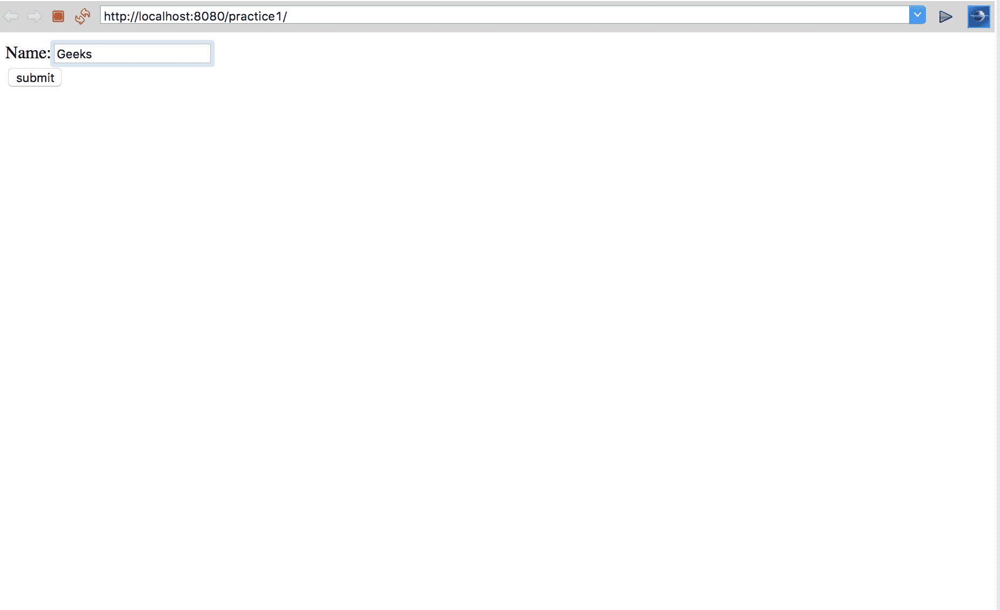
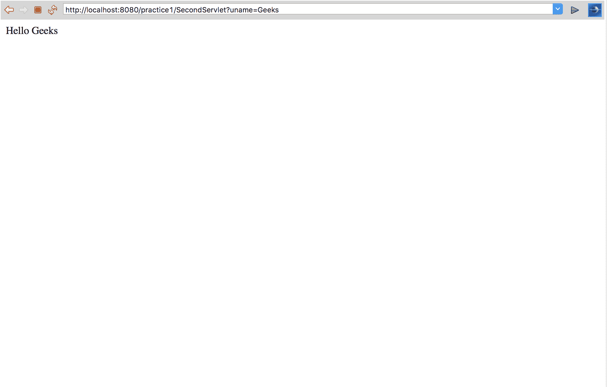
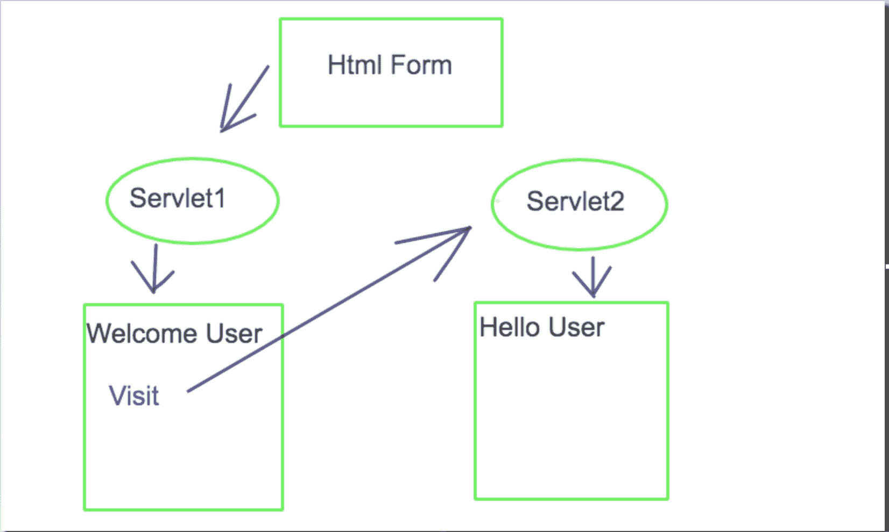

# 使用 Java Servlet 重写 URL

> 原文:[https://www . geesforgeks . org/URL-重写-使用-java-servlet/](https://www.geeksforgeeks.org/url-rewriting-using-java-servlet/)

Url 重写是在加载页面时附加或修改任何 url 结构的过程。

客户端发出的请求始终是新请求，服务器无法识别当前请求是由新客户端发送的，还是由以前的同一客户端发送的。由于 HTTP 协议的这一特性，网络服务器被称为无状态服务器。但是很多时候我们应该知道谁是处理请求的客户。
**例如:**
在任何社交网站登录到注销期间，服务器都应该知道谁是客户端，以便服务器可以根据用户需求管理所有请求。
这个问题由 Servlet 中的 Session 解决。

**Session :** Session 是客户端和服务器之间的一种状态，它包含客户端和服务器之间的多个请求和响应。我们知道 HTTP 和 Web Server 都是无状态的，维护会话的唯一方法是在每个请求和响应中，在服务器和客户端之间传递一些关于会话的唯一信息(会话 id)。

**以下是我们在请求和响应中提供唯一 id 的一些方法:**

*   [Servlet 中的会话接口](https://www.geeksforgeeks.org/the-httpsession-interface-in-servlet/)*   [饼干管理](https://www.geeksforgeeks.org/cookies-used-website/)*   URL Rewriting

    **网址改写**

    如果您的浏览器不支持 cookies，URL 重写将为您提供另一种会话跟踪替代方案。网址重写是一种修改请求的网址以包含会话标识的方法。有几种方法可以执行网址重写。
    这里我们讨论会话管理技术，其中我们将控制从一个 servlet 传递到另一个 servlet。将控制从一个 servlet 传递到另一个 servlet 的语法如下

    ```
    // SecondServlet is the name of the servlet where you want to pass control
    out.print("<a href='SecondServlet?uname=" + n + "'>visit</a>");
    ```

    **注意:**通常我们为请求调度器编写 web.xml 文件，但是在这个例子中我们使用了注释，所以他们不需要创建 web.xml 文件。

    注释的语法是:

    ```
    @WebServlet("/ServletName") // at the place of ServletName 
    we have to write the name of our servlet file and this annotation 
    should be written at the starting of class in servlet.
    ```

    **使用注释的 URL 重写进行会话跟踪的示例**

    ```
    <!-- Save this file as Index.html -->
    <!DOCTYPE html>
    <html>
    <head>
    <meta charset="UTF-8">
    <title>Insert title here</title>
    </head>
    <body>
    <form action="FirstServlet" method="get">  
    Name:<input type="text" name="userName"/><br/>  
    <input type="submit" value="submit"/>  
    </form>  
    </body>
    </html>
    ```

    

    ```
    // Name this file as FirstServlet.java
    package GeeksforGeeks;
    import java.io.*;
    import javax.servlet.*;
    import javax.servlet.annotation.WebServlet;
    import javax.servlet.http.*;
    @WebServlet("/FirstServlet") // annotation

    // this annotation is used for replacing xml file
    public class FirstServlet extends HttpServlet {

        // class name is FirstServlet which extends HttpServlet
        public void doGet(HttpServletRequest request, HttpServletResponse response)
        {
            try {
                response.setContentType("text/html");
               /* The response's character encoding is only set 
    from the given content type if this method 
    is called before getWriter is called. 
    This method may be called repeatedly to 
    change content type and character encoding.*/
                PrintWriter out = response.getWriter();

                /*T he Java PrintWriter class ( java.io.PrintWriter ) enables you to 
              write formatted data to an underlying Writer . 
             For instance, writing int, long and other primitive data
              formatted as text, rather than as their byte values*/
                String n = request.getParameter("userName");

    //request.getParameter takes the value from index.html file
      // where name is username
                out.print("Welcome " + n);

    // out.println is used to print on the client web browser

     //url rewriting is used for creating session 
    //       it will redirect  you to SecondServlet page
                out.print("<a href='SecondServlet?uname=" + n + "'>visit</a>");

                out.close();
            }
            catch (Exception e) {
                System.out.println(e);
            }
        }
    }
    ```

    

    ```
    // Name this file as SecondServlet.java
    package GeeksforGeeks;

    import java.io.*;
    import javax.servlet.*;
    import javax.servlet.annotation.WebServlet;
    import javax.servlet.http.*;

    @WebServlet("/SecondServlet") // annotation
    public class SecondServlet extends HttpServlet {

        public void doGet(HttpServletRequest request, HttpServletResponse response)
        {
            try {

                response.setContentType("text/html");
                /*
                 * The response's character encoding is only set from the given
                 * content type if this method is called before getWriter is called.
                 * This method may be called repeatedly to change content type and
                 * character encoding.
                 */
                PrintWriter out = response.getWriter();
                /*
                 * The Java PrintWriter class ( java.io.PrintWriter ) enables you to
                 * write formatted data to an underlying Writer . For instance,
                 * writing int, long and other primitive data formatted as text,
                 * rather than as their byte values
                 */
                // getting value from the query string
                String n = request.getParameter("uname");
                out.print("Hello " + n);
                /* out.println is used to print on the client web browser */
                out.close();
            }
            catch (Exception e) {
                System.out.println(e);
            }
        }
    }
    ```

    
    **程序流程**
    

    **解释(跟随图表)**
    当你在 eclipse 中部署你的项目时，第一个页面被加载到 HTML 表单中，其表单动作是第一个 servlet，因此控件将转到 servlet1。在这种情况下，我们将 servlet1 命名为 FirstServlet，在这里打印用户名。在 FirstServlet 中，我们提供了一个 url，在这里我们使用 url 重写将控制转移到 servlet2。在我们的例子中，我们将 servlet2 命名为 SecondServlet。
    **网址改写优势:**

    *   它不依赖于 cookies，无论 cookies 是被启用还是被禁用，它都会工作
    *   并非所有页面都需要额外的表单提交

    **网址重写的缺点**
    它只适用于只能发送文本的链接广告