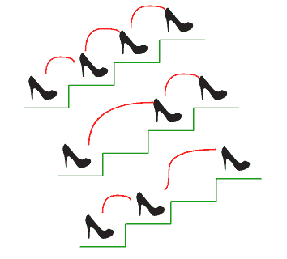
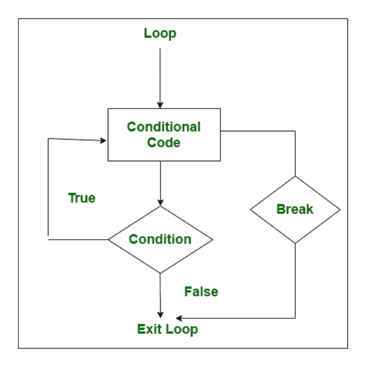

# Break 关键字在 Java 中的用法

> 原文:[https://www . geeksforgeeks . org/usage-of-break-keyword-in-Java/](https://www.geeksforgeeks.org/usage-of-break-keyword-in-java/)

**Break** 关键字常用于循环控制结构和 switch 语句内部。它用于在 java 中终止循环和切换语句。当在循环中遇到 break 关键字时，循环立即终止，程序控制转到循环后的下一条语句。在嵌套循环中使用 break 关键字时，只有内部循环会终止。即使它与 if 语句一起使用，在满足特定条件时终止。

break 关键字在 switch 语句中有特殊用法。switch 语句中的每个案例后面都有一个 break 关键字，这样每当程序控件跳转到下一个案例时，它就不会执行后续的案例。

现实生活插图:



> 考虑一个人爬楼梯。现在这里的红线描绘的是他/她的鞋子滑落的楼梯，他/她滚回底部。记住，如果他/她滑倒了，他/她将永远在基地着陆。
> 
> 在编程语言的计算机中，有一个名为“break”的关键字，它会突然停止在该范围内定义的所有语句的进一步执行。

**语法:**

用分号分隔关键字

```
break;
```

**中断语句流程图**



break 关键字的使用主要出现在循环概念中:

<figure class="table">

| Cycle type | Use the keyword "Break" |
| --- | --- |
| Simple cycle | When the inserted, deleted or updated target is completed, the program itself wants to terminate. |
| [Nested loop] | When the user wants to bring the command from the innermost loop to the outer loop |

</figure>

**情况 1:在 FOR 循环内断开关键字**

以便展示如何在 For 循环中使用 break 关键字。考虑到当' I '的值变为 39 时，break 关键字将发挥其作用并终止 for 循环。结果中会显示 39 之前的所有“I”值。

## Java 语言(一种计算机语言，尤用于创建网站)

```
// Java Program to show use of break statement
// inside the For loop
public class GFG {

    // Main driver code
    public static void main(String[] args)
    {
        // For loop for iteration
        for (int i = 3; i <= 50; i += 3) {
            if (i == 39) {
                // Using Break keyword to suspend
                // loop when i become 39
                break;
            }

            // Printing elements showcasing break usage
            System.out.print(i + " ");
        }
    }
}
```

**输出:**

```
3 6 9 12 15 18 21 24 27 30 33 36 
```

**情况 WHILE 循环内 Break 关键字**

以便展示如何在 While 循环中使用 break 关键字。考虑到当' I '的值变为 15 时，break 关键字将发挥其作用并终止 for 循环。结果中显示所有大于 15 到 35 的“I”值。

## Java 语言(一种计算机语言，尤用于创建网站)

```
// Java Program to illustrate the use of break statement
// inside the While loop

// Importing generic Classes/Files
import java.util.*;

public class GFG {

    // Main driver method
    public static void main(String[] args)
    {
        // While loop for iteration

        // Creating and initializing variable
        // outside loop
        int i = 35;

        // Condition check
        while (i >= 10) {
            if (i == 15) {
                // Using Break keyword to suspend
                // loop when i become 15

                // Decrementing variable initialized above
                i--;

                // Break statement
                break;
            }

            // Printing elements showcasing break
            System.out.print(i + " ");
            i--;
        }
    }
}
```

**输出:**

```
35 34 33 32 31 30 29 28 27 26 25 24 23 22 21 20 19 18 17 16 
```

**情况 3:DO-WHILE 循环内的 Break 关键字**

以便展示如何在 Do-while 循环中使用 break 关键字。考虑到当' I '的值变为 80 时，break 关键字将发挥其作用并终止 for 循环。结果中显示 80 之前的所有 I”值。

## Java 语言(一种计算机语言，尤用于创建网站)

```
// Java Program to illustrate the use of break statement
// Inside the do-While loop

// Importing all generic classes
import java.util.*;

// Importing specific class to take
// user input from the user
import java.util.Scanner;

public class GFG {

    // Main driver method
    public static void main(String[] args)
    {
        // Using do-While loop

        // Creating and initializing a variable
        // over which execution occurs
        int i = 0;

        // do loop consisting of executable statements
        do {
            if (i == 80) {

                // Incrementing variable by 5
                i += 5;

                // Using Break keyword to
                // suspend loop when i become 80
                break;
            }

            System.out.print(i + "  ");
            // Printing elements to show break usage

            i += 5;
        }
        // Condition check
        while (i <= 100);
    }
}
```

**输出:**

```
0  5  10  15  20  25  30  35  40  45  50  55  60  65  70  75
```

**案例四:Switch 语句内的 Break 关键字**

以便展示如何在 For 循环中使用 break 关键字。break 关键字用在每个 switch case 的底部，以终止每个语句序列并防止 switch case 语句的混合。

## Java 语言(一种计算机语言，尤用于创建网站)

```
// Java Program to illustrate the use of break statement
// inside the Switch Statement

// Importing generic Classes/Files
import java.util.*;

public class GFG {

    // Main driver method
    public static void main(String[] args)
    {
        // Declaring a variable for switch expression
        int numb = 20;

        // Switch expression
        switch (numb) {

        // Case statements
        case 10:
            System.out.println("TEN");

            // Break keyword to suspend the switch case
            // if given condition is fulfilled
            break;

        case 20:
            System.out.println("TWENTY");
            break;

        case 30:
            System.out.println("THIRTY");
            break;

            // Default case statement
        default:
            System.out.println("INFINITE");
        }
    }
}
```

**输出:**

```
TWENTY
```