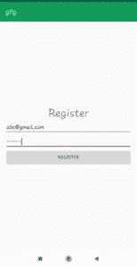
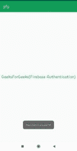
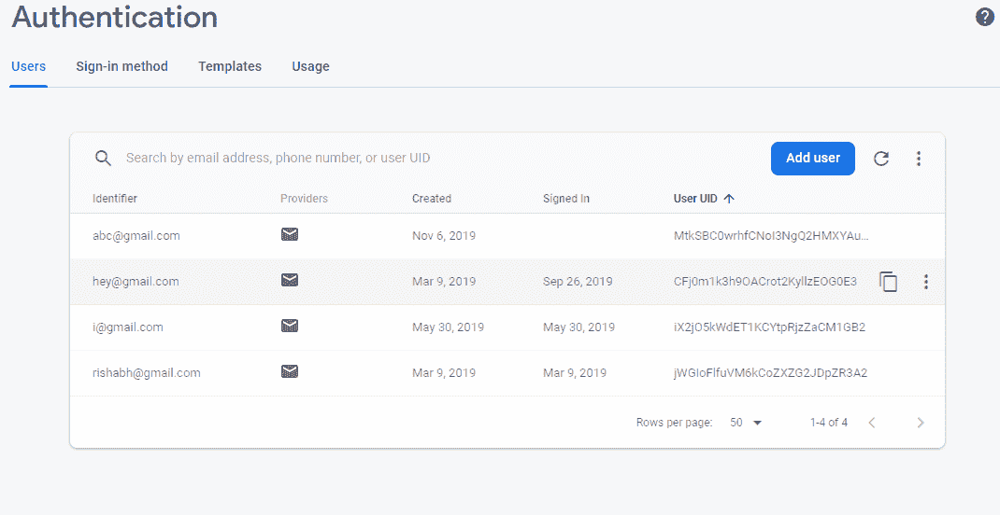
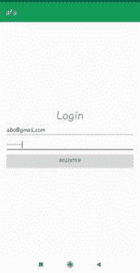

# 安卓中使用 Firebase 的用户认证

> 原文:[https://www . geesforgeks . org/user-authentication-use-firebase-in-Android/](https://www.geeksforgeeks.org/user-authentication-using-firebase-in-android/)

[Firebase](https://www.geeksforgeeks.org/firebase-realtime-database-with-operations-in-android-with-examples/) 是一个移动和 web 应用开发平台。它提供 web 应用程序或移动应用程序可能需要的服务。Firebase 提供电子邮件和密码身份验证，无需为用户身份验证构建后端。

firebase 用户身份验证的步骤如下:

*   **步骤 1:**
    在 android studio 上创建一个新项目，或者打开一个现有项目，在其中添加身份验证，并将 firebase 添加到该 android 应用程序中。添加 firebase 的步骤在以下链接中有很好的解释:
*   **步骤 2:**
    转到 Firebase 控制台()导航到您的应用程序，并在身份验证选项卡下，启用电子邮件/通过身份验证。

*   **第三步:** **活动 _registration.xml**
    这是你的报名活动。它有两个编辑文本，一个文本视图，一个按钮和一个进度条。所有这些视图都包含在垂直方向的线性布局中。编辑文本用于从用户处获取电子邮件和密码。按钮用于填写用户名和密码后注册。
    注册活动(activity_registration)的完整 xml 代码为:

    ## activity _ registration . XML

    ```java
    <?xml version="1.0" encoding="utf-8"?>

    <!-- Linear Layout with vertical orientation and other properties -->
    <LinearLayout
        xmlns:android="http:// schemas.android.com/apk/res/android"
        xmlns:app="http:// schemas.android.com/apk/res-auto"
        xmlns:tools="http:// schemas.android.com/tools"
        android:layout_width="match_parent"
        android:layout_height="match_parent"
        android:gravity="center_vertical"
        android:orientation="vertical"
        android:padding="15dp"
        tools:context=".RegistrationActivity">

        <!-- TextView for heading -->
        <TextView
            android:layout_width="wrap_content"
            android:layout_height="wrap_content"
            android:text="Register" />

        <!-- Edit text for email -->
        <EditText
            android:id="@+id/email"
            android:layout_width="match_parent"
            android:layout_height="wrap_content"
            android:hint="Enter your Email" />

        <!-- Edit text for password -->
        <EditText
            android:id="@+id/passwd"
            android:layout_width="match_parent"
            android:layout_height="wrap_content"
            android:hint="Enter your Password"
            android:inputType="textPassword" />

        <!-- Button for register with text "Register" -->
        <Button
            android:id="@+id/btnregister"
            android:layout_width="match_parent"
            android:layout_height="wrap_content"
            android:text="Register" />

        <!-- ProgressBar for loading time -->
        <ProgressBar
            android:id="@+id/progressbar"
            android:layout_width="wrap_content"
            android:layout_height="wrap_content"
            android:visibility="gone" />
    </LinearLayout>
    ```

    *   **Step 4:** **RegistrationActivity.java**
    *   现在轮到注册活动的 Java 代码了。
    *   在这种情况下，我们有一个一键监听器连接到按钮。单击按钮时，将调用 registerNewUser()。在这种方法中，检查电子邮件和密码参数是否不为空。如果是这种情况，则会显示一条错误消息。如果两个编辑文本都有数据，那么调用 createUserWithEmailAndPassword()方法。
    *   注册新用户**使用 createusewithmailandpassword()**函数，该函数接收两个参数，即您要注册的电子邮件和密码。在 createUserWithEmailAndPassword()方法中，检查任务是否成功。如果任务成功，用户将被引导至主活动或仪表板，否则将显示“注册失败”的吐司消息。
    *   对于用户认证，我们必须参考 FirebaseAuth。我们可以使用 getInstance 函数进行引用。代码片段为:

        ```java
        FirebaseAuth mAuth = FirebaseAuth.getInstance();
        ```

    注册活动的 Java 代码为:

    ## RegistrationActivity.java

    ```java
    package com.geeksforgeeks.firebaseuserauthentication;

    import android.support.v7.app.AppCompatActivity;
    import android.os.Bundle;
    import android.content.Intent;
    import android.view.View;
    import android.widget.Toast;
    import android.widget.EditText;
    import android.widget.TextView;
    import android.widget.Button;

    import com.google.firebase.auth.FirebaseAuth;
    import com.google.firebase.auth.AuthResult;
    import com.google.android.gms.tasks.OnCompleteListener;
    import com.google.android.gms.tasks.Task;

    public class RegistrationActivity extends AppCompatActivity {

        private EditText emailTextView, passwordTextView;
        private Button Btn;
        private ProgressBar progressbar;
        private FirebaseAuth mAuth;

        @Override
        protected void onCreate(Bundle savedInstanceState)
        {
            super.onCreate(savedInstanceState);
            setContentView(R.layout.activity_registration);

            // taking FirebaseAuth instance
            mAuth = FirebaseAuth.getInstance();

            // initialising all views through id defined above
            emailTextView = findViewById(R.id.email);
            passwordTextView = findViewById(R.id.passwd);
            Btn = findViewById(R.id.btnregister);
            progressbar = findViewById(R.id.progressbar);

            // Set on Click Listener on Registration button
            Btn.setOnClickListener(new View.OnClickListener() {
                @Override
                public void onClick(View v)
                {
                    registerNewUser();
                }
            });
        }

        private void registerNewUser()
        {

            // show the visibility of progress bar to show loading
            progressbar.setVisibility(View.VISIBLE);

            // Take the value of two edit texts in Strings
            String email, password;
            email = emailTextView.getText().toString();
            password = passwordTextView.getText().toString();

            // Validations for input email and password
            if (TextUtils.isEmpty(email)) {
                Toast.makeText(getApplicationContext(),
                               "Please enter email!!",
                               Toast.LENGTH_LONG)
                    .show();
                return;
            }
            if (TextUtils.isEmpty(password)) {
                Toast.makeText(getApplicationContext(),
                               "Please enter password!!",
                               Toast.LENGTH_LONG)
                    .show();
                return;
            }

            // create new user or register new user
            mAuth
                .createUserWithEmailAndPassword(email, password)
                .addOnCompleteListener(new OnCompleteListener<AuthResult>() {

                    @Override
                    public void onComplete(@NonNull Task<AuthResult> task)
                    {
                        if (task.isSuccessful()) {
                            Toast.makeText(getApplicationContext(),
                                           "Registration successful!",
                                           Toast.LENGTH_LONG)
                                .show();

                            // hide the progress bar
                            progressBar.setVisibility(View.GONE);

                            // if the user created intent to login activity
                            Intent intent
                                = new Intent(RegistrationActivity.this,
                                             MainActivity.class);
                            startActivity(intent);
                        }
                        else {

                            // Registration failed
                            Toast.makeText(
                                     getApplicationContext(),
                                     "Registration failed!!"
                                         + " Please try again later",
                                     Toast.LENGTH_LONG)
                                .show();

                            // hide the progress bar
                            progressBar.setVisibility(View.GONE);
                        }
                    }
                });
        }
    }
    ```

    *   **第五步:****activity _ log in . XML**
    现在注册活动之后我们要创建登录活动。登录活动的布局类似于注册活动，有两个编辑文本，一个按钮，一个文本视图，标题都包含在垂直方向的线性布局中。下面是 activity_login.xml 的 xml 文件的完整代码:

    ## activity _ log in . XML

    ```java
    <?xml version="1.0" encoding="utf-8"?>
    <!-- Linear Layout with vertical orientation and other properties -->

    <LinearLayout
        xmlns:android="http://schemas.android.com/apk/res/android"
        xmlns:app="http://schemas.android.com/apk/res-auto"
        xmlns:tools="http://schemas.android.com/tools"

        android:layout_width="match_parent"
        android:layout_height="match_parent"
        android:gravity="center_vertical"
        android:orientation="vertical"
        android:padding="15dp"
        tools:context=".LoginActivity">

        <!-- TextView for heading -->
        <TextView
            android:layout_width="wrap_content"
            android:layout_height="wrap_content"
            android:text="Login"/>

        <!-- Edit text for email -->
        <EditText
            android:id="@+id/email"
            android:layout_width="match_parent"
            android:layout_height="wrap_content"
            android:hint="Enter your Email" />

        <!-- Edit text for password -->
        <EditText
            android:id="@+id/password"
            android:layout_width="match_parent"
            android:layout_height="wrap_content"
            android:hint="Enter your Password"
            android:inputType="textPassword" />

        <!-- Button for Login with text "Login" -->
        <Button
            android:id="@+id/login"
            android:layout_width="match_parent"
            android:layout_height="wrap_content"
            android:text="Login" />

        <!-- ProgressBar for Loading Time -->
        <ProgressBar
            android:id="@+id/progressBar"
            android:layout_width="wrap_content"
            android:layout_height="wrap_content"
            android:visibility="gone" />
    </LinearLayout>
    ```

    *   **第 6 步:****【LoginActivity.java】**
    这里的代码与注册活动非常相似，但是对于登录**来说，使用了以电子邮件和密码为参数的登录电子邮件和密码()**功能，如果拥有电子邮件和密码的用户存在，那么您将被重定向到主活动或仪表板。在 signing with email and password()方法中，检查任务是否成功。如果任务成功，则用户被引导至主活动或仪表板，否则带有“登录失败”的 Toast 消息是 displayed.Java 代码，登录活动为:

    ## 【LoginActivity.java】

    ```java
    package com.geeksforgeeks.firebaseuserauthentication;

    import android.support.v7.app.AppCompatActivity;
    import android.os.Bundle;
    import android.content.Intent;
    import android.view.View;
    import android.widget.Toast;
    import android.widget.EditText;
    import android.widget.TextView;
    import android.widget.Button;

    import com.google.firebase.auth.FirebaseAuth;
    import com.google.firebase.auth.AuthResult;
    import com.google.android.gms.tasks.OnCompleteListener;
    import com.google.android.gms.tasks.Task;

    public class LoginActivity extends AppCompatActivity {

        private EditText emailTextView, passwordTextView;
        private Button Btn;
        private ProgressBar progressbar;

        private FirebaseAuth mAuth;
        @Override
        protected void onCreate(Bundle savedInstanceState)
        {
            super.onCreate(savedInstanceState);
            setContentView(R.layout.activity_login);
            // taking instance of FirebaseAuth
            mAuth = FirebaseAuth.getInstance();

            // initialising all views through id defined above
            emailTextView = findViewById(R.id.email);
            passwordTextView = findViewById(R.id.password);
            Btn = findViewById(R.id.login);
            progressbar = findViewById(R.id.progressBar);

            // Set on Click Listener on Sign-in button
            Btn.setOnClickListener(new View.OnClickListener() {
                @Override
                public void onClick(View v)
                {
                    loginUserAccount();
                }
            });
        }

        private void loginUserAccount()
        {

            // show the visibility of progress bar to show loading
            progressbar.setVisibility(View.VISIBLE);

            // Take the value of two edit texts in Strings
            String email, password;
            email = emailTextView.getText().toString();
            password = passwordTextView.getText().toString();

            // validations for input email and password
            if (TextUtils.isEmpty(email)) {
                Toast.makeText(getApplicationContext(),
                               "Please enter email!!",
                               Toast.LENGTH_LONG)
                    .show();
                return;
            }

            if (TextUtils.isEmpty(password)) {
                Toast.makeText(getApplicationContext(),
                               "Please enter password!!",
                               Toast.LENGTH_LONG)
                    .show();
                return;
            }

            // signin existing user
            mAuth.signInWithEmailAndPassword(email, password)
                .addOnCompleteListener(
                    new OnCompleteListener<AuthResult>() {
                        @Override
                        public void onComplete(
                            @NonNull Task<AuthResult> task)
                        {
                            if (task.isSuccessful()) {
                                Toast.makeText(getApplicationContext(),
                                               "Login successful!!",
                                               Toast.LENGTH_LONG)
                                    .show();

                                // hide the progress bar
                                progressBar.setVisibility(View.GONE);

                                // if sign-in is successful
                                // intent to home activity
                                Intent intent
                                    = new Intent(LoginActivity.this,
                                                 MainActivity.class);
                                startActivity(intent);
                            }

                            else {

                                // sign-in failed
                                Toast.makeText(getApplicationContext(),
                                               "Login failed!!",
                                               Toast.LENGTH_LONG)
                                    .show();

                                // hide the progress bar
                                progressbar.setVisibility(View.GONE);
                            }
                        }
                    });
        }
    }
    ```

    *   **第 7 步:****activity _ main . XML**
    这是仪表板活动，包含相对布局的简单文本视图。代码如下:

    ## activity _ main . XML

    ```java
    <RelativeLayout
        xmlns:android="http://schemas.android.com/apk/res/android"
        android:layout_width="fill_parent"
        android:layout_height="fill_parent"
        android:gravity="center"
        tools:context=".MainActivity">

        <TextView
                android:layout_width="wrap_content"
                android:layout_height="wrap_content"
                android:text="GeeksForGeeks(Firebase Authentication)"
                android:textSize="20dp"
               />
    </RelativeLayout>
    ```

    *   **Step 8:** **MainActivity.java**
    MainActivity contains the code for dashboard to which user is redirected after login or registration.

    ## MainActivity.java

    ```java
    package com.geeksforgeeks.firebaseuserauthentication;

    import android.support.v7.app.AppCompatActivity;
    import android.os.Bundle;
    import android.content.Intent;
    import android.view.View;
    import android.widget.Toast;
    import android.widget.EditText;
    import android.widget.TextView;
    import android.widget.Button;

    public class MainActivity extends AppCompatActivity {

        private TextView geeksforgeeks;

        @Override
        protected void onCreate(Bundle savedInstanceState)
        {
            super.onCreate(savedInstanceState);
            setContentView(R.layout.activity_login);

            // initialising all views through id defined above
            geeksforgeeks = findViewById(R.id.gfg);
            geeksforgeeks.setText(
                "GeeksForGeeks(Firebase Authentication)");
        }
    }
    ```

    **输出:**

    *   **Registering new user**
        [](https://media.geeksforgeeks.org/wp-content/uploads/20191105194424/11.jpeg) 

        Register the activity containing email and password fields

    *   **注册成功**
        [](https://media.geeksforgeeks.org/wp-content/uploads/20191106233836/x1.jpeg) 

        注册成功时的主要活动

    *   **新用户数据成功存储在 firebase 上。注册成功后，您可以在应用程序的 firebase 控制台上看到注册用户。**[](https://media.geeksforgeeks.org/wp-content/uploads/20191106233549/Screenshot-8631.png) 

        注册用户

    *   **用户尝试使用刚刚注册的凭证**
        [](https://media.geeksforgeeks.org/wp-content/uploads/20191105194443/13.jpeg) 

        登录带有电子邮件和密码字段的登录活动