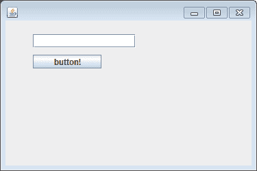

# 使用从另一个 Java 类执行的动作

> 原文:[https://www . geesforgeks . org/using-action performed-from-other-Java-class/](https://www.geeksforgeeks.org/using-actionperformed-from-another-java-class/)

java 中的事件处理使用 actionlistener 可能很容易实现，但是当您在一个 java 类文件中有多个 ActionListener，并且想要将 set GUI 部分(主要用于设置框架和其他对象)与类文件中的 [ActionListener](https://www.geeksforgeeks.org/java-swing-jmenubar/) 分开时，问题就出现了，但是它比您想象的要简单得多让我们先来看看将 Actionlistener 实现到 java 类的步骤。ActionListener 是‘*Java . util . event‘*包的一部分它只有一个方法[*action performed(ActionEvent)*](https://www.geeksforgeeks.org/java-swing-jtogglebutton-class/)在用户刚执行动作时调用。

**程序:**实现[动作监听器](https://www.geeksforgeeks.org/java-swing-jmenubar/)的步骤如下:

*   **步骤 1:** 创建一个事件处理程序类，并指定该类要么实现 ActionListener 接口，要么扩展一个实现 ActionListener 接口的类。
*   **步骤 2:** 将事件处理程序类的实例注册为一个或多个组件上的侦听器。
*   **步骤 3:** 包括实现监听器接口中的方法的代码。
*   **第 4 步:**现在使用名为*的 ActionListener 方法创建文件。*

**实现:**让我们创建第一个包含所有框架和其他组件的 java 文件。

**第一步:**

```
public class ActionListenerClass implements ActionListener { 
```

**第二步:**

```
someComponent.addActionListener(instanceOfactionlsitenerclass);
button.addActionListener(instanceOfactionlistenerclass)
// It could be a button or any other component
```

**第三步:**

```
For example:

public void actionPerformed(ActionEvent e) { 
    ...// code that reacts to the action... 

    // The single argument to the method is an ActionEvent object
    // that gives information about the event
}
```

**例 1-A:**

## Java 语言(一种计算机语言，尤用于创建网站)

```
// Java Program demonstrating the use of
// action listener from another java file

// Importing Swing class
import java.awt.event.ActionListener;
// Importing ActionListner from awt package
import javax.swing.*;
import javax.swing.JButton;
import javax.swing.JFrame;

// Class for actionlistner
public class GFG

// Creating a new text field
{
    static JTextField textfield = new JTextField();

    // Main driver method
    public static void main(String[] args)
    {
        // Creating a button with no text and caption
        JFrame frame = new JFrame();

        // Creating a button with the specified iccon object
        JButton button = new JButton("button!");

        // Setting frame size using setSize(),setLayout(),
        // setBounds

        // Setting width and height of a frame
        // using setSize() method
        frame.setSize(375, 250);

        frame.setLayout(null);
        button.setBounds(40, 50, 100, 20);
        textfield.setBounds(40, 20, 150, 20);

        // Component added to frame
        frame.add(button);
        frame.add(textfield);

        // Object of type actionlistener is created
        // with reference of actionperformclass
        ActionListener listener = new actionperformclass();

        // Adding the instance of event handler
        // as listener of component
        button.addActionListener(listener);
        frame.setDefaultCloseOperation(
            JFrame.EXIT_ON_CLOSE);
        frame.setVisible(true);
    }
}
```

**步骤 4:** 现在使用 ActionListener 的 actionPerformed(ActionEvent o)函数创建文件。

**实施例 1(B)**

## Java 语言(一种计算机语言，尤用于创建网站)

```
// Java Program that creates the file with the method
// actionPerformed(ActionEvent o) of ActionListener

// Importing awt module and Swing class
import java.awt.event.ActionEvent;
import java.awt.event.ActionListener;
import javax.swing.*;

// Class
// An action listener that prints a message
public class actionperformclass
    extends classactionlistener implements ActionListener {

    // Method
    public void actionPerformed(ActionEvent event)
    {
        // settext of textfield object of Jtextfield
        textfield.setText("button is clicked");
    }
}
```

**输出:**以上两个程序将由类 [actionListener](https://www.geeksforgeeks.org/java-swing-jmenubar/) 生成，是驱动类

> 流程是当用户单击按钮时，按钮触发一个动作事件，该事件调用动作侦听器的 actionPerformed 方法。每次用户按下按钮时，消息都会显示在文本字段中。
> 
> **注意:**程序的类文件应该出现在两个 java 文件中。

