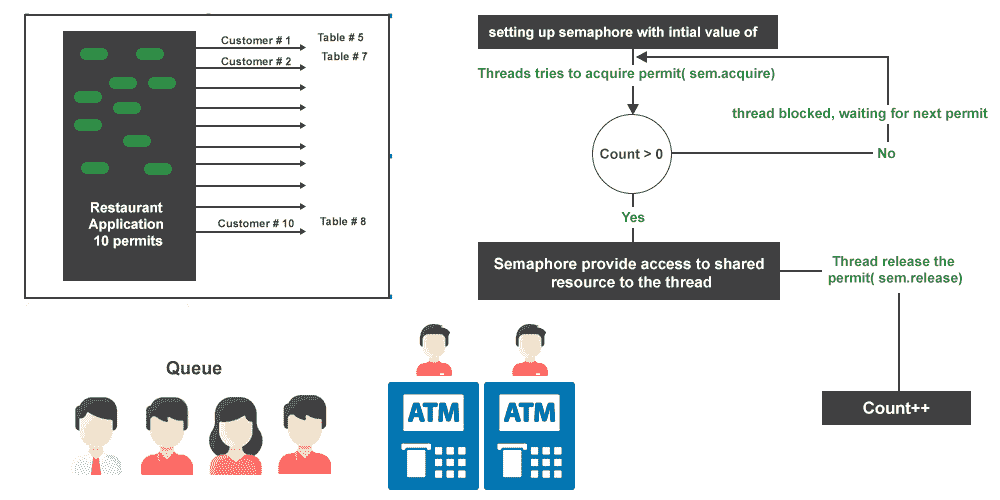

# 在 Java 中使用信号量保护一个资源的多个副本

> 原文:[https://www . geeksforgeeks . org/使用信号量保护多个 java 资源副本/](https://www.geeksforgeeks.org/using-semaphore-to-protect-more-than-one-copy-of-a-resource-in-java/)

信号量研究许可的概念。信号量用一定数量的许可初始化。许可证的数量等于可用共享资源的数量。当一个线程想要访问一个共享资源时，它获取许可，当访问完共享资源时，它释放许可。

插图:

> **说明 1:** 有 10 张桌子的餐厅应用程序。

有 20 个人站在餐厅外面，等待进入。在这种情况下，信号量的数量与 10 个资源(表)的数量相同。任何顾客要进入餐馆，都必须获得许可证。获得许可证后，他选择了一个可用的表。一旦他的订单完成，他就释放信号量，让其他排队的顾客可以使用。因此，旗语确保一次只有 10 名顾客可以进入餐厅点菜。



> **说明 2:** 在 ATM 中心排队等候的人。

如果有 2 台自动取款机，一次只有 2 个人可以进入自动取款机取钱。当顾客进入自动柜员机中心时，他会获得许可(如果有的话)，然后检查哪台自动柜员机可以免费使用。一旦他得到一台可用的自动取款机，他就锁上它，然后输入个人识别码并取款。退出后，他释放了自动取款机上的锁，也释放了信号量。他之所以要在取钱前锁定 ATM 机，是因为如果 2 个人在获得信号量后最终在同一个 ATM 机上。在这里，自动柜员机是一种共享资源，信号量的数量等于自动柜员机的数量。

**信号量的工作原理如下:**

对于我们的餐厅应用程序，我们用 10 个许可证初始化我们的信号量，这等于可用的桌子数量。如果队列中有 30 名顾客等待进入餐厅，顾客 1 获得许可证，进入餐厅。当顾客进入餐厅时，他会获得许可证，并从 10 张可用的桌子中选择 1 张。让我们假设客户#1 选择了表# 5。现有许可证数量为 9 个。由于许可证仍然有效，客户# 2 获得了另一个许可证，并选择了表# 7。通过这种方式，10 个客户可以获得许可证并选择未被占用的桌子。当顾客# 11 进入餐馆时，他被阻挡，直到 10 个顾客中的一个释放信号量并离开桌子。

**示例:**

## Java 语言(一种计算机语言，尤用于创建网站)

```java
// Java Program to Use a Semaphore to Protect more than One
// Copy of a Resource

// Importing input output classes
import java.io.*;
// Importing utility classes
import java.util.Arrays;
import java.util.concurrent.Semaphore;

// Class 1
// Helper class 1
class ATMQueue {

    // Member variables
    private Semaphore semaphore;
    private boolean[] freeAtms;

    // Method 1
    public ATMQueue()
    {

        semaphore = new Semaphore(2);
        freeAtms = new boolean[2];
        Arrays.fill(freeAtms, true);
    }

    // Method 2
    public void withDrawMoney()
    {

        // Try block to check fo exceptions
        try {

            // Try to acquire a semaphore.
            // If none are available, thread will block here
            // till a semaphore becomes available
            semaphore.acquire();

            // Check for available ATM machine
            int atmMachine = getAvailableATM();

            // since atm Machine is available to withdraw
            // money, we acquire a semaphore
            System.out.println(
                Thread.currentThread().getName()
                + ":-Withdrawing money from atm number :-"
                + atmMachine);

            System.out.println(
                "---------------------------------");

            Thread.sleep((long)(Math.random() * 1000));

            System.out.println(
                Thread.currentThread().getName()
                + ":-done withdrawing money");

            releaseATM(atmMachine);

            System.out.printf(
                "ATM machine :- %s is now available",
                atmMachine);

            System.out.println(
                "---------------------------------");

            System.out.println(
                "About to release the semaphore");

            semaphore.release();

            System.out.println("Semaphore released");
        }

        // catch block to handle the exceptions
        catch (InterruptedException e) {

            // Print the exceptions along with line number
            e.printStackTrace();
        }
    }

    // Method 3
    private void releaseATM(int atmNumber)
    {

        // We are making specific atm machine free for use
        synchronized (freeAtms)
        {
            freeAtms[atmNumber] = true;
        }
    }

    // Method 4
    private int getAvailableATM()
    {
        int freeAtm = -1;

        // We are using synchronized to ensure that only 1
        // thread can access and modify the shared boolean
        // array freeAtms
        synchronized (freeAtms)
        {

            for (int i = 0; i < freeAtms.length; i++) {

                if (freeAtms[i]) {
                    freeAtms[i] = false;
                    freeAtm = i;

                    break;
                }
            }
        }

        return freeAtm;
    }
}

// Class 2
// Helper class 2
class WithdrawMoneyTask implements Runnable {

    private ATMQueue atmQueue;

    public WithdrawMoneyTask(ATMQueue atmQueue)
    {
        // TODO Auto-generated constructor stub
        this.atmQueue = atmQueue;
    }

    @Override public void run()
    {
        System.out.println(
            Thread.currentThread().getName()
            + ": - about to withdraw money after acquiring the permit");

        atmQueue.withDrawMoney();
    }
}

// Class 3
// Main class
class GFG {

    // Main  driver method
    public static void main(String[] args)
    {

        // Print statement
        System.out.println("GFG!");

        // Creating an object of class 1 in main() method
        ATMQueue atmQueue = new ATMQueue();

        // Creating Thread class object
        Thread thread[] = new Thread[10];

        for (int i = 0; i < 10; i++) {
            thread[i] = new Thread(
                new WithdrawMoneyTask(atmQueue),
                "Thread " + i);
        }

        for (int i = 0; i < 10; i++) {
            thread[i].start();
        }
    }
}
```

## Java 语言(一种计算机语言，尤用于创建网站)

```java
// Java Program to Use a Semaphore to Protect more than One
// Copy of a Resource

// Importing input output classes
import java.io.*;
// Importing utility classes
import java.util.Arrays;
import java.util.concurrent.Semaphore;

// Class 1
// Helper class 1
class ATMQueue {

    // Member variables
    private Semaphore semaphore;
    private boolean[] freeAtms;

    // Method 1
    public ATMQueue()
    {

        semaphore = new Semaphore(2);
        freeAtms = new boolean[2];
        Arrays.fill(freeAtms, true);
    }

    // Method 2
    public void withDrawMoney()
    {

        // Try block to check fo exceptions
        try {

            // Try to acquire a semaphore.
            // If none are available, thread will block here
            // till a semaphore becomes available
            semaphore.acquire();

            // Check for available ATM machine
            int atmMachine = getAvailableATM();

            // since atm Machine is available to withdraw
            // money, we acquire a semaphore
            System.out.println(
                Thread.currentThread().getName()
                + ":-Withdrawing money from atm number :-"
                + atmMachine);

            System.out.println(
                "---------------------------------");

            Thread.sleep((long)(Math.random() * 1000));

            System.out.println(
                Thread.currentThread().getName()
                + ":-done withdrawing money");

            releaseATM(atmMachine);

            System.out.printf(
                "ATM machine :- %s is now available",
                atmMachine);

            System.out.println(
                "---------------------------------");

            System.out.println(
                "About to release the semaphore");

            semaphore.release();

            System.out.println("Semaphore released");
        }

        // catch block to handle the exceptions
        catch (InterruptedException e) {

            // Print the exceptions along with line number
            e.printStackTrace();
        }
    }

    // Method 3
    private void releaseATM(int atmNumber)
    {

        // We are making specific atm machine free for use
        synchronized (freeAtms)
        {
            freeAtms[atmNumber] = true;
        }
    }

    // Method 4
    private int getAvailableATM()
    {
        int freeAtm = -1;

        // We are using synchronized to ensure that only 1
        // thread can access and modify the shared boolean
        // array freeAtms
        synchronized (freeAtms)
        {

            for (int i = 0; i < freeAtms.length; i++) {

                if (freeAtms[i]) {
                    freeAtms[i] = false;
                    freeAtm = i;

                    break;
                }
            }
        }

        return freeAtm;
    }
}

// Class 2
// Helper class 2
class WithdrawMoneyTask implements Runnable {

    private ATMQueue atmQueue;

    public WithdrawMoneyTask(ATMQueue atmQueue)
    {
        // TODO Auto-generated constructor stub
        this.atmQueue = atmQueue;
    }

    @Override public void run()
    {
        System.out.println(
            Thread.currentThread().getName()
            + ": - about to withdraw money after acquiring the permit");

        atmQueue.withDrawMoney();
    }
}

// Class 3
// Main class
class GFG {

    // Main  driver method
    public static void main(String[] args)
    {

        // Print statement
        System.out.println("GFG!");

        // Creating an object of class 1 in main() method
        ATMQueue atmQueue = new ATMQueue();

        // Creating Thread class object
        Thread thread[] = new Thread[10];

        for (int i = 0; i < 10; i++) {
            thread[i] = new Thread(
                new WithdrawMoneyTask(atmQueue),
                "Thread " + i);
        }

        for (int i = 0; i < 10; i++) {
            thread[i].start();
        }
    }
}
```

**Output**

```java
GFG!
Thread 7: - about to withdraw money after acquiring the permit
Thread 4: - about to withdraw money after acquiring the permit
Thread 9: - about to withdraw money after acquiring the permit
Thread 2: - about to withdraw money after acquiring the permit
Thread 8: - about to withdraw money after acquiring the permit
Thread 0: - about to withdraw money after acquiring the permit
Thread 1: - about to withdraw money after acquiring the permit
Thread 5: - about to withdraw money after acquiring the permit
Thread 3: - about to withdraw money after acquiring the permit
Thread 6: - about to withdraw money after acquiring the permit
Thread 4:-Withdrawing money from atm number :-1
---------------------------------
Thread 7:-Withdrawing money from atm number :-0
---------------------------------
Thread 7:-done withdrawing money
ATM machine :- 0 is now available---------------------------------
About to release the semaphore
Semaphore released
Thread 9:-Withdrawing money from atm number :-0
---------------------------------
Thread 4:-done withdrawing money
ATM machine :- 1 is now available---------------------------------
About to release the semaphore
Semaphore released
Thread 2:-Withdrawing money from atm number :-1
---------------------------------
Thread 9:-done withdrawing money
ATM machine :- 0 is now available---------------------------------
About to release the semaphore
Semaphore released
Thread 8:-Withdrawing money from atm number :-0
---------------------------------
Thread 2:-done withdrawing money
ATM machine :- 1 is now available---------------------------------
About to release the semaphore
Semaphore released
Thread 0:-Withdrawing money from atm number :-1
---------------------------------
Thread 0:-done withdrawing money
ATM machine :- 1 is now available---------------------------------
About to release the semaphore
Semaphore released
Thread 1:-Withdrawing money from atm number :-1
---------------------------------
Thread 1:-done withdrawing money
ATM machine :- 1 is now available---------------------------------
About to release the semaphore
Semaphore released
Thread 5:-Withdrawing money from atm number :-1
---------------------------------
Thread 5:-done withdrawing money
ATM machine :- 1 is now available---------------------------------
About to release the semaphore
Semaphore released
Thread 3:-Withdrawing money from atm number :-1
---------------------------------
Thread 3:-done withdrawing money
ATM machine :- 1 is now available---------------------------------
About to release the semaphore
Semaphore released
Thread 6:-Withdrawing money from atm number :-1
---------------------------------
Thread 8:-done withdrawing money
ATM machine :- 0 is now available---------------------------------
About to release the semaphore
Semaphore released
Thread 6:-done withdrawing money
ATM machine :- 1 is now available---------------------------------
About to release the semaphore
Semaphore released
```

此外，由于信号量的出现导致程序执行中的并发，实时输出被追加。

<video class="wp-video-shortcode" id="video-596139-1" width="640" height="360" preload="metadata" controls=""><source type="video/mp4" src="https://media.geeksforgeeks.org/wp-content/uploads/20210429090740/semaphore.mp4?_=1">[https://media.geeksforgeeks.org/wp-content/uploads/20210429090740/semaphore.mp4](https://media.geeksforgeeks.org/wp-content/uploads/20210429090740/semaphore.mp4)</video>

**输出解释:**

*   在这个代码示例中，有 3 个类。取款任务类定义了要执行的作业/任务。所以它实现了 Runnable 接口。
*   它有一个代表自动柜员机的专用成员自动柜员机队列。我们称之为取款()方法。
*   在 ATMQueue 类中，我们有 2 个成员变量。成员变量信号量在构造函数中定义。它被初始化为 2，因为只有 2 台自动取款机。成员变量 freeAtms 是一个布尔数组，它在构造函数中被初始化为 true，表示两台 atm 机最初都是空闲的。
*   在取款()中，我们首先获取信号量，然后检查哪台 atm 机空闲。这是通过 getAvailableATM()完成的。有可能 2 个线程可能会获取信号量并输入这段代码，然后修改共享资源变量 freeAtms。因此，检查可用自动取款机并将其标记为繁忙的代码在同步块中。
*   一旦我们找到可用的自动取款机，我们就取款。一旦取款，我们就通过释放自动取款机(自动取款机号码)的方法释放自动取款机。该代码也处于同步状态，以确保只有 1 个线程进入该块并修改 freeAtms 布尔数组。然后，我们释放信号量，让其他等待的线程根据可用的自动柜员机获取和提取资金。

> 根据输出，在任何给定的时间点，只有 2 个线程可以获取信号量和取钱。如果一个线程无法获取信号量，它将被阻塞，直到获取信号量的一个线程释放它。这就是如何使用信号量来保护共享资源的多个副本，在本例中，共享资源是一台自动柜员机。