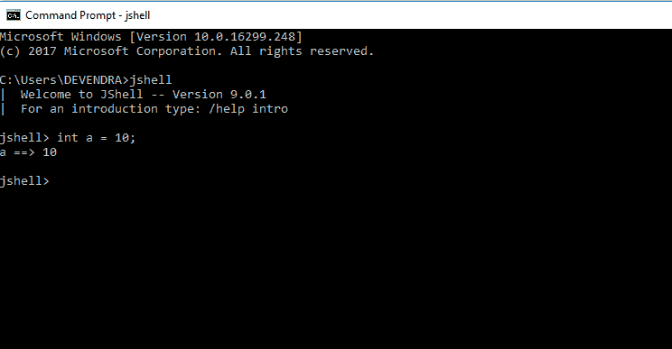
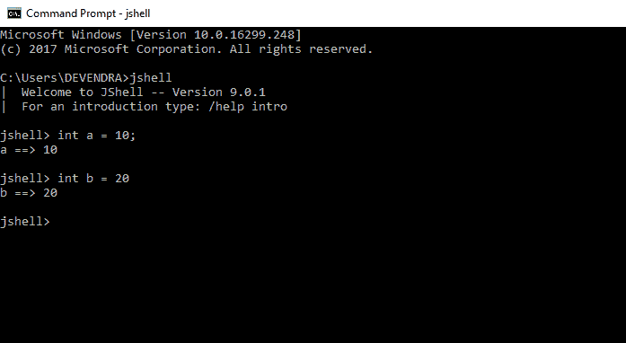
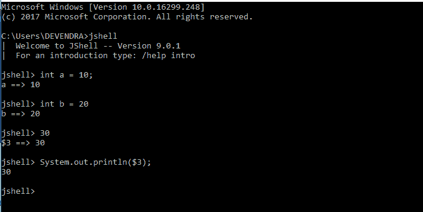
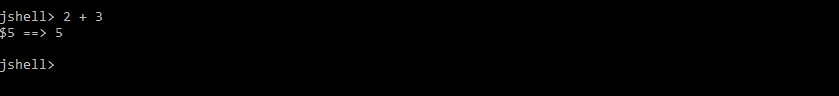
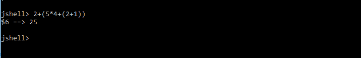
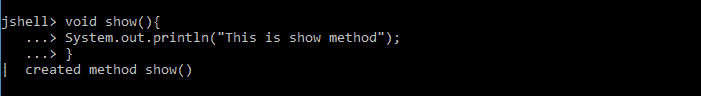

# 在 Java 9 的 JShell 中使用变量

> 原文:[https://www . geesforgeks . org/using-variables-jshell-Java-9/](https://www.geeksforgeeks.org/using-variables-jshell-java-9/)

先决条件:[Java 9 中的 JShell](https://www.geeksforgeeks.org/jshell-java-9-new-feature/)

我们可以在整个 Jshell 会话中声明变量并在任何地方使用。让我们创建一个
整数变量。

分号(；)是可选的，我们可以离开它，它工作得很好。看，变量 b 是不用分号创建的。

##### 临时变量

如果我们不提供变量名，Java 创建隐式变量来存储值。这些变量以$符号开始。我们可以通过指定隐式变量来使用这些变量，就像我们在下面的屏幕截图中所做的那样。

#### 公式

我们可以测试任何有效的 Java 表达式来获得即时输出。请看下面的例子。
**两个整数相加**

**复合词**

**创建和调用方法**
要测试方法业务逻辑，创建一个方法并立即得到结果。请参见以下示例

