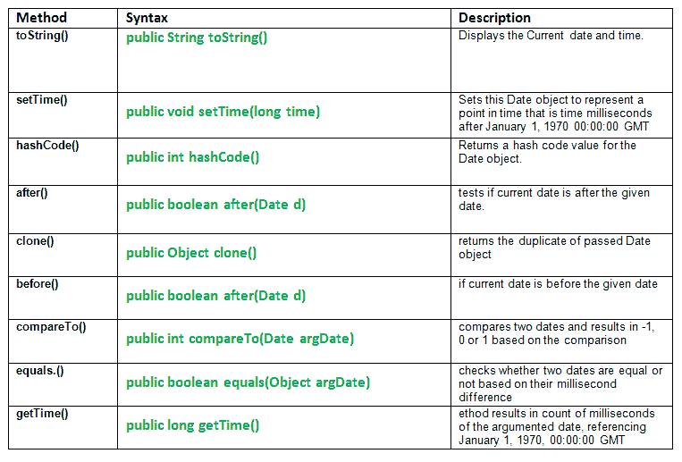

# Java 中的 util.date 类方法，示例

> 原文:[https://www . geesforgeks . org/util-date-class-methods-Java-examples/](https://www.geeksforgeeks.org/util-date-class-methods-java-examples/)

[](https://media.geeksforgeeks.org/wp-content/uploads/util.date-class-methods.png) 
**以下是一些重要的日期类方法:**

1.  **.toString() :** **java.util.Date.tostring()** method is a java.util.Date class method.It displays the Current date and time.
    Here Date object is converted to a string and represented as:

    ```java
     day mon dd hh:mm:ss zz yyyy 
    ```

    日:一周中的某一天
    周一:月
    日:月中的某一天
    时:小时
    毫米:分钟
    秒:秒
    zz:时区
    yyyy:年最多 4 位小数

    ```java
    Syntax:
    public String toString()
    Return:
    a string representation of the given date.

    ```

2.  **。setTime():****java.util.Date . setTime()**方法是一个 Java . util . date 类方法。将此日期对象设置为表示 1970 年 1 月 1 日 00:00:00 格林尼治标准时间之后的时间毫秒。

    ```java
    Syntax:
    public void setTime(long time)
    Parameters:
    time : the number of milliseconds.

    ```

3.  **.hashCode() :** **java.util.Date.hashCode()** method is a java.util.Date class method. Returns a hash code value for the Date object. The result is exclusive OR of the two halves of the primitive long value returned by the getTime() method.

    ```java
    Syntax:
    public int hashCode()
    Return:
    a hash code value for the Date object.

    ```

    **Java 代码的使用举例说明。toString()，setTime()，hashCode()方法。**

    ```java
    // Java Program explaining util.date class methods//
    // use of .toString(), setTime(), hashCode() methods
    import java.util.*;  // class having access to Date class methods

    public class NewClass
    {
        public static void main(String[] args)
        {
            Date mydate = new Date();

            // Displaying the current date and time
            System.out.println("System date : "+ mydate.toString() );

            // Is used to set time by milliseconds. Adds 15680 
            // milliseconds to January 1, 1970 to get new time.
            mydate.setTime(15680);

            System.out.println("Time after setting:  " + mydate.toString());

            int d = mydate.hashCode();
            System.out.println("Amount (in ms) by which time" + 
                               " is shifted :  " + d);
        }
    }
    ```

    **Java 代码输出:**

    ```java
    System date : Tue Nov 01 02:37:18 IST 2016
    Time after setting:  Thu Jan 01 05:30:15 IST 1970
    Amount (in milliseconds)  by which time is shifted :  15680

    ```

4.  **。after():****Java . util . date . after()**方法测试当前日期是否在给定日期之后。

    ```java
    Syntax:
    public boolean after(Date d)
    Parameters:
    d : date
    Return:
    true if and only if the instant represented by this Date object is strictly later
    than the instant represented by 'when'; else false
    Exception:
    NullPointerException - if Date object is null.

    ```

5.  **。clone():****Java . util . Date . clone()**方法返回传递的 Date 对象的副本。

    ```java
    Syntax:
    public Object clone()
    Return:
    a clone of this instance.

    ```

6.  **.before() :** **java.util.Date.after()** method tests if current date is before the given date.

    ```java
    Syntax:
    public boolean before(Date d)
    Parameters:
    d : date
    Return:
    true if and only if the instant represented by this Date object is strictly earlier
    than the instant represented by 'when'; else false
    Exception:
    NullPointerException - if when is null.

    ```

    **Java 代码来说明 after()，clone()，before()方法的使用。**

    ```java
    // JAVA program explaining Date class methods
    // after(), clone(), before()
    import java.util.Date;
    public class NewClass
    {
        public static void main(String[] args)
        {
            // create 2 dates
            Date date1 = new Date(2016, 11, 18);
            Date date2 = new Date(1997, 10, 27);

            // Use of after() to check date2 is after date1
            boolean a = date2.after(date1);
            System.out.println("Is date2 is after date1 : " + a);

            // Use of after() to check date2 is after date1
            a = date1.after(date2);
            System.out.println("Is date1 is after date2 : " + a);
            System.out.println("");

            // Use of clone() method
            Object date3 = date1.clone();
            System.out.println("Cloned date3 :" + date3.toString());
            System.out.println("");

            // Use of before() to check date2 is after date1
            boolean b = date2.before(date1);
            System.out.println("Is date2 is before date1 : " + a);
        }
    }
    ```

    **输出:**

    ```java
    Is date2 is after date1 : false
    Is date1 is after date2 : true

    Cloned date3 :Mon Dec 18 00:00:00 IST 3916

    Is date2 is before date1 : true

    ```

7.  **。compare to():****Java . util . date . compare to()**方法比较两个日期，并根据比较结果得出-1、0 或 1。

    ```java
    Syntax:
    public int compareTo(Date argDate)
    Parameters:
    argDate : another date to compare with
    Result:
    0  : if the argumented date = given date.
    -1 : if the argumented date > given date.
    1  : if the argumented date < given date.

    ```

8.  **。equals():****Java . util . date . equals()**方法根据毫秒差检查两个日期是否相等。

    ```java
    Syntax:
    public boolean equals(Object argDate)
    Parameters:
    argDate : another date to compare with
    Result:
    true if both the date are equal; else false.

    ```

9.  **.getTime() :** **java.util.Date.getTime()** method results in count of milliseconds of the argumented date, referencing January 1, 1970, 00:00:00 GMT.

    ```java
    Syntax:
    public long getTime()
    Result:
    milliseconds of the argumented date, referencing January 1, 1970, 00:00:00 GMT.

    ```

    **Java 代码来说明 compareTo()，getTime()，equals()方法的使用。**

    ```java
    // Java program explaining Date class methods
    // compareTo(), getTime(), equals()
    import java.util.*;
    public class NewClass
    {
        public static void main(String[] args)
        {
            Date d1 = new Date(97, 10, 27);
            Date d2 = new Date(97, 6, 12);

            // Use of compareto() method
            int comparison = d1.compareTo(d2);    // d1 > d2
            int comparison2 = d2.compareTo(d1);   // d2 > d1
            int comparison3 = d1.compareTo(d1);   // d1 = d1

            System.out.println("d1 > d2 : " + comparison);
            System.out.println("d1 < d2 : " + comparison2);
            System.out.println("d1 = d1 : " + comparison3);
            System.out.println("");

            // Use of equal() method
            boolean r1 = d1.equals(d2);
            System.out.println("Result of equal() r1 : " + r1);

            boolean r2 = d1.equals(d1);
            System.out.println("Result of equal() r2 : " + r2);
            System.out.println("");

            // Use of getTime() method
            long count1 = d1.getTime();
            long count2 = d1.getTime();
            System.out.println("Milliseconds of d1 : " + count1);
            System.out.println("Milliseconds of d2 : " + count2);
        }
    }
    ```

    **输出:**

    ```java
    d1 > d2 : 1
    d1 < d2 : -1
    d1 = d1 : 0

    Result of equal() r1 : false
    Result of equal() r2 : true

    Milliseconds of d1 : 880569000000
    Milliseconds of d2 : 880569000000

    ```

    本文由 <font color="green">**莫希特·古普塔**</font> 供稿。如果你喜欢 GeeksforGeeks 并想投稿，你也可以使用[write.geeksforgeeks.org](https://write.geeksforgeeks.org)写一篇文章或者把你的文章邮寄到 review-team@geeksforgeeks.org。看到你的文章出现在极客博客主页上，帮助其他极客。

    如果你发现任何不正确的地方，或者你想分享更多关于上面讨论的话题的信息，请写评论。