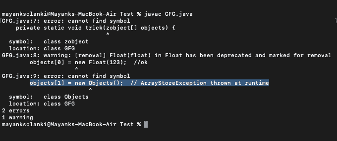

# Java 中的差异

> 原文:[https://www.geeksforgeeks.org/variance-in-java/](https://www.geeksforgeeks.org/variance-in-java/)

**差异**是指更复杂类型之间的子类型如何与其组件之间的子类型相关联。这里的“更复杂的类型”指的是更高级别的结构，比如容器和函数。因此，差异是关于容器和由通过类型层次结构连接的参数组成的函数之间的赋值兼容性。它允许参数和子类型多态性的安全集成。

> 在 java 中，方差是在**使用点定义的。**

**方差类型:**方差有以下 4 种。类型构造函数有以下类型:

<figure class="table">

| **协变** | 如果它接受子类型但不接受超类型 |
| **逆变** | 如果它接受超类型但不接受子类型 |
| **双变量** | 如果它同时接受超类型和子类型 |
| **不变** | 如果它既不接受超类型也不接受子类型。 |

</figure>

**Java 中的不变性:**使用站点必须在类型参数上没有开放边界。如果 A 是 B 的超类型，那么通用类型< A >不是通用类型< B >的超类型，反之亦然。这意味着这两种类型彼此没有关系，在任何情况下都不能相互交换。

**类型 1:不变容器**

在 java 中，不变量可能是您将遇到的第一个泛型示例，并且是最直观的。类型参数的方法可以像预期的那样使用。类型参数的所有方法都是可访问的。它们是不能交换的，你可以从它们中读出两者，如下图所示。

**说明 1:** 不能兑换

```
// Type hierarchy Person :> Joe :> JoeJr

List<Person> p = new ArrayList<>();

// Ok
p.add(new Person()); 
// Ok 
p.add(new Joe());   
// Ok
p.add(new JoeJr());    
```

**插图 2:** 从它们中读取对象

```
// Type hierarchy : Person :>Joe :> JoeJr

List <Joe> joes = new ArrayList<>();
// Ok
Joe j = joes.get(0);  
// Ok
Person p = joes.get(0);  
```

**类型 Java 中的协方差**

use-site 必须是类型参数的开放下限。如果 B 是 A 的 **a** 亚型，那么 GenericType < B >是 GenericType <的一个亚型？延伸 A >。

**注意:**Java 中的数组一直是协变的

在 Java **1.5** 中引入泛型之前，数组是唯一可用的泛型容器。它们一直是协变的，例如**整数[]** 是**对象[]** 的一个子类型。编译器允许您将**整数[]** 传递给接受**对象[]** 的方法。如果该方法插入了**整数**的超类型，运行时会抛出[arraystorexception](https://www.geeksforgeeks.org/arraystoreexception-in-java/)。协变泛型类型规则在编译时实现这种检查，首先不允许错误发生。

**例**

## Java 语言(一种计算机语言，尤用于创建网站)

```
class GFG {

    public static void main(String args[])
    {
        Number[] numbers = new Number[] { 1, 2, 3, 4, 5 };
        trick(numbers);
    }
    private static void trick(zobject[] objects)
    {
        objects[0] = new Float(123); // ok
        objects[1] = new Objects(); // ArrayStoreException
                                    // thrown at runtime
    }
}
```

**输出:**



现在让我们讨论协变容器。Java 允许子类型化(协变)泛型类型，但是它根据最小惊奇原则对什么可以“流入和流出”这些泛型类型设置了限制。换句话说，具有类型参数返回值的方法是可访问的，而具有类型参数输入参数的方法是不可访问的。

**说明 1:** 可以将超类型替换为子类型:

```
// Type hierarchy : Person :> Joe :> JoeJr
List<? extends Joe> = new ArrayList<Joe>();  //ok
List<? extends Joe> = new ArrayList<JoeJr>();  //ok
List<? extends Joe> = new ArrayList<Person>();  // Compile error
```

**插图 2:** 从它们中阅读是直观的:

```
//Type hierarchy : Person :> Joe :> JoeJr
List<? extends Joe> joes = new ArrayList<>();
Joe j = joes.get(0);  //ok
Person p = joes.get(0);  //ok
JoeJr jr = joes.get(0);  // compile error
```

禁止向它们写入(违反直觉)，以防止上述数组的陷阱。例如，在下面的示例代码中，如果其他人的带有协变 arg 的方法**列出了<，那么**列表< Joe >** 的调用者/所有者会很惊讶？>延长人**增加了一个**吉尔。**

```
// Type hierarchy : Person > Joe > JoeJr
List<? extends Joe> joes = new ArrayList<>();
joes.add(new Joe());  // compile error (you don't  what subtype of Joe is in the list)
joes.add(new JoeJr());  // compile error
joes.add(new Person());  //compile error
joes.add(new Object());  // compile error
```

**类型 3:逆变容器**

逆变容器的行为违反直觉:与协变容器相反，对具有类型参数返回值的方法的访问是不可访问的，而对具有类型参数输入参数的方法的访问是可访问的:

**说明 1:** 您可以将子类型替换为超类型:

```
List<> super Joe> joes = new ArrayList<Joe>();  // ok
List<? super Joe> joes = new ArrayList<Person>();  // ok
List<? super Joe> joes = new ArrayList<JoeJr>();  //Compile Error
```

**插图 2:** 从它们中读取时无法捕获特定类型:

```
List<? super Joe> joes = new ArrayList<>();
Joe j = joes.get(0);  // compile error
Person p = joes.get(0);  // compile error
Object o = joes.get(0);   // because everything is a object in java
```

**说明 3:** 可以添加“下限”的子类型:

```
List<? super Joe> Joes = new ArrayList<>();
joes.add(new JoeJr());  allowed
```

**说明 4:** 但是不能添加超类型:

```
List<? super Joe> joes = new ArrayList<>();
joes.add(new Person());  // compile error
joes.add(new Object());  // compile error
```

**类型 Java 中的双变量**

使用站点必须在类型参数上声明一个**无界通配符**。

带有无界通配符的泛型类型是同一泛型类型的所有有界变体的超类型。例子是**泛型<？>** 是**通用型<弦>** 的超型。由于无界类型是类型层次结构的根，因此在其参数类型中，它只能访问从 **java.lang.Object.** 继承的方法

```
Think of GenericType<?> as GenericType<Object>.
```

**让我们讨论具有 N 型参数的结构的方差。**功能等更复杂的类型呢？同样的原则也适用，只是需要考虑更多的类型参数。下图说明了如何回答这些难题。

插图:

```
Function<Person, Joe> personToJoe = null;
Function<Joe, JoeJr> joeToJoeJr = null;
personToJoe = joeToJoeJr; // compile error

// Covariance
Function<? extends Person, ? extends Joe> personToJoe
    = null;
Function<Joe, JoeJr> jorToJorJr = null;
personToJoe = joeToJoeJr; // ok

// Contravariance
Function<? super Joe, ? super JoeJr> joeToJoeJr = null;
Function<? super Person, ? super Joe> personToJoe = null;
joeToJoeJr = personToJoe; // ok
```

**变异与遗传**

**说明 1:** Java 允许覆盖具有协变返回类型和异常类型的方法:

```
interface person {
    Person get();
    void fail() throws Exception;
}
interface Joe extends Person {
    JoeJr get();
    void fail() throws IOException;
}
class JoeImpl implements Joe {
    public JoeJr get() {} // overriden
    public void fail throws IOException {} // Overriden
}
```

**说明 2:** 试图用协变参数重写方法只会导致重载:

```
interface Person {
    void add(Person p);
}
interface Joe extends Person {
    void add(Joe j);
}
class JoeImpl implements Joe {
    public void add(Person p) {} // overload
    public void add(Joe j) {} // overload
}
```

**结论:**方差给 Java 带来了额外的复杂性。虽然关于方差的类型规则很容易理解，但是关于类型参数的方法的可访问性的规则是违反直觉的。理解它们不仅仅是“显而易见的”。它需要停下来思考逻辑结果。

方差在我的日常编程中提供了适度的净收益，尤其是当需要与子类型兼容时(这在 OOP 中是经常发生的事情)。