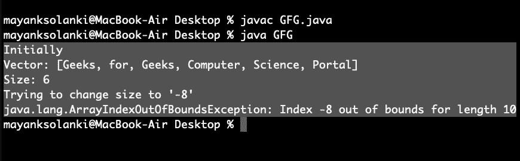

# Java 中的 Vector setSize()方法，示例

> 原文:[https://www . geesforgeks . org/vector-set size-method-in-Java-with-example/](https://www.geeksforgeeks.org/vector-setsize-method-in-java-with-example/)

[](https://www.geeksforgeeks.org/java-util-vector-class-java/)****。setSize()** 是[向量类](https://www.geeksforgeeks.org/java-util-vector-class-java/)的一种方法，用于设置向量的新大小。如果向量的新大小大于当前大小，则向向量添加空元素。如果新大小小于当前大小，则删除所有高阶元素。**

**此方法将向量的大小修改为新大小，并且不返回任何内容。**

****语法:****

```
public void setSize(int newSize)
```

****参数:**该方法接受向量的强制参数**新大小**。**

****返回类型:** NA**

****异常:**T2【arrayindexoofboundsexception**

> ****注意:**如果新的大小是负的，那么它会抛出**运行时错误****

****例 1:****

## **Java 语言(一种计算机语言，尤用于创建网站)**

```
// Java Program to Illustrate setSize() method
// of Vector class

// Importing required classes
import java.util.*;

// Main class
public class GFG {

    // Main driver method
    public static void main(String[] args)
    {

        // Creating object of Vector class
        // Declaring object of string type
        Vector<String> v = new Vector<String>();

        // Inserting elements into the vector
        // using add() method
        // Custom input elements
        v.add("Geeks");
        v.add("for");
        v.add("Geeks");
        v.add("Computer");
        v.add("Science");
        v.add("Portal");

        // Printing vector before calling setSize() method
        System.out.println("Initially");
        System.out.println("Vector: " + v);
        System.out.println("Size: " + v.size());

        // Setting new custom size
        v.setSize(8);

        // Printing vector after calling setSize()
        System.out.println("\nAfter using setSize()");
        System.out.println("Vector: " + v);
        System.out.println("Size: " + v.size());
    }
}
```

****Output**

```
Initially
Vector: [Geeks, for, Geeks, Computer, Science, Portal]
Size: 6

After using setSize()
Vector: [Geeks, for, Geeks, Computer, Science, Portal, null, null]
Size: 8
```** 

****例 2:** 当新尺寸为正时**

## **Java 语言(一种计算机语言，尤用于创建网站)**

```
// Java program to Illustrate setSize() method
// of Vector class
// Where size is positive

// Importing utility classes
import java.util.*;

// Main class
public class GFG {

    // amin driver method
    public static void main(String[] args)
    {
        // Creating vector object of string type
        Vector<String> v = new Vector<String>();

        // Inserting elements into the vector
        //. using add() method
        // Custom input elements
        v.add("Geeks");
        v.add("for");
        v.add("Geeks");
        v.add("Computer");
        v.add("Science");
        v.add("Portal");

        // Printing vector before calling setSize()
        System.out.println("Initially");
        System.out.println("Vector: " + v);
        System.out.println("Size: " + v.size());

        // Setting new size
        v.setSize(4);

        // Printing vector after calling setSize()
        System.out.println("\nAfter using setSize()");
        System.out.println("Vector: " + v);
        System.out.println("Size: " + v.size());
    }
}
```

****Output**

```
Initially
Vector: [Geeks, for, Geeks, Computer, Science, Portal]
Size: 6

After using setSize()
Vector: [Geeks, for, Geeks, Computer]
Size: 4
```** 

****例 3:** 当新尺寸为负时**

## **Java 语言(一种计算机语言，尤用于创建网站)**

```
// Java program to Illustrate setSize() method
// of vector class
// Where size is negative

// Importing utility classes
import java.util.*;

// Main class
public class GFG {

    // Main driver method
    public static void main(String[] args)
    {
        // Creating Vector class object of string type
        Vector<String> v = new Vector<String>();

        // Inserting elements into the vector
        // using add() method
        v.add("Geeks");
        v.add("for");
        v.add("Geeks");
        v.add("Computer");
        v.add("Science");
        v.add("Portal");

        // Printing vector before calling setSize()
        System.out.println("Initially");
        System.out.println("Vector: " + v);
        System.out.println("Size: " + v.size());

        // Try block to check for exceptions
        try {

            // Setting new size
            v.setSize(-8);
        }

        // Catch block to handle exceptions
        catch (Exception e) {

            // Display message when exceptions occured
            System.out.println("Trying to change "
                               + "size to '-8'\n" + e);
        }
    }
}
```

****输出:****

****