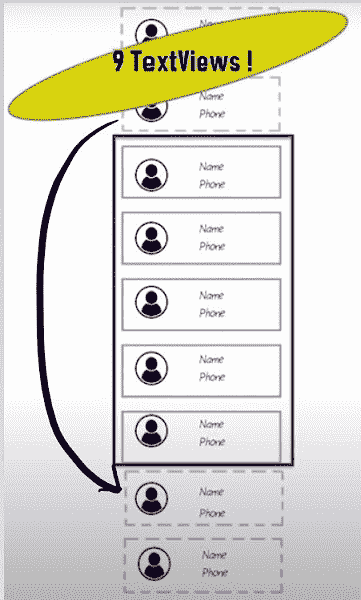
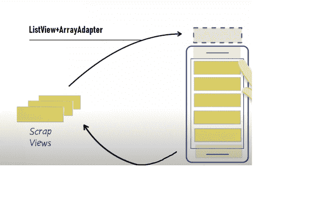
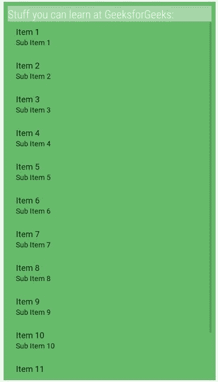

# 用 ListView 查看安卓回收

> 原文:[https://www . geeksforgeeks . org/view-带 listview 的安卓回收/](https://www.geeksforgeeks.org/view-recycling-in-android-with-listview/)

[内存管理](https://www.geeksforgeeks.org/operating-systems-gq/memory-management-gq/)是应用开发的一个至关重要的方面。由于移动设备的内存非常有限，因此在我们的应用中有必要谨慎使用。这样做的最佳实践之一是“**查看回收**”。

本文是关于安卓中的视图回收，然后创建了一个简单的应用程序，它使用**[【ListView】](https://www.geeksforgeeks.org/android-listview-in-kotlin/)**和 **ArrayAdapter** 来实现视图回收的实践。

**<u>安卓中视图回收的需求</u>**
通过回收未使用的视图来显示新内容，而不是为相同的视图创建新的视图，从而尽可能少地使用内存，这是一种惯例。假设，我们正在向下滚动一千个单词的列表。如果我们为每个单词创建一个 **[文本视图](https://www.geeksforgeeks.org/textview-widget-in-android-using-java-with-examples/)** ，我们将为此需要一千个**文本视图**。这将浪费大量内存，因为我们设备的屏幕一次只显示 7-8 个**文本视图**，如果我们想看到其余的文本视图，我们需要向下滚动。

当我们向下滚动时，位于顶部的**文本视图**不再可见。因此，可以推断当用户向下滚动列表视图时，顶部的**文本视图**没有被用户使用。因此，未使用的**文本视图**被回收，并在用户向下滚动时在底部使用。这样，我们的任务就可以只用其中的几个就能完成，而不是有一千个**文本视图**。

**<u>安卓中查看回收的例子</u>**
最常见的例子之一就是我们手机的电话簿。我们的手机上可以有许多联系人，但我们的手机不会为每个联系人创建新的**文本视图**，而是回收未使用的向上/向下滚动的视图，并用新的联系人信息填充它们，并在用户向上/向下滚动时再次显示。

[](https://media.geeksforgeeks.org/wp-content/uploads/20200626180427/rec11.jpg)

**<u>使用 ArrayAdapter 和 Listview</u>** 实现视图回收

*   **ArrayAdapter** 是从 **BaseAdapter** 类扩展而来的一个 Java 公共类。ArrayAdapter 对象使数据(要显示的数据)适应数组。基本上，适配器是用户界面组件和数据之间的桥梁，有助于填充用户界面组件中的数据。
*   **[ListView](https://www.geeksforgeeks.org/android-listview-in-kotlin/)** 是从**ablistview**扩展而来的一个 Java 公共类。列表视图是一种将几个项目分组并在垂直列表中显示的视图。如果提供的数据量无法在屏幕上显示，该列表也会自动滚动。
*   **ArrayAdapter** and **ListView** are required for view recycling. ListView asks for views from ArrayAdpapter by sending it a request and a specified position. ArrayAdpapter then returns the view at the specified position as the ListView keeps on asking for it until the device’s screen is filled. Now, when the user scrolls down, ListView gives ArrayAdpapter the top views which aren’t displayed on the device’s screen anymore. The ArrayAdpapter then erases the previous data of that ScrapView and sets new data and returns it to the ListView instead of creating a new view!

    [](https://media.geeksforgeeks.org/wp-content/uploads/20200626181540/rec2.png)

下面是一个演示内存管理实践的简单应用程序。

*   **Step 1:** Add the below code in **activity_main.xml** file which would just contain a **ListView** and a **TextView**.

    ## activity_main.xml

    ```
    <LinearLayout
        android:layout_height="match_parent"
        android:layout_width="match_parent"
        xmlns:android="http://schemas.android.com/apk/res/android"
        android:orientation="vertical"
        android:background="#66bb6a"
        android:padding="8dp">

        <TextView
            android:layout_width="match_parent"
            android:layout_height="wrap_content"
            android:text="Stuff you can learn at GeeksforGeeks:"
            android:background="#a5d6a7"
            android:textSize="22sp"
            android:fontFamily="sans-serif-condensed-light"
            android:textColor="#fafafa"/>
        <ListView
            android:id="@+id/list"
            android:orientation="vertical"
            android:layout_width="match_parent"
            android:layout_height="match_parent"/>
    </LinearLayout>
    ```

    **输出:**

    [](https://media.geeksforgeeks.org/wp-content/uploads/20200626182830/rec3.jpg)

*   **Step 2:** In the below code, when we initialize the **ArrayAdapter**, we pass a layout called **android.R.layout.simple_list_item_1** along with our **ArrayList** and **Context**. The android.R.layout.simple_list_item_1 is a **inbuilt** layout that describes the design in which a single list item will be shown. It conventionally consists of just a single **TextView**
    Once the ListView and ArrayAdapter are initialized, set the ArrayAdapter on the ListView using the **setAdapter()** method.

    ## MainActivity.java

    ```
    package com.example.gfgrecycleview;

    import androidx.appcompat.app.AppCompatActivity;
    import android.os.Bundle;
    import android.widget.ArrayAdapter;
    import android.widget.ListView;

    import java.util.ArrayList;

    public class MainActivity
        extends AppCompatActivity {

        public static final
            String LOG_TAG
            = MainActivity.class
                  .getName();

        @Override
        protected void onCreate(Bundle savedInstanceState)
        {
            super.onCreate(savedInstanceState);
            setContentView(R.layout.activity_main);

            // Create a list of study fields.
            ArrayList<String> stuff = new ArrayList<>();
            stuff.add("Data Structures");
            stuff.add("Algorithms");
            stuff.add("Competitive Programming");
            stuff.add("Interview Questions");
            stuff.add("Python");
            stuff.add("Java");
            stuff.add("Designing");
            stuff.add("Coding");
            stuff.add("Developing");
            stuff.add("Project Ideas");
            stuff.add("C++");
            stuff.add("Basically Everything!");

            // Find a reference to the
            //{@link ListView} in the layout
            ListView itemListView
                = (ListView)findViewById(R.id.list);

            // Create a new {@link ArrayAdapter}
            // of study fields
            ArrayAdapter<String> adapter
                = new ArrayAdapter<String>(
                    this,
                    android.R.layout.simple_list_item_1,
                    stuff);

            // Set the adapter
            // on the {@link ListView}
            // so the list can be populated
            /// in the user interface
            itemListView.setAdapter(adapter);
        }
    }
    ```

    **输出:**

    <video class="wp-video-shortcode" id="video-439745-1" width="320" height="540" preload="metadata" controls=""><source type="video/mp4" src="https://media.geeksforgeeks.org/wp-content/uploads/20200608114433/Android-Emulator-Nexus_4_API_23_5556-2020-06-08-11-10-27_Trim.mp4?_=1">[https://media.geeksforgeeks.org/wp-content/uploads/20200608114433/Android-Emulator-Nexus_4_API_23_5556-2020-06-08-11-10-27_Trim.mp4](https://media.geeksforgeeks.org/wp-content/uploads/20200608114433/Android-Emulator-Nexus_4_API_23_5556-2020-06-08-11-10-27_Trim.mp4)</video>