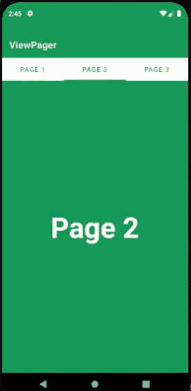
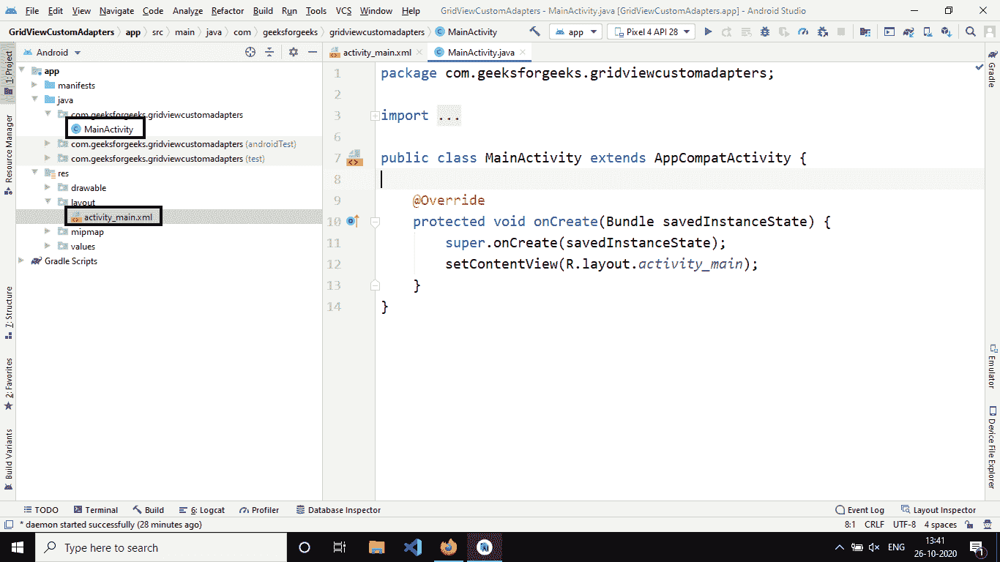
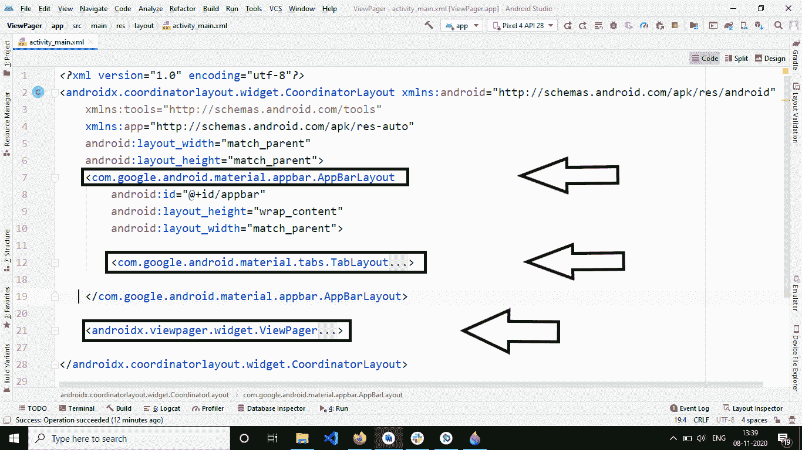
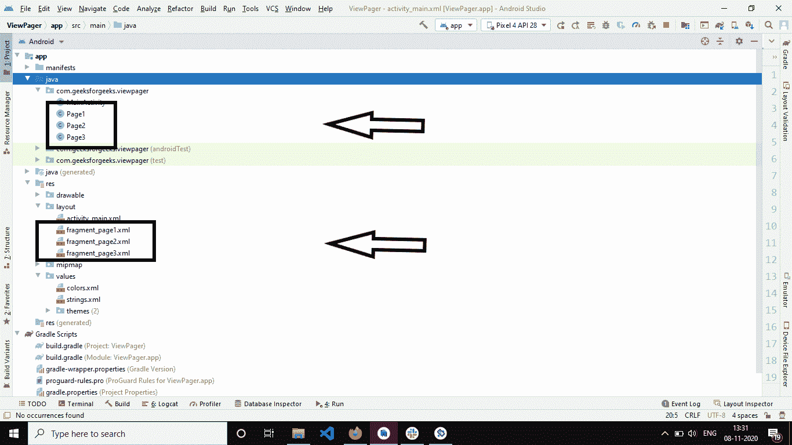
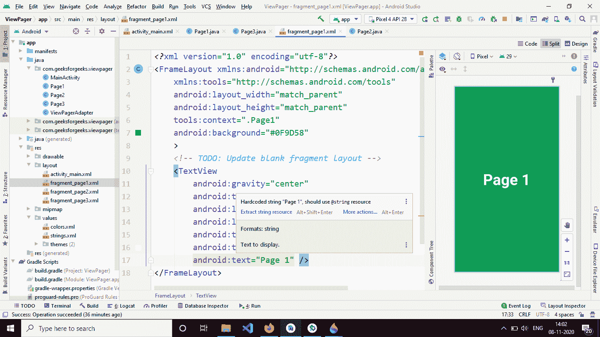
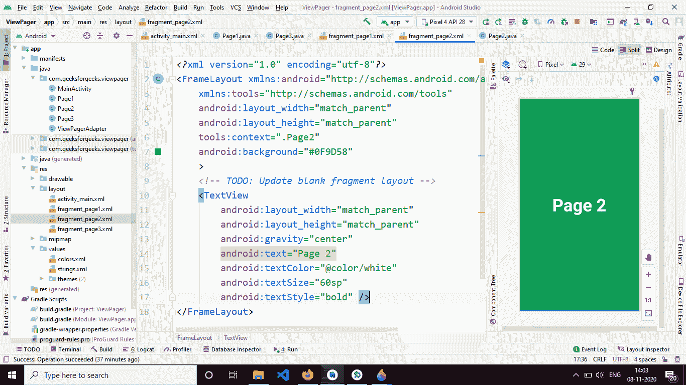
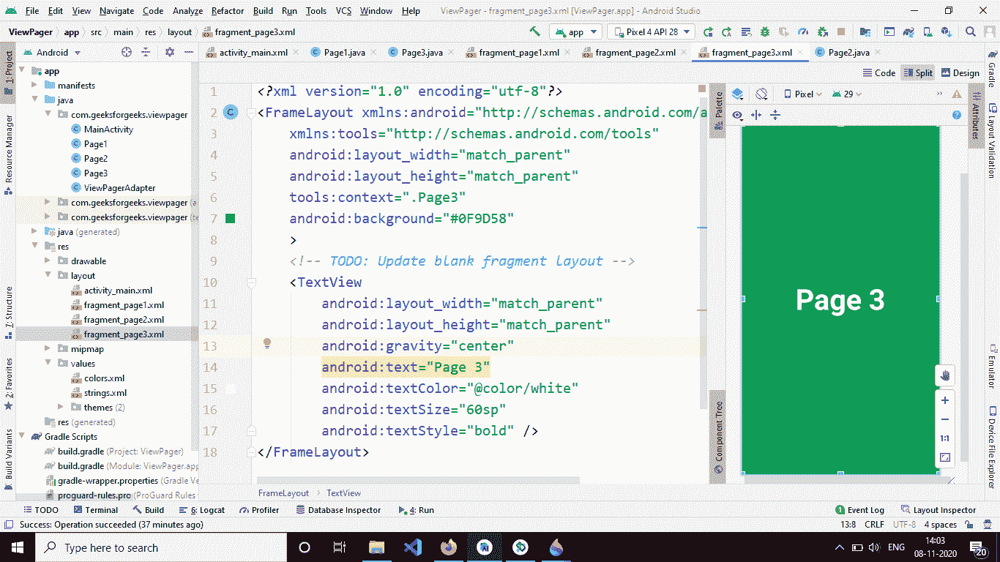
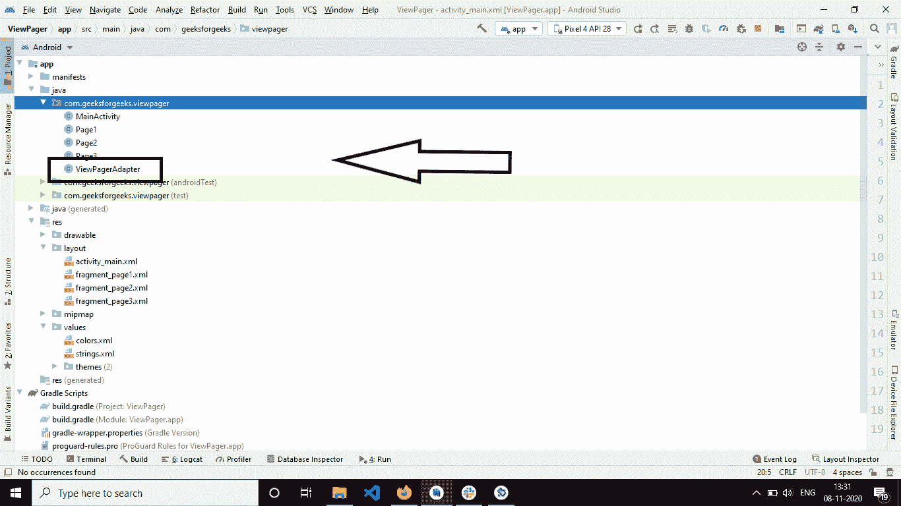

# 在安卓系统中使用片段查看寻呼机，示例

> 原文:[https://www . geeksforgeeks . org/view pager-使用带示例的安卓片段/](https://www.geeksforgeeks.org/viewpager-using-fragments-in-android-with-example/)

**ViewPager** 是一个布局管理器，允许用户左右翻动数据页面。它主要出现在像 Youtube、Snapchat 这样的应用程序中，在这些应用程序中，用户向右-向左移动以切换到屏幕。不是使用活动，而是使用片段。它还用于在用户第一次启动应用时引导用户通过应用。

### 安卓系统中使用片段的可视寻呼机

**实现可视寻呼机的步骤:**

1.  将视图页面小部件添加到 XML 布局(通常是 main_layout)。
2.  通过扩展片段页面适配器或片段状态页面适配器类来创建适配器。

适配器填充视图寻呼机内的页面。PagerAdapter 是由 FragmentPagerAdapter 和 FragmentStatePagerAdapter 扩展的基类。让我们来看看这两个班的区别。

**片段页面适配器和片段状态页面适配器的区别:**

*   **片段状态页面适配器:**仅将屏幕上显示的当前片段保存在内存中。这是内存高效的，应该在具有动态片段的应用程序中使用。(其中片段的数量不是固定的。).
*   **片段页面适配器:**当片段数量固定时，应使用此适配器。一个有 3 个标签的应用程序，在应用程序运行时不会改变。本教程将使用 FragmentPagerAdapter。

**以下是 ViewPagerAdapter 类的结构:**

## Java 语言(一种计算机语言，尤用于创建网站)

```
import androidx.annotation.NonNull;
import androidx.annotation.Nullable;
import androidx.fragment.app.Fragment;
import androidx.fragment.app.FragmentManager;
import androidx.fragment.app.FragmentPagerAdapter;
import java.util.ArrayList;
import java.util.List;

public class ViewPagerAdapter extends FragmentPagerAdapter {

    private final List<Fragment> fragments = new ArrayList<>();
    private final List<String> fragmentTitle = new ArrayList<>();

    public ViewPagerAdapter(@NonNull FragmentManager fm)
    {
        super(fm);
    }

    public void add(Fragment fragment, String title)
    {
        fragments.add(fragment);
        fragmentTitle.add(title);
    }

    @NonNull @Override public Fragment getItem(int position)
    {
        return fragments.get(position);
    }

    @Override public int getCount()
    {
        return fragments.size();
    }

    @Nullable
    @Override
    public CharSequence getPageTitle(int position)
    {
        return fragmentTitle.get(position);
    }
}
```

**方法说明:**

*   **getCount():** 此方法返回要显示的片段数。(需要覆盖)
*   **getItem(int pos):** 返回 pos 索引处的片段。(需要覆盖)
*   **视图页面适配器(@NonNull 片段管理器 FM):** (必需)视图页面适配器需要有一个接受片段管理器实例的参数化构造函数。负责管理碎片。一个碎片管理器管理安卓中的碎片，具体来说，它处理碎片之间的事务。事务是添加、替换或移除片段的一种方式。
*   **getPageTitle(int pos):** (可选)与 getItem()类似，该方法返回索引位置的页面标题。
*   **添加(片段片段，字符串标题):**该方法负责填充片段和片段标题列表。分别保存片段和标题。

### 例子

下面给出了一个 GIF 示例，来了解一下在这篇文章中要做什么。注意，我们将使用 **Java** 语言来实现这个项目。



### 逐步实施

**第一步:创建新项目**

要在安卓工作室创建新项目，请参考[如何在安卓工作室创建/启动新项目](https://www.geeksforgeeks.org/android-how-to-create-start-a-new-project-in-android-studio/)。注意选择 **Java** 作为编程语言。最初，项目目录应该是这样的。



**步骤 2:使用 activity_main.xml 文件**



三个小部件 **AppBarLayout** 用来托管负责显示页面标题的**tableout**。**视图页面**布局将容纳不同的片段。下图解释了让应用程序按预期运行需要设置的重要参数。


在**表格布局**中，我们需要添加**标签模式** =“固定”参数，该参数告诉安卓系统在我们的应用程序中将有固定数量的标签。将以下代码添加到“ **activity_main.xml** 文件中。

## 可扩展标记语言

```
<?xml version="1.0" encoding="utf-8"?>
<androidx.coordinatorlayout.widget.CoordinatorLayout
    xmlns:android="http://schemas.android.com/apk/res/android"
    xmlns:app="http://schemas.android.com/apk/res-auto"
    android:layout_width="match_parent"
    android:layout_height="match_parent">

    <com.google.android.material.appbar.AppBarLayout
        android:id="@+id/appbar"
        android:layout_width="match_parent"
        android:layout_height="wrap_content">

        <com.google.android.material.tabs.TabLayout
            android:id="@+id/tab_layout"
            android:layout_width="match_parent"
            android:layout_height="match_parent"
            app:tabGravity="fill"
            app:tabMode="fixed" />

    </com.google.android.material.appbar.AppBarLayout>

    <androidx.viewpager.widget.ViewPager
        android:id="@+id/viewpager"
        android:layout_width="match_parent"
        android:layout_height="match_parent"
        app:layout_behavior="@string/appbar_scrolling_view_behavior" />

</androidx.coordinatorlayout.widget.CoordinatorLayout>
```

**第三步:创建片段**

现在我们需要设计出碎片化的页面。在本教程中，我们将使用三个页面(片段)。向项目中添加三个空白片段。项目结构应该是这样的。



下面分别是**Page1.java、**、**T3、**Page3.java**文件的代码。**

## Java 语言(一种计算机语言，尤用于创建网站)

```
import android.os.Bundle;
import android.view.LayoutInflater;
import android.view.View;
import android.view.ViewGroup;
import androidx.annotation.NonNull;
import androidx.annotation.Nullable;
import androidx.fragment.app.Fragment;

public class Page1 extends Fragment {

    public Page1() {
        // required empty public constructor.
    }

    @Override
    public void onCreate(@Nullable Bundle savedInstanceState) {
        super.onCreate(savedInstanceState);
    }

    @Nullable
    @Override
    public View onCreateView(@NonNull LayoutInflater inflater, @Nullable ViewGroup container, @Nullable Bundle savedInstanceState) {
        return inflater.inflate(R.layout.fragment_page1, container, false);
    }
}
```

## Java 语言(一种计算机语言，尤用于创建网站)

```
import android.os.Bundle;
import android.view.LayoutInflater;
import android.view.View;
import android.view.ViewGroup;
import androidx.annotation.NonNull;
import androidx.annotation.Nullable;
import androidx.fragment.app.Fragment;

public class Page2 extends Fragment {

    public Page2() {
        // required empty public constructor.
    }

    @Override
    public void onCreate(@Nullable Bundle savedInstanceState) {
        super.onCreate(savedInstanceState);
    }

    @Nullable
    @Override
    public View onCreateView(@NonNull LayoutInflater inflater, @Nullable ViewGroup container, @Nullable Bundle savedInstanceState) {
        return inflater.inflate(R.layout.fragment_page2, container, false);
    }
}
```

## Java 语言(一种计算机语言，尤用于创建网站)

```
import android.os.Bundle;
import android.view.LayoutInflater;
import android.view.View;
import android.view.ViewGroup;
import androidx.annotation.NonNull;
import androidx.annotation.Nullable;
import androidx.fragment.app.Fragment;

public class Page3 extends Fragment {

    public Page3() {
        // required empty public constructor.
    }

    @Override
    public void onCreate(@Nullable Bundle savedInstanceState) {
        super.onCreate(savedInstanceState);
    }

    @Nullable
    @Override
    public View onCreateView(@NonNull LayoutInflater inflater, @Nullable ViewGroup container, @Nullable Bundle savedInstanceState) {
        return inflater.inflate(R.layout.fragment_page3, container, false);
    }
}
```

**方法描述:**

*   **第 1 页():**默认结构。
*   **OnCreateView(OnCreateView(LayoutInFlater，ViewGroup 容器，Bundle savedInstanceState):** 该方法负责膨胀(解析)相应的 XML 文件，并返回添加到 ViewPager 适配器的视图。
*   **onCreate(捆绑保存实例状态):**这种方法类似于活动 onCreate()方法。

设计页面 XML 文件。所有的 XML 布局片段都有相同的设计。我们在中心有一个 [TextView](https://www.geeksforgeeks.org/textview-widget-in-android-using-java-with-examples/) 显示各自页面的名称，这里使用的根容器是[T3【框架布局】T5【其背景设置为 **#0F9D58**](https://www.geeksforgeeks.org/android-framelayout-in-kotlin/)

以下是**片段 _page1.xml** 文件的代码:



**代码:**

## 可扩展标记语言

```
<?xml version="1.0" encoding="utf-8"?>
<FrameLayout
    xmlns:android="http://schemas.android.com/apk/res/android"
    xmlns:tools="http://schemas.android.com/tools"
    android:layout_width="match_parent"
    android:layout_height="match_parent"
    android:background="#0F9D58"
    tools:context=".Page1">

    <!-- TODO: Update blank fragment layout -->
    <TextView
        android:layout_width="match_parent"
        android:layout_height="match_parent"
        android:gravity="center"
        android:text="Page 1"
        android:textColor="@color/white"
        android:textSize="60sp"
        android:textStyle="bold" />
</FrameLayout>
```

以下是**片段 _page2.xml** 文件的代码:



**代码:**

## 可扩展标记语言

```
<?xml version="1.0" encoding="utf-8"?>
<FrameLayout
    xmlns:android="http://schemas.android.com/apk/res/android"
    xmlns:tools="http://schemas.android.com/tools"
    android:layout_width="match_parent"
    android:layout_height="match_parent"
    android:background="#0F9D58"
    tools:context=".Page2">

    <!-- TODO: Update blank fragment layout -->
    <TextView
        android:layout_width="match_parent"
        android:layout_height="match_parent"
        android:gravity="center"
        android:text="Page 2"
        android:textColor="@color/white"
        android:textSize="60sp"
        android:textStyle="bold" />
</FrameLayout>
```

以下是**片段 _page3.xml** 文件的代码:



**代码:**

## 可扩展标记语言

```
<?xml version="1.0" encoding="utf-8"?>
<FrameLayout
    xmlns:android="http://schemas.android.com/apk/res/android"
    xmlns:tools="http://schemas.android.com/tools"
    android:layout_width="match_parent"
    android:layout_height="match_parent"
    android:background="#0F9D58"
    tools:context=".Page3">

    <!-- TODO: Update blank fragment layout -->
    <TextView
        android:layout_width="match_parent"
        android:layout_height="match_parent"
        android:gravity="center"
        android:text="Page 3"
        android:textColor="@color/white"
        android:textSize="60sp"
        android:textStyle="bold" />
</FrameLayout>
```

**步骤 4:创建可视寻呼机适配器**

向项目结构中添加一个名为**viewpragadapter**的 java 类。项目结构如下所示。



以下是**ViewPagerAdapter.java**文件的代码:

## Java 语言(一种计算机语言，尤用于创建网站)

```
import androidx.annotation.NonNull;
import androidx.annotation.Nullable;
import androidx.fragment.app.Fragment;
import androidx.fragment.app.FragmentManager;
import androidx.fragment.app.FragmentPagerAdapter;
import java.util.ArrayList;
import java.util.List;

public class ViewPagerAdapter extends FragmentPagerAdapter {

    private final List<Fragment> fragments = new ArrayList<>();
    private final List<String> fragmentTitle = new ArrayList<>();

    public ViewPagerAdapter(@NonNull FragmentManager fm) {
        super(fm);
    }

    public void add(Fragment fragment, String title) {
        fragments.add(fragment);
        fragmentTitle.add(title);
    }

    @NonNull
    @Override
    public Fragment getItem(int position) {
        return fragments.get(position);
    }

    @Override
    public int getCount() {
        return fragments.size();
    }

    @Nullable
    @Override
    public CharSequence getPageTitle(int position) {
        return fragmentTitle.get(position);
    }
}
```