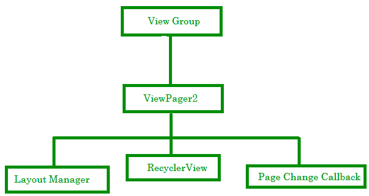
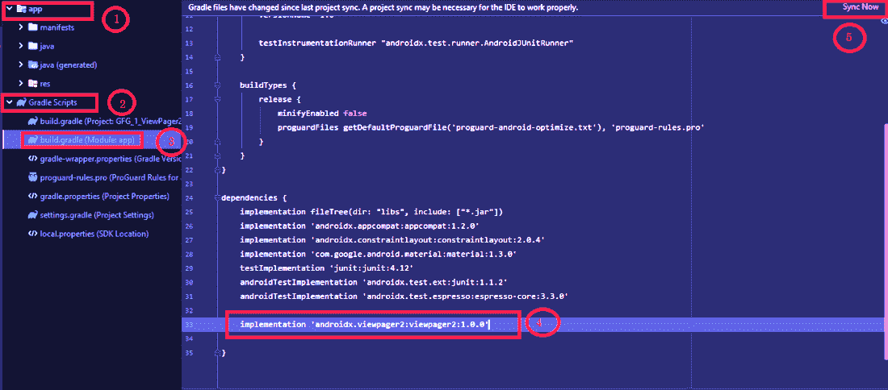
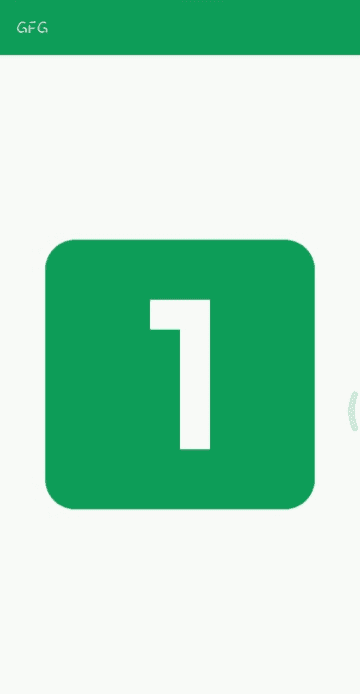

# 在安卓中查看页面 2，示例

> 原文:[https://www . geeksforgeeks . org/viewpar 2-in-Android-with-example/](https://www.geeksforgeeks.org/viewpager2-in-android-with-example/)

在前往**查看页面 2** 之前，让我们了解一下**查看页面**。你们大多数人都使用过 WhatsApp，当你打开 WhatsApp 时，你可以在顶部看到，有四个部分摄像头，聊天，状态，呼叫这些是可视寻呼机。因此，Viewpager 是一个安卓小部件，用于通过使用相同的活动向左或向右滑动来从一个页面导航到另一个页面。因此，当我们使用 Viewpager 时，我们可以在一个活动中添加不同的布局，这可以通过使用片段来完成。像 WhatsApp、Snapchat 这样的著名应用程序使用[可视寻呼机](https://www.geeksforgeeks.org/android-viewpager-in-kotlin/)。

**Viewpager 2**是谷歌在 2009 年 2 月 7 日发布的 viewprager 的更新或增强版本。它带有各种新功能。viewpager2 最重要的特性是回收视图，它使 viewpager2 比 Viewpager 更有效。通过使用 Recyclerview，我们可以动态添加项目。如果你知道如何实现[回收视图](https://www.geeksforgeeks.org/android-recyclerview/)，那么你可以很容易地实现视图页面 2。

### **视图页面 2 的功能**

*   它隐式使用了 Recyclerview，是最重要的功能。
*   支持从右向左布局。
*   支持垂直方向。
*   引入复合页面转换器来组合多个页面转换器
*   **notifyDataScheached()**功能齐全。

### **更多关于视图页面 2**



*   **视图组**:就像视图页一样，视图页 2 是从视图组延伸出来的。视图组是可以包含其他视图的视图。它是视图类的子类。它是布局的基类，如[线性布局](https://www.geeksforgeeks.org/linearlayout-and-its-important-attributes-with-examples-in-android/)、[相对布局](https://www.geeksforgeeks.org/android-relativelayout-in-kotlin/)等。
*   **布局管理器:**布局管理器与您在回收视图中使用的布局管理器相同。布局管理器由视图页面管理器管理，它管理视图，并用于设置视图页面 2 的方向。
*   **回收视图:**回收视图用于处理提供给它的组件。它将向分配给它的用户显示数据，并使 ViewPager2 更加高效。

### **页面更改回调方法**

*   **onpagescroll()**:当前页面有滚动活动时触发此方法。
*   **onPageSelected()** :选择新页面时触发。
*   **OnPagescrollStateChanged()**:有滚动状态时触发会改变。

**设置方向**

默认情况下，视图页面 2 的方向为水平。我们可以通过调用 **setOrientation()** 方法并将 ORIENTATION_VERTICAL 传递给它，将 viewpager2 的方向设置为垂直。用于水平方向

```java
YourViewPager2Object.orientation = ViewPager2.ORIENTATION_VERTICAL 
```

### **现在让我们看看如何在我们的项目中使用 viewpager 2**

要使用视图页面 2，您必须首先在您的 Build.gradle 文件中添加依赖项:

这样做。**转到****app>Gradle Scripts>build . Gradle(Module:app)**然后如下所示将下面的依赖项“**实现‘androidx . view page 2:view page 2:1 . 0 . 0’【T5’”写入依赖项部分，然后点击立即同步。**



```java
dependencies {
      implementation 'androidx.viewpager2:viewpager2:1.0.0'
}
```

完成所有这些步骤后，现在让我们构建一个应用程序。因此，我们将构建下面的应用程序。



**第一步:创建新项目**

在安卓工作室的欢迎界面，点击**新建项目。**如果您已经打开了一个项目，**转到文件>新建>新项目。**选择项目模板窗口，选择空活动，点击下一步。在名称字段中输入您的应用名称。从语言下拉菜单中选择 Java。

**第二步:添加矢量资产显示在屏幕上**

转到**应用程序>资源>可绘制>右键单击>新建>矢量资产**并选择您选择的任何矢量资产

**第三步:转到 activity_main.xml，并向其中添加 ViewPager2 小部件**

导航到 **app > res >布局> activity_main.xml** 并将下面的代码添加到该文件中。下面是**activity _ main . XML**文件的代码。

## 可扩展标记语言

```java
<?xml version="1.0" encoding="utf-8"?>
<LinearLayout 
    xmlns:android="http://schemas.android.com/apk/res/android"
    xmlns:tools="http://schemas.android.com/tools"
    android:layout_width="match_parent"
    android:layout_height="match_parent"
    tools:context=".MainActivity">

    <androidx.viewpager2.widget.ViewPager2
        android:id="@+id/viewpager"
        android:layout_width="match_parent"
        android:layout_height="match_parent"
        android:orientation="vertical" />

</LinearLayout>
```

**第四步:新建布局资源文件**

**转到 app > res >布局>右键单击>新建>布局资源文件**，并将该文件命名为**“images _ holder . XML”。**在该文件中插入一个 ImageView 小部件，并为其提供一个 **id** 。这个布局文件将保存我们的图像。下面是**images _ holder . XML**文件的代码。

## 可扩展标记语言

```java
<?xml version="1.0" encoding="utf-8"?>
<LinearLayout 
    xmlns:android="http://schemas.android.com/apk/res/android"
    android:layout_width="match_parent"
    android:layout_height="match_parent">

    <ImageView
        android:id="@+id/images"
        android:layout_width="match_parent"
        android:layout_height="match_parent" />

</LinearLayout>
```

**步骤 5:创建适配器类**

转到**应用程序> java >右键单击第一个包名>新建> java 类**将该类命名为**视图页面 2 适配器。**适配器是使用 Recyclerview 的一个重要类。因为它包含了处理 RecyclerView 的所有重要方法。下面是适配器类的实现。为了更好地理解，在代码中添加了注释。下面是**ViewPager2Adapter.java**文件的代码。代码中添加了注释，以更详细地理解代码。

## Java 语言(一种计算机语言，尤用于创建网站)

```java
import android.content.Context;
import android.view.LayoutInflater;
import android.view.View;
import android.view.ViewGroup;
import android.widget.ImageView;

import androidx.annotation.NonNull;
import androidx.recyclerview.widget.RecyclerView;

class ViewPager2Adapter extends RecyclerView.Adapter<ViewPager2Adapter.ViewHolder> {

    // Array of images
    // Adding images from drawable folder
    private int[] images = {R.drawable.ic_baseline_looks_one_24, R.drawable.ic_baseline_looks_two_24, R.drawable.ic_baseline_looks_3_24,
            R.drawable.ic_baseline_looks_4_24, R.drawable.ic_baseline_looks_5_24};
    private Context ctx;

    // Constructor of our ViewPager2Adapter class
    ViewPager2Adapter(Context ctx) {
        this.ctx = ctx;
    }

    // This method returns our layout
    @NonNull
    @Override 
    public ViewHolder onCreateViewHolder(@NonNull ViewGroup parent, int viewType) {
        View view = LayoutInflater.from(ctx).inflate(R.layout.images_holder, parent, false);
        return new ViewHolder(view);
    }

    // This method binds the screen with the view
    @Override 
    public void onBindViewHolder(@NonNull ViewHolder holder, int position) {
        // This will set the images in imageview
        holder.images.setImageResource(images[position]);
    }

    // This Method returns the size of the Array
    @Override 
    public int getItemCount() {
        return images.length;
    }

    // The ViewHolder class holds the view
    public static class ViewHolder extends RecyclerView.ViewHolder {
        ImageView images;

        public ViewHolder(@NonNull View itemView) {
            super(itemView);
            images = itemView.findViewById(R.id.images);
        }
    }
}
```

**第 6 步:使用****MainActivity.java 文件**

转到**MainActivity.java**文件，参考以下代码。以下是**MainActivity.java**文件的代码。代码中添加了注释，以更详细地理解代码。

## Java 语言(一种计算机语言，尤用于创建网站)

```java
import android.os.Bundle;

import androidx.appcompat.app.AppCompatActivity;
import androidx.viewpager2.widget.ViewPager2;

public class MainActivity extends AppCompatActivity {

    // Create object of ViewPager2
    private ViewPager2 viewPager2; 

    @Override
    protected void onCreate(Bundle savedInstanceState) {
        super.onCreate(savedInstanceState);
        setContentView(R.layout.activity_main);

        // Initializing the viewpager2 object
        // It will find the view by its id which
        // you have provided into XML file
        viewPager2 = findViewById(R.id.viewpager);

        // Object of ViewPager2Adapter 
        // this will passes the 
        // context to the constructor
        // of ViewPager2Adapter
        ViewPager2Adapter viewPager2Adapter = new ViewPager2Adapter(this);

        // adding the adapter to viewPager2 
        // to show the views in recyclerview
        viewPager2.setAdapter(viewPager2Adapter);

        // To get swipe event of viewpager2
        viewPager2.registerOnPageChangeCallback(new ViewPager2.OnPageChangeCallback() {
            @Override
            // This method is triggered when there is any scrolling activity for the current page
            public void onPageScrolled(int position, float positionOffset, int positionOffsetPixels) {
                super.onPageScrolled(position, positionOffset, positionOffsetPixels);
            }

            // triggered when you select a new page
            @Override
            public void onPageSelected(int position) {
                super.onPageSelected(position);
            }

            // triggered when there is
            // scroll state will be changed
            @Override
            public void onPageScrollStateChanged(int state) {
                super.onPageScrollStateChanged(state);
            }
        });
    }
}
```

**输出:**

<video class="wp-video-shortcode" id="video-604395-1" width="640" height="360" preload="metadata" controls=""><source type="video/mp4" src="https://media.geeksforgeeks.org/wp-content/uploads/20210510090624/1620617104978.mp4?_=1">[https://media.geeksforgeeks.org/wp-content/uploads/20210510090624/1620617104978.mp4](https://media.geeksforgeeks.org/wp-content/uploads/20210510090624/1620617104978.mp4)</video>