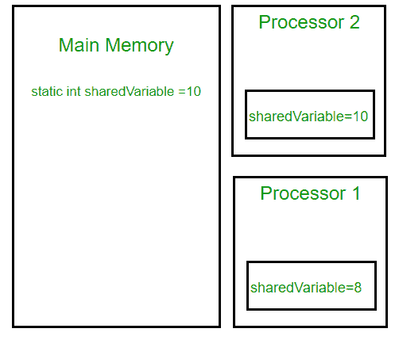

# Java 中的 volatile 关键字

> 原文:[https://www.geeksforgeeks.org/volatile-keyword-in-java/](https://www.geeksforgeeks.org/volatile-keyword-in-java/)

使用 volatile 是使类线程安全的另一种方法(像同步的原子包装器)。线程安全意味着一个方法或类实例可以被多个线程同时使用而没有任何问题。

考虑下面这个简单的例子。

```
class SharedObj
{
   // Changes made to sharedVar in one thread
   // may not immediately reflect in other thread
   static int sharedVar = 6;
}
```

假设两个线程正在处理 **SharedObj** 。如果两个线程在不同的处理器上运行，每个线程都可能有自己的本地副本**共享变量**。如果一个线程修改了它的值，这个变化可能不会立即反映在主内存中的原始值中。这取决于缓存的[写策略](https://en.wikipedia.org/wiki/CPU_cache#Write_policies)。现在，另一个线程不知道导致数据不一致的修改值。

下图显示，如果两个线程在不同的处理器上运行，那么 **sharedVariable** 的值在不同的线程中可能不同。



请注意，没有任何同步操作的正常变量的写入可能对任何读取线程都不可见(这种行为称为[顺序一致性](https://en.wikipedia.org/wiki/Sequential_consistency))。虽然大多数现代硬件都提供了良好的缓存一致性，因此一个缓存中的更改很可能会反映在另一个缓存中，但是依靠硬件来“修复”有故障的应用程序并不是一个好的做法。

```
class SharedObj
{
   // volatile keyword here makes sure that
   // the changes made in one thread are 
   // immediately reflect in other thread
   static volatile int sharedVar = 6;
}
```

请注意，volatile 不应与 static 修饰符混淆。静态变量是所有对象共享的类成员。它们在主存中只有一个副本。

**volatile vs synchronized:**
在我们继续之前，让我们看一下锁和同步的两个重要特性。

1.  **互斥:**表示一次只能有一个线程或进程执行一个代码块(关键段)。
2.  **可见性**:表示一个线程对共享数据的更改对其他线程可见。

Java 的 synchronized 关键字保证了互斥和可见性。如果我们使修改共享变量值的线程块同步，只有一个线程可以进入该块，它所做的更改将反映在主内存中。所有其他试图同时进入阻塞的线程将被阻塞并进入睡眠状态。

在某些情况下，我们可能只需要可见性，而不需要原子性。在这种情况下使用 synchronized 是一种过度杀伤，可能会导致可伸缩性问题。挥发性来拯救。可变变量具有同步的可见性特征，但不具有原子性特征。易失性变量值永远不会被缓存，所有的读写都将在主内存中进行。然而，volatile 的使用仅限于非常有限的一组情况，因为大多数时候原子性是需要的。例如一个简单的增量语句，如 x = x+1；或者 x++看起来是一个单一的操作，但实际上是一个复合的读-修改-写操作序列，必须以原子方式执行。

**Java 中的 volatile vs C/c++:**
Java 中的 Volatile 不同于[C/c++](https://www.geeksforgeeks.org/understanding-volatile-qualifier-in-c/)中的“Volatile”限定词。对于 Java 来说，“volatile”告诉编译器，变量的值绝不能被缓存，因为它的值可能会在程序本身的范围之外发生变化。在 C/C++中，开发嵌入式系统或设备驱动程序时需要“易失性”，在这种情况下，您需要读取或写入内存映射的硬件设备。特定设备寄存器的内容可能随时改变，因此您需要“volatile”关键字来确保这种访问不会被编译器优化掉。

**参考文献:**
[【https://www.ibm.com/developerworks/java/library/j-jtp06197/】](https://www.ibm.com/developerworks/java/library/j-jtp06197/)
[https://docs . Oracle . com/javase/tutorial/essential/concurrency/atomic . html](https://docs.oracle.com/javase/tutorial/essential/concurrency/atomic.html)
[http://tutorials.jenkov.com/java-concurrency/volatile.html](http://tutorials.jenkov.com/java-concurrency/volatile.html)
[https://pveentjer . WordPress . com/2008/05/17/jmm-感谢上帝-或魔鬼-for-strong-cache-coherence/](https://pveentjer.wordpress.com/2008/05/17/jmm-thank-god-or-the-devil-for-strong-cache-coherence/)

本文由苏拉布·库马尔供稿。如果发现有不正确的地方，请写评论，或者想分享更多关于以上讨论话题的信息