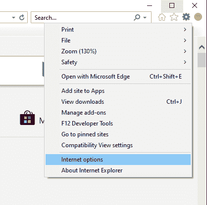
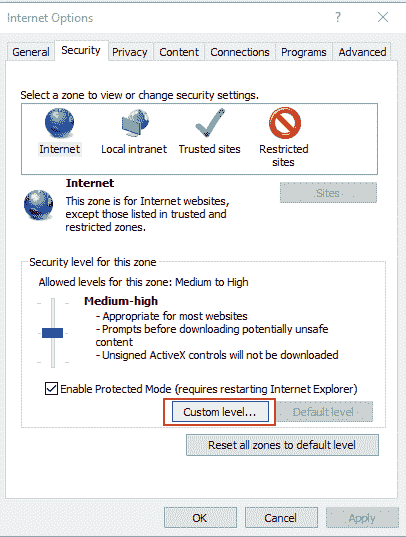
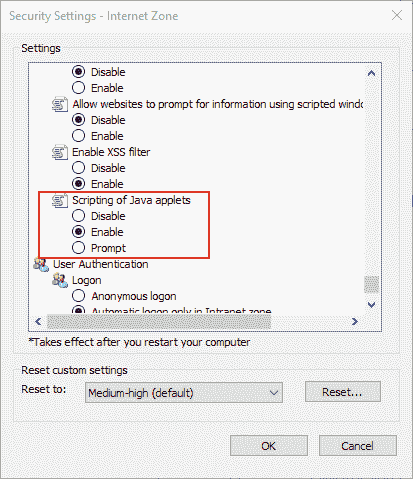

# 支持 Java 小程序的网络浏览器以及如何启用它们

> 原文:[https://www . geesforgeks . org/支持 java 小程序的网络浏览器以及如何启用它们/](https://www.geeksforgeeks.org/web-browsers-that-support-java-applets-and-how-to-enable-them/)

**先决条件:** [Java 教程](https://www.geeksforgeeks.org/java-tutorials/)

这篇文章是关于浏览器对 Java 的支持。

**为什么我们在浏览器上需要 Java 的支持？**

如果你学过或者掌握了一些知识，或者曾经在 Java 中工作过，那么很可能你已经遇到了这个 [Java Applet](https://www.geeksforgeeks.org/java-applet-basics/) 的概念。因此，Applet 只不过是一个 Java 程序，唯一的区别是它不能直接在独立的机器上运行。它需要一个网络浏览器来运行。它很容易嵌入到 HTML 页面中，是一个客户端概念，即运行在客户端。

因此，要运行 Applet，我们需要一个支持 Java 的浏览器。浏览器自带一个 Java 插件，允许在上面执行小程序。因此，支持 Java 的浏览器可以毫无困难地运行 Applet。

现在，我们知道了为什么我们需要浏览器支持 Java，让我们从今天支持它的浏览器列表开始。

**支持 Java 的浏览器:**
浏览器需要依赖 **NPAPI(网景插件应用编程接口)**的 Java 插件。如今，大多数知名浏览器已经放弃了对它的支持。

以下是不再支持 Java Applet 的**浏览器**:

*   谷歌 Chrome
*   火狐浏览器
*   旅行队
*   微软边缘
*   歌剧

所以，正如你所看到的，所有这些浏览器不再支持 Applet。即使是甲骨文 JDK 的更新版本也没有 Java 浏览器插件的支持。

放弃支持的原因是发现了安全问题和风险。

但是有**互联网浏览器**仍然**支持 Java 小程序**。所以，今天**互联网浏览器**是唯一支持 Java Applet 的浏览器。

**如何在 Internet Explorer 中启用 Java？**
以下是在互联网浏览器上启用 Java 的步骤:

1.  点击窗口右上角的“**工具**”图标，或者按 **Alt+X** (如果在窗口上)。
2.  然后在菜单中选择“**互联网选项**”。
    
3.  然后在“**安全**选项卡，点击“**自定义等级**”。
    
4.  Now, In the pop-up, scroll down and search for ‘**Scripting of Java applet**’ and make sure it is enabled and click OK.

    

**注意:**如果你还想运行 Applet，并且安全不是问题，如果你不想使用 Internet Explorer，[那么你可以下载任何支持 Java Applet 的浏览器的旧版本](https://java.com/en/download/help/enable_browser.xml)。