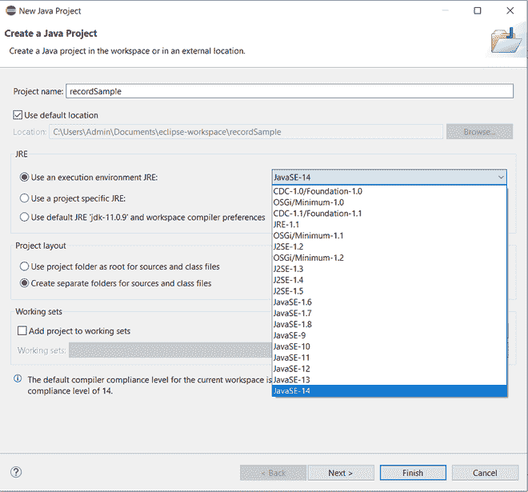
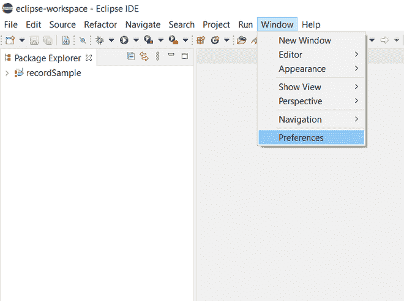
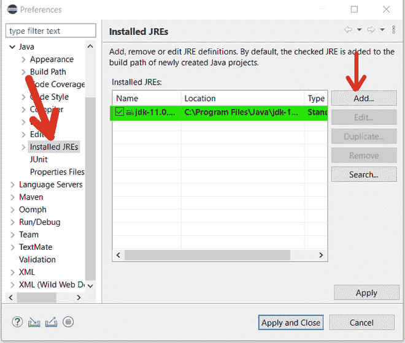
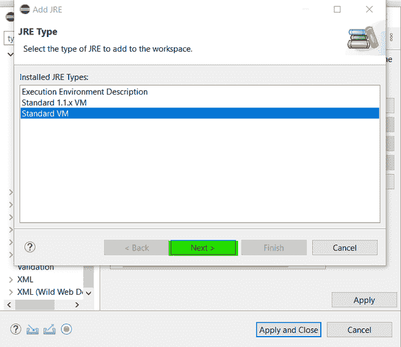
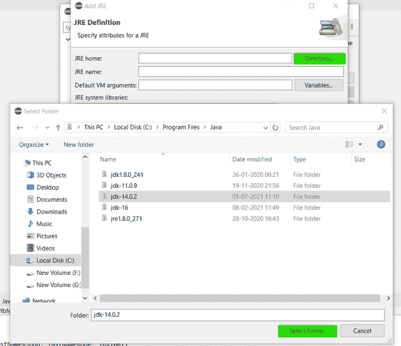
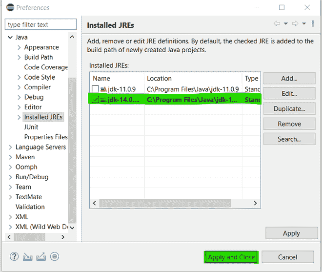
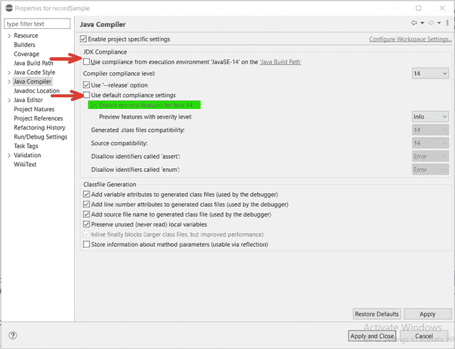

# 什么是 Java 记录，如何与构造函数和方法一起使用？

> 原文:[https://www . geesforgeks . org/什么是 java 记录以及如何与构造函数和方法一起使用/](https://www.geeksforgeeks.org/what-are-java-records-and-how-to-use-them-alongside-constructors-and-methods/)

作为开发人员和软件工程师，我们的目标是始终设计获得最大效率的方法，如果我们需要为其编写更少的代码，那么这是一种福气。

在 Java 中，记录是一种特殊类型的类声明，旨在减少样板代码。引入 Java 记录的目的是将其用作创建数据载体类的一种快速方法，即以简单地包含数据并在模块之间传输数据为目标的类，也称为 POJOs(普通旧 Java 对象)和 DTOs(数据传输对象)。Record 在 Java SE 14 中是作为预览功能引入的，这是一个设计、实现和规范都很完整的功能，但它不是该语言的永久补充，这意味着该功能在该语言的未来版本中可能存在，也可能不存在。Java SE 15 扩展了预览功能，增加了本地记录类等功能。

让我们首先讨论一下为什么在实施之前我们需要记录。让我们考虑一个例子。

插图:

考虑一个简单的类 Employee，它的目标是包含雇员的数据，如其 ID 和姓名，并充当跨模块传输的数据载体。要创建这样一个简单的类，您需要定义它的构造函数、getter 和 setter 方法，如果您想将对象用于像 HashMap 这样的数据结构，或者将其对象的内容打印为字符串，我们需要重写诸如 equals()、hashCode()和 toString()这样的方法。

**例**

## Java 语言(一种计算机语言，尤用于创建网站)

```java
// Java Program Illustrating Program Withoput usage of Records 

// A sample Employee class
class Employee {

    // Member variables of this class
    private String firstName;
    private String lastName;
    private int Id;

    // Constructor of this class
    public Employee(String firstName, String lastName,
                    int Id)
    {

        // This keyword refers to current instance itself
        this.firstName = firstName;
        this.lastName = lastName;
        this.Id = Id;
    }

    // Setter and Getter methods

    // Setter-getter Method 1
    public void setFirstName(String firstName)
    {
        this.firstName = firstName;
    }

    // Setter-getter Method 2
    // to get the first name of employee
    public String getFirstName() { return firstName; }

    // Setter-getter Method 3
    // To set  the last name of employees
    public void setLastName(String lasstName)
    {

        // This keyword refers to current object itself
        this.lastName = lastName;
    }

    // Setter-getter Method 3
    // To set  the last name of employees
    public String getLastName() { return lastName; }

    // Setter-getter Method 4
    // To set  the last name of employees
    public void setId(int Id) { this.Id = Id; }

    // Setter-getter Method 5
    // To set  the last name of employees
    public int getId() { return Id; }

    // Setter-getter Method 6
    public String toString()
    {

        // Return the attributes
        return "Employee [firstName=" + firstName
            + ", lastName=" + lastName + ", Id=" + Id + "]";
    }

    // Method 7
    // Overriding hashCode method
    @Override public int hashCode()
    {

        // Final variable
        final int prime = 31;
        int result = 1;

        result = prime * result + Id;
        result = prime * result
                 + ((firstName == null)
                        ? 0
                        : firstName.hashCode());
        result
            = prime * result
              + ((lastName == null) ? 0
                                    : lastName.hashCode());

        return result;
    }

    // Method 8
    // Overriding equals method to
    // implement with data structures
    @Override public boolean equals(Object obj)
    {

        // This refers to current instance itself
        if (this == obj)
            return true;

        if (obj == null)
            return false;

        if (getClass() != obj.getClass())
            return false;

        Employee other = (Employee)obj;

        if (Id != other.Id)
            return false;

        if (firstName == null) {
            if (other.firstName != null)
                return false;
        }

        else if (!firstName.equals(other.firstName))
            return false;

        if (lastName == null) {
            if (other.lastName != null)
                return false;
        }

        else if (!lastName.equals(other.lastName))
            return false;

        return true;
    }
}
```

> **注意:**仅仅是创建一个携带一些数据的类就超过了 100 行代码。

现在，在讨论记录的属性之前，让我们先来看看使用 Record 创建一个类似的类以获得它的用法，如下所示:

**记录的更多属性**

*   您可以在记录中使用嵌套类和接口。
*   您也可以有嵌套记录，这将隐式地是静态的。
*   记录可以实现接口。
*   您可以创建一个通用记录类。
*   可以使用本地记录类(从 Java SE 15 开始)。
*   记录可序列化。

尽管使用记录作为数据载体对象很有诱惑力，但记录仍然是 Java 中的一个预览功能。此外，由于它们仅用作数据载体，因此定义我们自己的访问方法和其他实例方法会违背目的。记录可以用来减少开发人员所做的工作，但是在内部，记录和类之间的性能差异并没有那么大

```java
public record Employee(int id, String firstName, String lastName) {}
```

就这样！只有 2 行代码，这是使用 Record 实现这 80 行代码所需要的全部。为了了解 Java 如何实现这样的功能，我们将首先学习如何自己设置它。现在让我们讨论演示 java 记录的可视化辅助工具的步骤。因为记录是 Java SE 14 的一个特性，所以我们的机器上需要 JDK 14。从这个[档案](https://www.oracle.com/java/technologies/javase/jdk14-archive-downloads.html)为你的机器下载甲骨文 JDK 14。将 JDK-14 和任何其他 java 版本一起下载并安装到 Java 文件夹后，请遵循以下步骤。

> **注**:本教程使用 Eclipse IDE。

**设置 java 记录的步骤**

**步骤 1:** 新建一个 Java 项目，选择 JavaSE-14 作为执行环境。



**步骤 2:** 如果这是您第一次使用 JDK-14，那么您还需要执行一些步骤来配置记录。您可能会在项目文件夹中看到这种类型的异常标记。


**第三步:**要解决这个问题，在顶部，转到*窗口- >偏好设置*。



**第 4 步:**在首选项窗口中，点击*已安装的 JREs* ，然后点击*添加，如下图:*



**步骤 5:** 现在在打开的添加 JRE 窗口中，选择*标准 VM* 并点击*下一步。*你会看到一个新的窗口打开来选择一个 JRE，现在点击*目录*并导航到你的 jdk-14 的安装位置并选择那个文件夹。点击*完成*。

 

**第六步:**勾选刚刚添加的 JDK-14，*应用*即可。



**第七步:**我们还没有完成。由于记录是一个预览功能，我们需要让他们能够使用它。在左侧的*项目浏览器*窗口中，选择您的项目，右键单击并转到其*属性*。

**步骤 8:** 在打开的窗口上，在窗口的右侧，从各种选项中选择 *Java 编译器。*之后，在左侧，取消选中图像中用红色箭头标记的设置，并选中用绿色突出显示的设置。这样做将启用预览功能。



**第九步:**点击*应用关闭后，*会出现提示询问是否要重建项目。选择*是*。

**实施:**

配置环境后，我们现在可以继续为记录编写代码了。

编码记录是通过编写记录而不是类声明中的**类**来声明的。定义记录时，所有实例字段都作为参数写入。构造函数、getter 方法、toString()、equals()和 hashCode()是由 Java 编译器在编译时生成的。这里需要注意的一点是，记录不提供 setter 方法，因为应该在创建对象时提供实例变量的值。

```java
// A simple Employee class to be used as a DTO

public record Employee(int id, String firstName,
                       String lastName) {
}
```

**例 1**

```java
// Creating Employee object and showcasing its use cases

// Main class
class GFG {

  // Main driver method
  public static void main(String args[]) {

    // Creating object with default constructor
    Employee e1 = new Employee(1001, "Derok", "Dranf");

    // Auto generated getter methods
    System.out.println(e1.id() + " " + e1.firstName()
                       + " " + e1.lastName());

    // Auto-generated toString() method
    System.out.println(e1.toString());
  }
}
```

**输出:**

```java
1001 Derok Dranf
Employee[id=1001, firstName=Derok, lastName=Dranf]
```

我们会注意到 getter 方法在命名约定上与创建的普通 getter 方法(例如:getFirstName())并不相似，相反，它们只是由字段的名称(例如:FirstName())来表示。现在让我们扩展前面的例子来测试这些功能。

这不是一张唱片能做的全部。记录还为我们提供了以下能力:

*   创建我们自己的构造器。在记录中，您可以创建一个参数化构造函数，该构造函数使用其主体中提供的参数调用默认构造函数。您还可以创建类似于默认构造函数的紧凑构造函数，但是您可以添加一些额外的功能，例如构造函数体内部的检查。
*   创建实例方法。像任何其他类一样，您可以为记录类创建和调用实例方法。
*   创建静态字段。记录限制我们只能将实例变量作为参数编写，但允许使用静态变量和静态方法。

**例 1**

```java
// Java Program Illustrating a Record class
// defining constructors, instance methods
// and static fields

// Record class
public record Employee(int id, String firstName,
                       String lastName)
{

    // Instance fields need to be present in the record's
    // parameters but record can define static fields.
    static int empToken;

    // Constructor 1 of this class
    // Compact Constructor
    public Employee
    {
        if (id < 100) {
            throw new IllegalArgumentException(
                "Employee Id cannot be below 100.");
        }
        if (firstName.length() < 2) {
            throw new IllegalArgumentException(
                "First name must be 2 characters or more.");
        }
    }

    // Constructor 2 of this class
    // Alternative Constructor
    public Employee(int id, String firstName)
    {
        this(id, firstName, null);
    }

    // Instance methods
    public void getFullName()
    {
        if (lastName == null)
            System.out.println(firstName());

        else
            System.out.println(firstName() + " "
                               + lastName());
    }

    // Static methods
    public static int generateEmployeeToken()
    {
        return ++empToken;
    }
}
```

**例 2**

## Java 语言(一种计算机语言，尤用于创建网站)

```java
// Java Program to Illustrate Record's functionalities

// Main class
class GFG {

  // Main driver method
  public static void main(String args[]) {

    // Creating object with default constructor
    Employee e1 = new Employee(1001, "Derok", "Dranf");

    // auto generated getter methods
    System.out.println(e1.id() + " " + e1.firstName()
                       + " " + e1.lastName());

    // Auto-generated toString() method
    System.out.println(e1.toString());

    // Creating object with parameterised constructor
    Employee e2 = new Employee(1002, "Seren");

    // Using instance methods
    e2.getFullName();

    // Using static methods
    System.out.println("Employee " + e2.id()
                       + " Token = "
                       + e2.generateEmployeeToken());

    // Using the equals() method
    System.out.print("Is e1 equal to e2: "
                     + e1.equals(e2));
  }
}
```

**输出:**

```java
1001 Derok Dranf
Employee[id=1001, firstName=Derok, lastName=Dranf]
Seren
Employee 1002 Token = 1
Is e1 equal to e2: false
```

**极客，你有没有想过编译器有什么魔力？**

如上所述，记录只是一个类的特殊声明，编译器在内部将其转换为带有一些限制的普通类，这使得它不同于典型的类。当 Java 文件被 Java 编译器编译成字节码时。生成的类文件包含记录类的扩展声明。通过查看那个文件，我们可以了解更多关于记录的信息。为我们上面创建的员工记录生成的字节码如下:

```java
public final class Employee extends java.lang.Record {
   private final int id;
   private final java.lang.String firstName;
   private final java.lang.String lastName;
   static int empToken;

   public Employee(int id, java.lang.String firstName, java.lang.String lastName) { /* compiled code */ }

   public Employee(int id, java.lang.String firstName) { /* compiled code */ }

   public void getFullName() { /* compiled code */ }

   public static int generateEmployeeToken() { /* compiled code */ }

   public int id() { /* compiled code */ }

   public java.lang.String firstName() { /* compiled code */ }

   public java.lang.String lastName() { /* compiled code */ }

   public java.lang.String toString() { /* compiled code */ }

   public final int hashCode() { /* compiled code */ }

   public final boolean equals(java.lang.Object o) { /* compiled code */ }
}
```

**结论:**如果我们花一些时间观察字节码，您会注意到以下情况:

*   **记录**已经被**类**取代。
*   该类及其数据成员已被声明为**最终**。这意味着这个类不能被扩展，即不能被继承，并且也是不可变的。
*   该类扩展了 **java.lang.Record** 。这意味着所有记录都是 java.lang 包中定义的 Record 的子类。
*   有一个默认构造函数和一个参数化构造函数。您会注意到，我们定义的紧凑构造函数没有单独的声明。这是因为紧凑构造函数不生成单独的构造函数，而是将其代码添加到默认构造函数体的开头。
*   实例和静态方法按原样声明。
*   toString()、hashCode()和 equals()方法已由编译器自动生成..