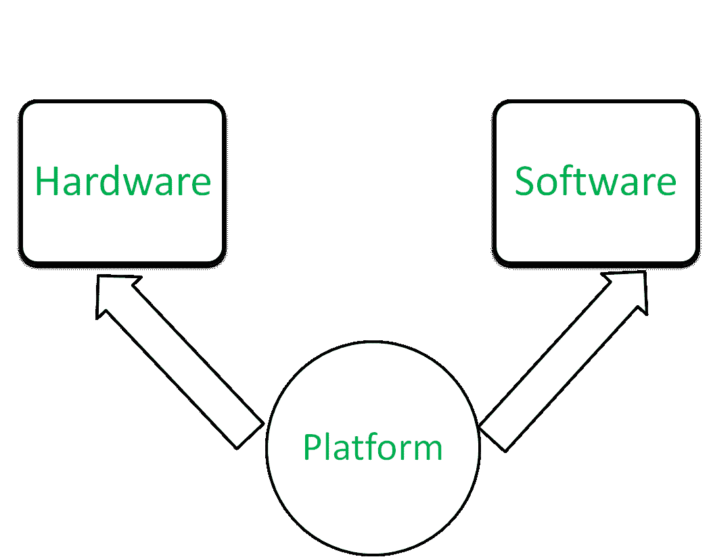

# Java 平台与其他平台的主要区别是什么？

> 原文:[https://www . geesforgeks . org/Java 平台和其他平台的主要区别是什么/](https://www.geeksforgeeks.org/what-are-the-main-differences-between-the-java-platform-and-other-platforms/)

**什么是平台？**:平台是程序运行的硬件或软件环境。Java 有自己的运行时环境，称为 [JRE(Java 运行时环境)](https://www.geeksforgeeks.org/differences-jdk-jre-jvm/)和 [Java 虚拟机(JVM)](https://www.geeksforgeeks.org/jvm-works-jvm-architecture/) ，将 Java 代码转换为机器代码。

平台类型

**Java 平台与其他平台的区别:**

Java 平台和其他平台的主要区别是:

1.  [Java 是与**平台无关的**](https://www.geeksforgeeks.org/java-platform-independent/) 由于这个特性我们可以在一个平台上编写 Java 代码，并且可以在任何其他平台上读取/运行，即 **[WORA(一次写入随处读取)](https://www.geeksforgeeks.org/why-is-java-write-once-and-run-anywhere/)** 。其他语言缺乏这种能力。
2.  Java 平台是在其他基于硬件的平台之上运行的**纯软件平台**，其他平台大多是硬件软件或者纯硬件，只能在基于硬件的平台上运行。
3.  程序员可以在**任何 OS** 上开发 Java 代码。大多数其他平台都不具备这种能力。
4.  Java 有自己的运行时环境，称为 [JRE(Java 运行时环境)](https://www.geeksforgeeks.org/differences-jdk-jre-jvm/)和 [Java 虚拟机(JVM)](https://www.geeksforgeeks.org/jvm-works-jvm-architecture/) ，将 Java 代码转换为机器代码，而这一功能在其他平台上是缺失的。