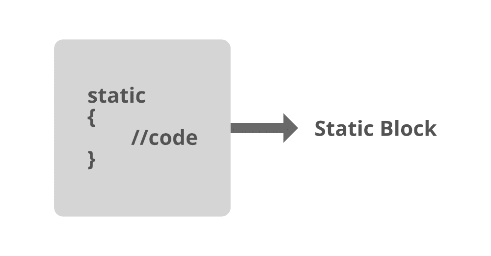
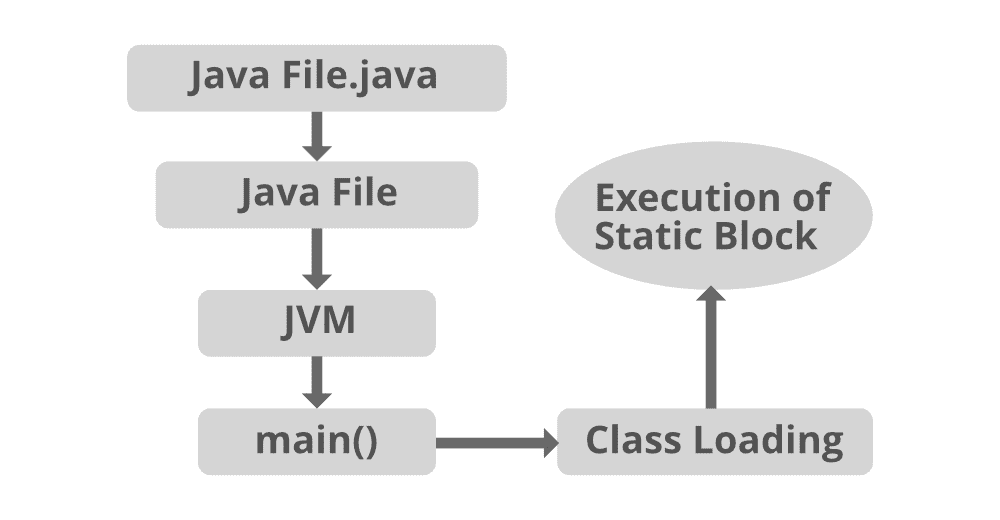

# 什么是 Java 中的类加载和静态块？

> 原文:[https://www . geesforgeks . org/什么是 java 中的类加载和静态块/](https://www.geeksforgeeks.org/what-is-class-loading-and-static-blocks-in-java/)

[类加载](https://www.geeksforgeeks.org/classloader-in-java/)是将类特定信息存储在内存中的过程。特定于类的信息是指关于类成员的信息，即变量和方法。就像在发射子弹之前，首先，我们需要将子弹装入手枪。同样，要首先使用一个类，我们需要通过类加载器来加载它。静态块在一个类的生命周期中只运行一次。它只能访问静态成员，并且只属于该类。

[静态块](https://www.geeksforgeeks.org/g-fact-79/)就像任何以‘Static’关键字开头的代码块都是静态块。Static 是一个关键字，当它被附加到方法、变量、块时，就成为类方法、类变量和类块。您可以使用类名调用静态变量/方法。 [JVM](https://www.geeksforgeeks.org/jvm-works-jvm-architecture/) 在“类加载时间”执行静态块。

执行顺序:对于每个静态块，都有一个静态块/方法/变量初始化的顺序。

1.  静态块
2.  静态变量
3.  静态法



> 现在弄清楚类加载和静态块之间的联系在对静态块和类加载有了概念之后，发现静态块的执行发生在类第一次被加载的时候。它是一系列的步骤。

**说明:**展示该静态块的一般执行应该发生在前面提到的一系列步骤中。

随机考虑一个 java 文件“File.java”，其中有一个静态块，然后是一系列上述步骤。

1.  java 文件编译。
2.  java 文件的执行。
3.  Java 虚拟机 JVM 正在调用程序中的主方法。
4.  类已加载，所有必要的信息都已存储在内存中。
5.  静态块的执行开始。



请求

## Java 语言(一种计算机语言，尤用于创建网站)

```
// Java Program to illustrate static block concept
// alongside discussing the class loading

// Importing all input output classes
import java.io.*;

// Class
class GFG {

    // Static block
    static
    {
        // Static block will be executed first
        // before anything else

        // Print message
        System.out.println(
            "I am static block and will be shown to eyeballs first no matter what");
    }

    // Main driver method
    public static void main(String[] args)
    {
        // Print message
        // Now main method will execute
        System.out.println(
            "I am the only line in main method but static block is hindering me to display first");
    }
}
```

**Output**

```
I am static block and will be shown to eyeballs first no matter what
I am the only line in main method but static block is hindering me to display first

```