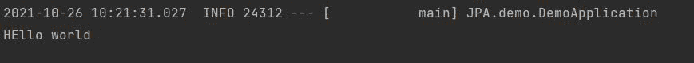

# 什么是 Spring Boot 的命令行运行界面？

> 原文:[https://www . geesforgeks . org/what-is-command-line-runner-interface-in-spring-boot/](https://www.geeksforgeeks.org/what-is-command-line-runner-interface-in-spring-boot/)

[Java 语言](https://www.geeksforgeeks.org/java/)是所有编程语言中最流行的语言之一。使用 java 编程语言有几个优点，无论是出于安全目的还是构建大型分发项目。使用 Java 的优势之一是，Java 试图借助类、继承、多态等概念，将语言中的每个概念与现实世界联系起来。

java 中还有其他几个概念，增加了 java 代码和程序员之间的用户友好交互，例如泛型、访问说明符、注释等。这些特性为类以及 java 程序的方法增加了一个额外的属性。在本文中，我们将讨论 spring boot 中的命令行 runner 接口。

**命令行界面**

这个接口存在于 springbootframework.boot 的依赖项中，用于快速启动 spring boot 应用程序。此接口包含在应用程序启动后执行的 run 方法()。极客们，如果你们觉得不容易理解，那就先了解一下 [Spring Initializr](https://www.geeksforgeeks.org/spring-initializr/)

**调用的方法:**覆盖运行()

```
void run(String ..arg)
```

**参数:**此方法包含 [varargs 参数](https://www.geeksforgeeks.org/variable-arguments-varargs-in-java/)用于处理多个字符串对象。

**返回类型:**不返回任何东西(空)

我们使用它是因为如果它是使用命令行运行程序接口的关联优势，如上所述。[使用命令行 runner 接口调试](https://www.geeksforgeeks.org/software-engineering-debugging/)非常容易，因为我们不需要通过 API 调用显式调用特定的资源，我们可以使用命令行 runner 接口的 run 方法调用它们，一旦应用程序成功执行，就会立即执行。

让我们用一个例子来理解这个界面的功能，所以 **Spring Initializr** 基本上是一个基于 web 的工具，使用它我们可以很容易地生成 Spring Boot 项目的结构。它还为元数据模型中表达的项目提供了各种不同的特性。这个模型允许我们配置 JVM 支持的依赖列表。在这里，我们将使用 spring 初始化器创建一个应用程序的结构，因此，要做到这一点，以下步骤如下所示:

**步骤:**

1.  转到 spring 初始化
2.  按照要求填写细节。
3.  单击生成，它将下载初始项目
4.  提取压缩文件。
5.  转到回弹应用程序类
6.  运行 SpringBootAppApplication 类，等待 Tomcat 服务器

**步骤 1:** 转到春季初始化


**第二步:**按要求填写详细内容。对于此应用:

```
Project: Maven
Language: Java
Spring Boot: 2.2.8
Packaging: JAR
Java: 8
Dependencies: Spring Web
```

**第 3 步:**点击生成，将下载启动项目。

**第 4 步:**提取 zip 文件。现在打开一个合适的 IDE，然后转到文件- >新建- >现有来源的项目- > Spring-boot-app，并选择 pom.xml。在提示符下单击导入更改，等待项目同步。


> **注意:**在 Maven 的导入项目窗口中，确保选择了与创建项目时选择的 JDK 相同的版本。

**第 5 步:**转到 src - > main - > java - >回弹应用程序类

**SpringBootAppApplication.java**

```
@SpringBootApplication

// Main class
// Implementing CommandLineRunner interface
public class SpringBootAppApplication implements CommandLineRunner 
{

    // Method 1
    // run() method for springBootApplication to execute
    @Override
    public void run(String args[]) throws Exception 
    {

        // Print statement when method is called
        System.out.println("HEllo world");
    }

    // Method 2
    // Main driver method
    public static void main(String[] args) 
    {

        // Calling run() method to execute SpringBootApplication by
        // invoking run() inside main() method
        SpringApplication.run(SpringBootAppApplication .class, args);
    }
}
```

这个应用程序现在可以运行了。

**第 6 步:**运行 SpringBootAppApplication 类，等待 [Tomcat 服务器](https://www.geeksforgeeks.org/difference-between-apache-tomcat-server-and-apache-web-server/)在已经设置了默认端口的地方启动。

> **提示:**Tomcat 服务器的默认端口是 8080，可以在 application.properties 文件中更改。

**输出:**在端子/CMD 上产生



如果我们想打印一些东西，我们必须使用应用编程接口调用，这就是为什么命令行运行程序接口是有帮助的。