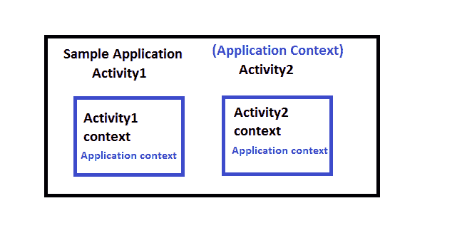

# 安卓中的语境是什么？

> 原文:[https://www.geeksforgeeks.org/what-is-context-in-android/](https://www.geeksforgeeks.org/what-is-context-in-android/)

安卓应用流行了很长一段时间，它正在向更高的水平发展，因为用户的期望是他们需要以更容易、更流畅的视图查看他们想要的数据。因此，安卓开发者在开发应用程序之前必须了解重要的术语。在安卓编程中，我们通常会遇到一个词**上下文**。那么这个语境到底是什么，为什么如此重要？要回答这个问题，首先让我们看看上下文的字面意思是什么:

> *形成一个事件、陈述或想法的背景的环境，根据这些环境可以完全理解*

看看这个定义，我们会遇到两件事:

*   上下文告诉我们周围的信息。
*   了解我们想要了解的环境是非常重要的。

同样，当我们谈论安卓编程时，上下文可以理解为给我们提供应用程序当前状态的上下文。我们可以把上下文及其用法分成三个要点:

*   它允许我们访问资源。
*   它允许我们通过发送消息与其他安卓组件进行交互。
*   它为您提供关于您的应用程序环境的信息。

在官方[安卓文档](https://developer.android.com/reference/android/content/Context)中，上下文定义为:

> 应用程序环境的全局信息接口。这是一个抽象类，其实现由 Android 系统提供。它允许访问特定于应用程序的资源和类，以及对应用程序级操作的调用，如启动活动、广播和接收意图等。

### 通过真实世界的例子理解上下文

让我们一个人参观一家旅馆。他需要在合适的时间吃早餐、午餐和晚餐。除了这些事情之外，还有很多其他的事情，他想在逗留期间做。那么他是怎么得到这些东西的呢？他会让客房服务人员为他带来这些东西。对吗？所以这里的**客房服务人员是语境**考虑到**你是单身活动**和**酒店要成为你的 app** ，最后该**早餐、午餐&晚餐就得成为资源**。

### **这个作品怎么样**？****

**1。它是应用程序当前/活动状态的上下文。**

通常，应用程序有多个屏幕，如显示/查询/添加/删除屏幕(基本应用程序的一般要求)。因此，当用户在搜索某样东西时，在这种情况下，上下文就是一个查询屏幕。

**2。它用于获取有关活动和应用程序的信息。**

查询屏幕的上下文指定用户正在进行查询活动，他/她可以提交与应用程序相关的查询

**3。它用于访问资源、数据库和共享首选项等。**

通过 Rest 服务，API 调用可以在安卓应用中消费。Rest 服务通常保存数据库数据，并以 JSON 格式向安卓应用程序提供输出。各个屏幕的上下文有助于获得数据库数据和跨屏幕共享的数据

**4。活动类和应用程序类都扩展了上下文类。**

在 android 中，上下文是主要的重要概念，对它的错误使用会导致内存泄漏。活动指的是单个屏幕，应用指的是整个应用，两者都扩展了上下文类。

## 安卓系统中的上下文类型

Android 中主要有两种类型的上下文可用。

1.  **应用上下文和**
2.  **活动上下文**

应用程序层次结构的整体视图如下所示:



从上图可以看出，在“示例应用程序”中，最近的上下文是应用程序上下文。在“活动 1”和“活动 2”中，活动上下文(这里是活动 1 的活动 1 上下文和活动 2 的活动 2 上下文)和应用程序上下文。与两者最接近的上下文仅是它们的活动上下文。

### **应用上下文**

该上下文与应用程序的[生命周期](https://www.geeksforgeeks.org/activity-lifecycle-in-android-with-demo-app/)相关联。主要是一个单独的实例，可以通过**【getApplicationContext()**访问。应用程序上下文的一些用例是:

*   如果有必要创建单例对象
*   在一项活动中图书馆的必要性

### **getApplicationContext():**

用于返回链接到应用程序的上下文，该应用程序保存在其内部运行的所有活动。 当我们调用一个方法或构造函数时，我们经常需要传递一个上下文，我们经常使用**【this】**来传递活动上下文，或者使用**【GetapplicationContext】**来传递应用程序上下文。该方法一般用于应用层面，可用于参考至所有活动。例如，如果我们想在整个安卓应用中访问一个变量，我们必须通过**GetapplicationContext()**来使用它。

**示例:**

## Java 语言(一种计算机语言，尤用于创建网站)

```java
import android.app.Application;

public class GlobalExampleClass extends Application
{
  private String globalName;
  private String globalEmail;

  public String getName() 
  {
      return globalName;
  }

  public void setName(String aName) 
  {
      globalName = aName;    
  }

  public String getEmail() 
  {
      return globalEmail;
  }

  public void setEmail(String aEmail) 
  {
      globalEmail = aEmail;
  }
}
```