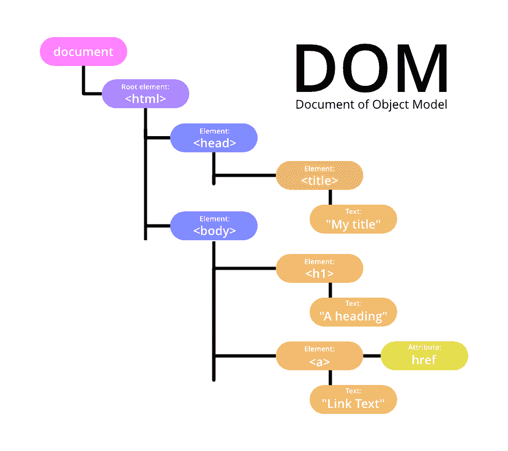

# 什么是 Java DOM 中的文档对象？

> 原文:[https://www . geesforgeks . org/什么是 java-dom 中的文档对象/](https://www.geeksforgeeks.org/what-is-document-object-in-java-dom/)

**文档对象模型**是对万维网联盟的褒奖。它解释了一个接口，使程序能够访问和修改 XML 文档的样式、结构和内容。支持 DOM 的 XML 解析器实现了这个接口。从下面提供的图片可以清楚地看到。

**什么时候应该使用 DOM 解析器？**

1.  当你非常了解文档的结构时，可以使用它。
2.  如果需要多次使用 XML 文档中的信息，请使用它。
3.  您需要移动部分 XML 文档。

**使用 DOM 我们得到了什么？**

*   当用 [DOM 解析器](https://www.geeksforgeeks.org/difference-between-sax-parser-and-dom-parser-in-java/)解析一个 XML 文档时，它会返回一个包含文档所有元素的树结构。
*   DOM 提供了各种各样的功能，比如你可以用它来检查文档的内容和结构。

让我们讨论一下 DOM 的优势，如下所示:

*   用于操作文档结构。
*   数据保存在内存中。
*   您可以在树中前进和后退(随机访问)
*   您可以直接对内存中的树进行更改。

**DOM 接口**

*   **节点:**DOM 节点接口是一个抽象基类，许多其他 DOM 应用编程接口对象都基于它，因此这些对象类型可以类似地使用，并且经常可以互换。
*   **元素:**它代表一个程序元素，如包、类或方法。
*   **Attr:** 用于表示元素的一个属性。
*   **文本:**是元素或属性的实际内容。
*   **文档:**文档代表整个 XML 文档。

常见的 DOM 方法:

<figure class="table">

| 方法 | 已执行的操作 |
| --- | --- |
| getelemontid_) | 它用于虚拟访问任何元素。它访问具有指定标识的第一个元素。 |
| 获得由塔格名的元素 （） | 在前面的方法中，我们可能会有一些错误。但是这种方法可以消除这些问题。getElementByTagName 允许您搜索页面上具有指定标记名的所有元素。 |

</figure>

> 页面上的任何元素，包括 DOM 结构中的文本和空白，都被称为“节点”节点可以在 XHTML 标签之间。