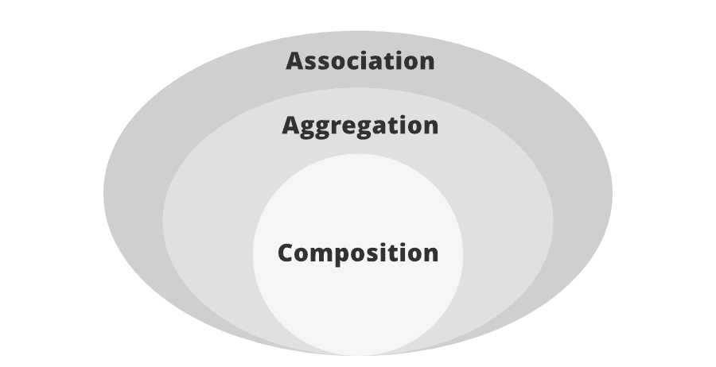
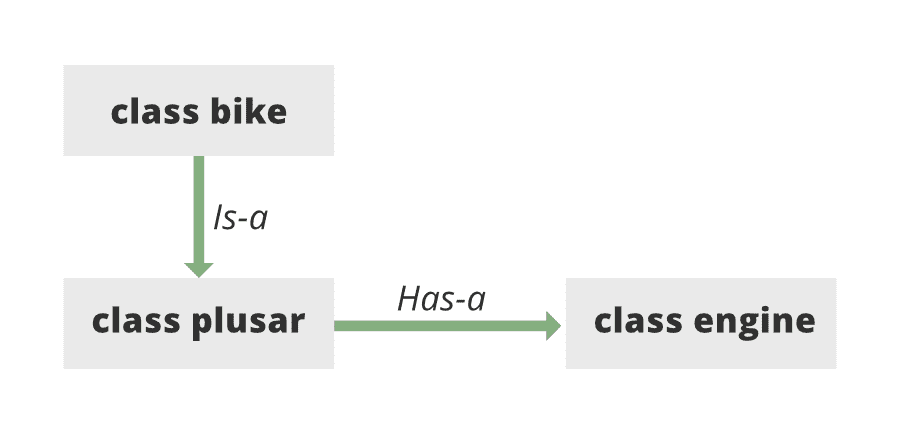

# 什么是 Java 中的有一关系？

> 原文:[https://www . geesforgeks . org/is-is-has-a-relation-in-Java/](https://www.geeksforgeeks.org/what-is-has-a-relation-in-java/)

[关联](https://www.geeksforgeeks.org/association-composition-aggregation-java/)是两个独立的类之间通过它们的对象建立的关系。[组合](https://www.geeksforgeeks.org/association-composition-aggregation-java/)和[聚合](https://www.geeksforgeeks.org/association-composition-aggregation-java/)是两种关联形式。在 Java 中，一个[有-一个](https://www.geeksforgeeks.org/association-composition-aggregation-java/)的关系被称为复合。它还用于 Java 中的代码重用。在 Java 中，一个“有-有”关系本质上意味着一个类的例子引用了另一个类的场合或者另一个相似类的出现。例如，车辆有马达，犬类有尾巴，等等。在 Java 中，没有这样的口号来执行一个“有-有”关系。然而，我们通常利用新的口号来实现 Java 中的一种有-有关系。



[Has-a](https://www.geeksforgeeks.org/association-composition-aggregation-java/) 是一种特殊的关联形式，其中:

*   它代表着“有-有”关系。
*   这是一种单向关联，即单向关系。例如，如上图所示，脉冲星摩托车有一个发动机，但反之亦然是不可能的，因此本质上是单向的。
*   在聚合中，两个条目可以单独存在，这意味着结束一个实体不会影响另一个实体。

插图:



这表明脉冲星级有一个引擎。通过为引擎设置一个不同的类，我们不需要将整个有速度的代码放在范类中，这使得在许多应用程序中重用速度类成为可能。

在面向对象的元素中，客户不必为哪篇文章完成了真正的工作而大惊小怪。为了实现这一点，范类向范类的客户隐藏了执行的微妙之处。因此，本质上发生的是，客户会要求范班做一个特定的活动，范班要么在没有任何人帮助的情况下完成这项工作，要么要求另一个班完成这项活动。

**实现:**下面是同一个的实现，具体如下:

1.  Car 类有几个实例变量和几个方法
2.  玛莎拉蒂是一种扩展了汽车等级的汽车，表明玛莎拉蒂是一辆汽车。玛莎拉蒂也使用发动机的方法，停止，使用合成。这表明玛莎拉蒂有一台发动机。
3.  发动机级别有两种方法*启动()*和*停止()*，玛莎拉蒂级别使用这两种方法。

**示例:**

## Java 语言(一种计算机语言，尤用于创建网站)

```java
// Java Program to Illustrate has-a relation

// Class1
// Parent class
public class Car {

    // Instance members of class Car
    private String color;
    private int maxSpeed;

    // Main driver method
    public static void main(String[] args)
    {
        // Creating an object of Car class
        Car nano = new Car();

        // Assigning car object color
        nano.setColor("RED");

        // Assigning car object speed
        nano.setMaxSpeed(329);

        // Calling carInfo() over object of Car class
        nano.carInfo();

        // Creating an object of Maserati class
        Maserati quattroporte = new Maserati();

        // Calling MaseratiStartDemo() over
        // object of Maserati class
        quattroporte.MaseratiStartDemo();
    }

    // Methods implementation

    // Method 1
    // To set the maximum speed of car
    public void setMaxSpeed(int maxSpeed)
    {
        // This keyword refers to current object itself
        this.maxSpeed = maxSpeed;
    }

    // Method 2
    // To set the color of car
    public void setColor(String color)
    {
        // This keyword refers to current object
        this.color = color;
    }

    // Method 3
    // To display car information
    public void carInfo()
    {
        // Print the car information - color and speed
        System.out.println("Car Color= " + color
                           + " Max Speed= " + maxSpeed);
    }
}

// Class2
// Child class
// Helper class
class Maserati extends Car {

    // Method in which it is shown
    // what happened with the engine of Puslar
    public void MaseratiStartDemo()
    {
        // Creating an object of Engine type
        // using stop() method
        // Here, MaseratiEngine is name of an object
        Engine MaseratiEngine = new Engine();
        MaseratiEngine.start();
        MaseratiEngine.stop();
    }
}

// Class 3
// Helper class
class Engine {

    // Method 1
    // To start a engine
    public void start()
    {
        // Print statement when engine starts
        System.out.println("Started:");
    }

    // Method 2
    // To stop a engine
    public void stop()
    {
        // Print statement when engine stops
        System.out.println("Stopped:");
    }
}
```

**Output**

```java
Car Color= RED Max Speed= 150
Started:
Stopped:
```