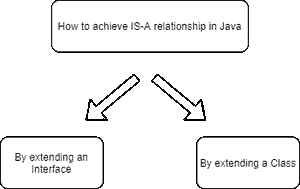
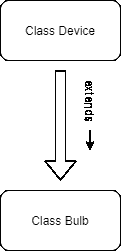

# 什么是 Java 中的 Is-A-关系？

> 原文:[https://www . geesforgeks . org/is-is-is-a-relationship-in-Java/](https://www.geeksforgeeks.org/what-is-is-a-relationship-in-java/)

**一个关系**在 Java 中的意思是两个或多个类之间的不同关系。例如，如果一个类“灯泡”继承了另一个类“设备”，那么我们可以说“灯泡”与“设备”有一种“是”的关系，这意味着“灯泡”是一个设备。

在 Java 中，我们有两种类型的关系:

1.  **Is-A 关系:**每当一个类继承另一个类时，称为 Is-A 关系。
2.  **Has-A 关系:**每当一个类的实例在另一个类中使用时，就称为 Has-A 关系。

### 是一种关系

**IS-A 关系**与[继承](https://www.geeksforgeeks.org/inheritance-in-java/)完全相关。例如——猕猴桃是一种水果；灯泡是一种装置。

*   IS-通过使用[扩展](https://www.geeksforgeeks.org/extends-vs-implements-in-java/)关键字，可以简单地实现关系。
*   在 Java 中，为了代码的可重用性和避免代码冗余，还使用了一种关系。
*   IS-A 关系是单向的，这意味着我们可以说灯泡是一个装置，但反之亦然；一个设备是灯泡是不可能的，因为不是所有的设备都是灯泡。
*   IS-关系是紧密耦合的，这意味着改变一个实体会影响另一个实体。

### 信息系统的优势——一种关系

*   代码可重用性。
*   减少冗余。

### **如何实现 IS-A 关系**

**IS-A** 关系可以简单地通过使用 extend 关键字扩展接口或类来实现。



让我们借助流程图来理解 **IS-A 关系**



**在上面的流程图中，**类 Bulb **扩展了**类 Device，这意味着 Device 是 Bulb 的父类，而 class Bulb 据说是有 Is-A 关系的。因此我们可以说灯泡**是-A** 装置。

### 信息系统的实施——一种关系

1.设备类有一个名为设备名的字段。

2.灯泡类扩展了设备，这意味着灯泡是一种设备。

3.因为设备是父类，这意味着设备类可以存储灯泡类实例的引用。

**例:**下面是同一个的实现，具体如下:

## Java 语言(一种计算机语言，尤用于创建网站)

```
// Java program to demonstrate the 
// working of the Is-A relationship

import java.io.*;

// parent class
class Device {

    private String deviceName;

    public void setDeviceName(String deviceName)
    {
        this.deviceName = deviceName;
    }

    public String getDeviceName()
    {
        return this.deviceName + " is a Device";
    }
}

// child class
class Bulb extends Device {
    public static void main(String gg[])
    {
        // parent class can store the reference
        // of instance of child classes
        Device device = new Bulb();

        // set the device name to bulb
        System.out.println("Device name is Bulb");
        device.setDeviceName("Bulb");

        // print the device name
        System.out.println(device.getDeviceName());
    }
}
```

**Output**

```
Device name is Bulb
Bulb is a Device
```

在上面的 java 程序中，灯泡类继承了设备类。因此，我们可以说灯泡与设备类有一种“是-是”关系。因此灯泡**是一个**装置。