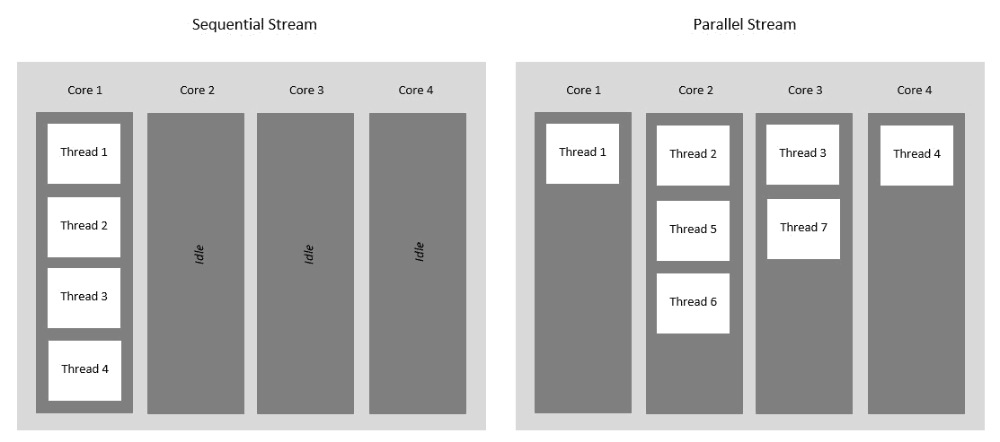
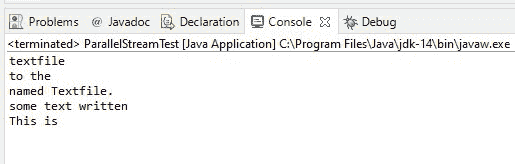
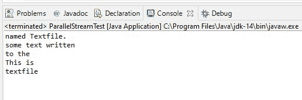
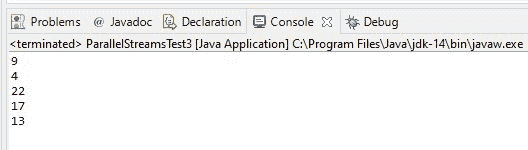

# 什么是 Java 并行流？

> 原文:[https://www . geesforgeks . org/what-is-Java-parallel-streams/](https://www.geeksforgeeks.org/what-is-java-parallel-streams/)

Java Parallel Streams 是 Java 8 及更高版本的一个特性，旨在利用处理器的多个内核。正常情况下，任何 java 代码都有一个处理流，它是按顺序执行的。而通过使用并行流，我们可以将代码分成多个流，这些流在不同的内核上并行执行，最终的结果是各个结果的组合。然而，执行的顺序不在我们的控制之下。

因此，建议在以下情况下使用并行流:无论执行顺序如何，结果都不受影响，一个元素的状态不影响另一个元素，数据源也不受影响。



### 为什么是平行流？

引入并行流是为了提高程序的性能，但是选择并行流并不总是最好的选择。在某些情况下，我们需要以一定的顺序执行代码，在这种情况下，我们最好使用顺序流来执行任务，以牺牲性能为代价。这两种流之间的性能差异只在大型程序或复杂项目中受到关注。对于小规模的项目来说，它甚至可能不引人注目。基本上，当顺序流表现不佳时，您应该考虑使用并行流。

### 创建流的方法

我们有两种方法可以创建，下面列出了这两种方法，后面将描述如下:

1.  对流使用 parallel()方法
2.  在集合上使用并行流()

**方法 1:** 在流上使用并行()方法

**基本流接口**的**并行()方法**返回一个等效的并行流。让我们借助一个例子来解释它是如何工作的。

在下面给出的代码中，我们创建了一个文件对象，它指向系统中预先存在的“txt”文件。然后我们创建一个流，一次从文本文件中读取一行。然后我们使用**并行()方法**在控制台上打印读取的文件。每次运行的执行顺序是不同的，您可以在输出中观察到这一点。下面给出的两个输出具有不同的执行顺序。

**例**

## Java 语言(一种计算机语言，尤用于创建网站)

```java
// Java Program to Illustrate Parallel Streams
// Using parallel() method on a Stream

// Importing required classes
import java.io.File;
import java.io.IOException;
import java.nio.file.Files;
import java.util.stream.Stream;

// Main class
// ParallelStreamTest
public class GFG {

    // Main driver method
    public static void main(String[] args) throws IOException {

        // Creating a File object
        File fileName = new File("M:\\Documents\\Textfile.txt");

        // Create a Stream of string type
        // using the lines() method to
        // read one line at a time from the text file
        Stream<String> text = Files.lines(fileName.toPath());

        // Creating parallel streams using parallel() method
        // later using forEach() to print on console
        text.parallel().forEach(System.out::println);

        // Closing the Stream
        // using close() method
        text.close();
    }
}
```

**输出:**

1A



产出 1

1B



产出 2

**方法 2:** 在集合上使用并行流()

[集合接口](https://www.geeksforgeeks.org/collections-in-java-2/)的**并行流()方法**以集合为源返回一个可能的并行流。让我们借助一个例子来解释这个工作。

**实施:**

在下面给出的代码中，我们再次使用并行流，但是这里我们使用一个列表来读取文本文件。因此，我们需要*parallels stream()方法。*

**例**

## Java 语言(一种计算机语言，尤用于创建网站)

```java
// Java Program to Illustrate Parallel Streams
// using parallelStream() method on a Stream

// Importing requied classes
import java.io.File;
import java.io.IOException;
import java.nio.file.Files;
import java.util.*;

// Main class
// ParallelStreamsTest
public class GFG {

    // Main driver method
    public static void main(String[] args)
        throws IOException
    {

        // Creating a File object
        File fileName
            = new File("M:\\Documents\\List_Textfile.txt");

        // Reading the lines of the text file by
        // create a List using readAllLines() method
        List<String> text
            = Files.readAllLines(fileName.toPath());

        // Creating parallel streams by creating a List
        //  using readAllLines() method
        text.parallelStream().forEach(System.out::println);
    }
}
```

**输出:**



输出