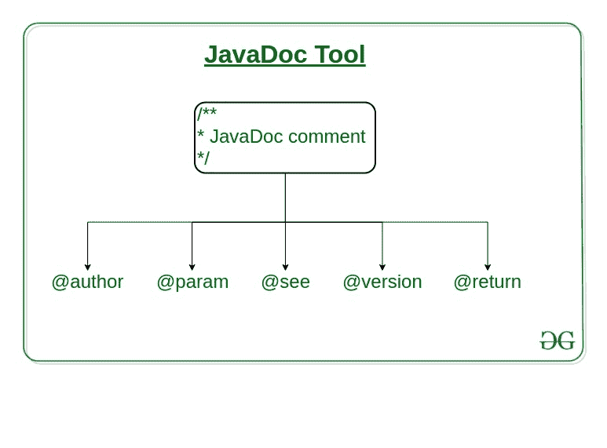

# 什么是 JavaDoc 工具，如何使用？

> 原文:[https://www . geesforgeks . org/what-is-javadoc-tool-and-how-it/](https://www.geeksforgeeks.org/what-is-javadoc-tool-and-how-to-use-it/)

**JavaDoc 工具**是 [Java 编程语言](https://www.geeksforgeeks.org/java/)中的**文档生成器工具**，用于生成 HTML 格式的标准文档。它生成 [API](https://www.geeksforgeeks.org/introduction-to-apis/) 文档。它解析一组描述类、方法、构造函数和字段的源文件中的声明和文档。

在使用 JavaDoc 工具之前，您必须包含 JavaDoc 注释/**……..*/提供有关类、方法和构造函数等的信息。为了给任何 java 文件创建一个好的、可理解的文档 API，你必须为每个类、方法、构造函数写更好的注释。



JavaDoc 注释不同于普通注释，因为注释开头有一个额外的星号。它也可能包含 [**HTML 标签**](https://www.geeksforgeeks.org/most-commonly-used-tags-in-html/) 。

```
// Single-Line Comment

/* 
* Multiple-Line comment
*/
 /** 
* JavaDoc comment
*/
```

通过编写大量的注释，它**不会影响 Java 程序的性能**，因为所有的注释都会在编译时被移除。

**JavaDoc 格式:–**
它有两个部分:–一个描述，后面是块标签。
一些集成开发环境(IDE)会自动生成类似 NetBeans、IntelliJ IDEA、Eclipse 等的 JavaDoc 文件。

**生成 javaDoc:–**
要创建一个 JavaDoc，你不需要编译 Java 文件。要创建 Java 文档应用编程接口，您需要编写 Javadoc，后跟文件名。

```
javadoc file_name or javadoc package_name
```

成功执行上述命令后，将会创建多个 HTML 文件，打开名为 index 的文件查看所有关于类的信息。

**JavaDoc 标签**

<figure class="table">

| 标签 | 参数 | 描述 |
| --- | --- | --- |
| @作者 | 作者姓名 | 描述一个作者 |
| @param | 描述 | 提供有关方法参数或其输入的信息 |
| @参见 | 参考 | 生成到文档其他元素的链接 |
| @版本 | 版本名 | 提供类、接口或枚举的版本。 |
| @返回 | 描述 | 提供返回值 |

</figure>

**在 Eclipse 中生成 JavaDoc:–**

*   从“项目”菜单中选择“生成 JavaDoc”选项，将出现一个向导。
*   指定 JavaDoc 文件在计算机上的位置，默认情况下，它将在 c 盘中。
*   选择项目，然后选择要为其创建 JavaDoc 文件的包。
*   在右侧，选择您想要为其生成 JavaDoc 的类，默认情况下，所有的类都将被选中。
*   然后，您还可以通过选择可见性来指定将为哪些类生成 JavaDoc。
*   选择将放置生成的 JavaDoc 的目标位置。
*   然后单击下一步或完成。
    如果在下一个窗口中选择下一步，您可以选择文档标题和其他基本选项。

**示例 1:–**

## Java 语言(一种计算机语言，尤用于创建网站)

```
package exa;

import java.util.Scanner;

/**
*
* @author Yash
*/
public class Example {
    /**
* This is a program for adding two numbers in java.
    * @param args
*/
    public static void main(String[] args)
    {
        /**
        * This is the main method
        * which is very important for
        * execution for a java program.
        */

        int x, y;
        Scanner sc = new Scanner(System.in);
        /**
        * Declared two variables x and y.
        * And taking input from the user
        * by using Scanner class.
        *
        */

        x = sc.nextInt();
        y = sc.nextInt();
        /**
        * Storing the result in variable sum
        * which is of the integer type.
        */
        int sum = x + y;

        /**
        * Using standard output stream
        * for giving the output.
        * @return null
        */
        System.out.println("Sum is: " + sum);
    }
}
```

**为上述类生成文档**

```
javadoc exa
```

**javadoc 截图:–**

