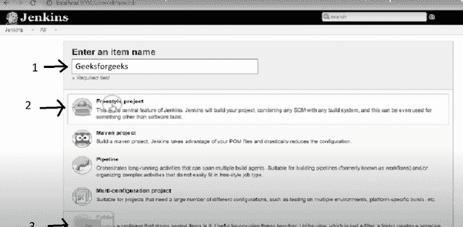
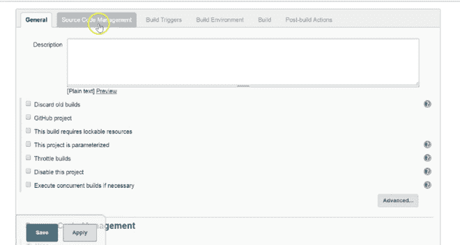
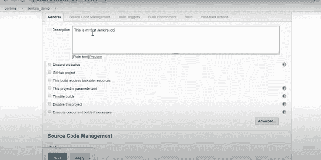
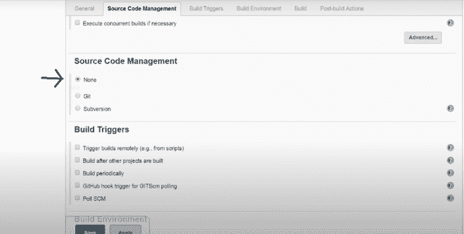
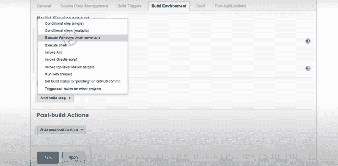
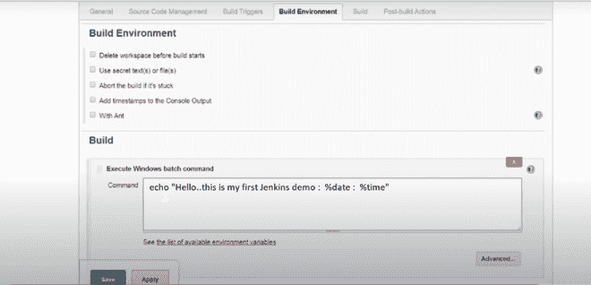
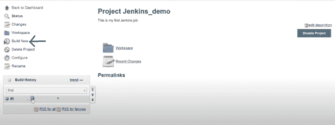

# 什么是詹金斯？

> 原文:[https://www.geeksforgeeks.org/what-is-jenkins/](https://www.geeksforgeeks.org/what-is-jenkins/)

[**【詹金斯】**](https://www.geeksforgeeks.org/jenkins-and-git-integration-using-ssh-key/) 是一个用于自动化的工具，它是一个开源服务器，允许所有开发人员构建、测试和部署软件。它在 java 上工作或运行，因为它是用 java 编写的。通过使用 Jenkins，我们可以对项目(工作)或端到端自动化进行持续集成。

在进行安装的程序部分之前，让我们讨论一下这个工具的必要性。如今，人类一天比一天懒惰，所以即使我们面前有数字屏幕和一个点击按钮，也需要一些自动化。在这里，我指的是自动化的那一部分，在那里我们不需要看到一个过程(这里称为一个作业)完成，然后它做另一个作业。为此，詹金斯和我们在一起。

### **在窗户上安装詹金斯:**

1.  在安装 Jenkins 之前，您应该已经在您的设备上安装了 java，如上所述，它在 java 上工作，因此安装很重要，为此，您应该安装 jdk8 版本。可以从提供的链接找到[下载](https://www.oracle.com/in/java/technologies/javase/javase-jdk8-downloads.html)。请确保在下载 JDK8 时，根据您的操作系统选择一个有利的选项(如 windows X 64 位)，然后安装 JDK8。
    *   安装 java 后，使用 java 版本的命令提示符检查它，这将显示您是否拥有它。
2.  现在，转到詹金斯的官方网站，即 www.jenkins.io。在这里，您将有两个选项，一个是 LTS 版本，一个是每周版本。从LTS 部分下载视窗詹金斯(推荐)。
3.  下载后，打开 zip(压缩)文件，右键单击并选择全部提取选项提取文件。我们正在解压缩压缩文件。
4.  提取后，可以看到詹金斯的新文件夹。打开它，安装詹金斯。安装后，它会自动将您带到运行 localhost::8080 的浏览器。8080 是詹金斯的默认端口。如果浏览器没有自动打开，只需搜索 localhost::8080。
    *   之后，你会看到詹金斯的仪表盘或者界面。如果你是第一次安装它，那么它会给你看一些推荐安装的插件。然后，你准备使用詹金斯。

**程序:**

> 我们将创建一个非常基本的工作，将抛出一些输出。所以，让我们开始吧。在 Jenkins 上创建和运行作业如下

**第一步:**点击一个新的项目，然后你会有一个页面，在这个页面上你必须给你的工作命名，并根据你的需要选择“自由式项目”或任何其他选项，然后点击“确定”。



**第二步:**之后，你将到达一个页面，在那里你有不同的选项(像构建、构建触发器、源代码管理)来帮助你管理你的工作。



**第三步:**现在，我们将对我们的工作进行一些描述。



**步骤 4:** 现在，你必须提供你正在使用的源代码管理工具，因为这里我们没有使用任何人，所以将选择“无”选项。



**第五步:**在这之后，如果你想给一些触发器，那么你可以选择相应的甚至詹金斯提供给我们预定的触发器。你也可以相应地选择营造一个环境。但是，这里我们做了一个简单的工作，所以我们没有使用任何触发器和构建环境选项。

**步骤 6:** 在构建部分，我们有一个选项‘执行 Windows 批处理命令’，通过它我们可以编写一些命令或代码。



**第七步:**现在可以根据需要给出命令了。



然后单击应用并保存。所以，你的工作被创造了。

**第 8 步:**现在，我们将运行它，单击“立即构建”选项，将创建一个构建历史，然后单击它。



**第九步:**现在点击控制台输出，可以看到你的输出。此外，通过控制台输出，您可以看到您的作业是失败还是成功。


现在我们已经完成了程序部分，詹金斯已经安装在机器上了。让我们最后讨论一下下面列出的一些术语的含义:

```
Console output- gives details on how/what it runs behind.
Run any job== build now.
The symbol of the sun means the success of your job.
The symbol of the cloud means the failure of your job.
The trigger means automatic run and also we can give a schedule in it.
```

**需要记住的要点:**

*   因为我们知道在开源中我们使用 git 和 GitHub，为了实现自动化，我们必须让 Jenkins 与 GitHub 交互，所以你需要插件来实现。这个插件只不过是一个软件程序，它给现有的程序增加了一些重要的功能。为什么**外挂**？Jenkins 知道如何从 GitHub 克隆并集成，但是插件让它有了理解 git 各种命令的头脑。
*   每当一个作业正在下载一个文件/文件夹，这样詹金斯就必须提供一个空间，这个空间被称为工作空间。通常，我们使用詹金斯进行作业链接。
*   **作业链接**–将作业相互连接，即只要先前的作业运行正常，詹金斯就会转到下一个作业。这也就是众所周知的**T3**管道**。例如——假设你在詹金斯做了 3 个工作，你想让它们在前面的工作完成时运行。因此，当作业 1 已经运行时，作业 2 将运行，然后是作业 3。为此，请在“复制”选项卡中复制以前的作业，并从触发器中选择“在其他项目后生成”选项。这里，作业 2 相对于作业 3 位于上游，相对于作业 1 位于下游。**
*   安装管道插件，以便有一个更好的视图，因为这样我们可以看到上游和下游。默认情况下，我们只能在 Jenkins 中并行运行两个作业。但是我们也可以并行运行更多的作业，这取决于你的操作系统内存。