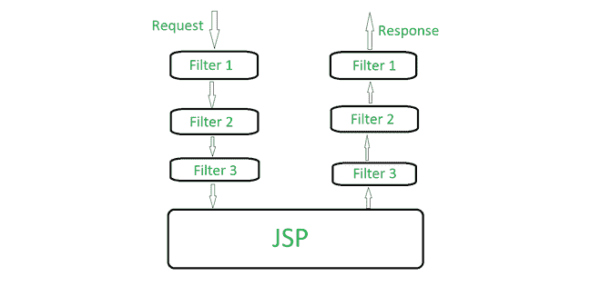
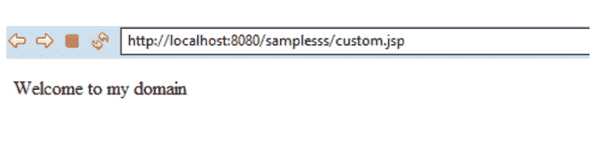

# 什么是 JSP 过滤器？

> 原文:[https://www.geeksforgeeks.org/what-is-jsp-filters/](https://www.geeksforgeeks.org/what-is-jsp-filters/)

[JSP](https://www.geeksforgeeks.org/introduction-to-jsp/) (Java Server Pages)是一种服务器端技术，用于用 Java 创建 web 应用程序。为了操纵服务器的响应并拦截来自客户端的请求，JSP 有其专有的过滤器，在 java 类的帮助下使用。同时，过滤器用于验证用户的凭证，并对有问题的数据执行数据加密技术。

### 句法

可以创建一个 *web.xml* 文件来部署 JSP 过滤器，可以推导出以下代码语法供参考:

> <filter-name></filter-name>
> 
> <filter-class></filter-class>
> 
> <filter-mapping></filter-mapping>
> 
> <filter-name></filter-name>
> 
> <url-pattern></url-pattern>

### JSP 过滤器的工作



JSP 过滤器是 java 类，主要用于拦截来自任何客户端的请求或操纵服务器的响应。此外，过滤器使用日志记录和审计等技术，通过加密数据和提供用户身份验证来提供数据安全功能。要创建和实现过滤器接口，可以使用 *javax.servlet* 类。

除了 JSP 之外，servlets 和其他标记语言(如 HTML)也使用过滤器。此外，我们还可以在图像和视频中看到滤镜的使用。很明显，在某些需要降低视频性能的情况下，过滤器被用来增加一些额外的复杂性，这可能是因为它非常快，并且非常容易被不同的用户环境访问。

用于定义过滤器的 *web.xml* 文件被映射到 servlets 和/或 JSP 页面，以便使用过滤器功能。运行 JSP 代码时调用 JSP 容器，同时创建部署描述符文件中部署的过滤器的实例。

### JSP 中过滤器的类型

**1。日志过滤器:**当我们试图在后端或服务器上记录任何信息时，日志过滤器可以在适当的位置使用。理解这一点的一个简单例子是使用*日志记录时间过滤器*在日志中记录传入请求和传出响应的时间。

**2。数据压缩过滤器:**顾名思义，过滤器可以用于数据需要压缩到一定程度的传入信息。压缩过滤器将数据压缩到所需的百分比，然后进行相应的通信。

**3。令牌化过滤器:**所有进入的用户数据都在令牌化过滤器的帮助下存储和检索。

**4。加密过滤器:**有时代码在过滤器的帮助下得到保护，有时我们想加密并保存流经过滤器的用户数据，为了实现这一目标*加密过滤器*应运而生并很好地完成了工作。

**5。认证过滤器:**认证过滤器仅用于完成认证的目的。所有试图进入的用户都通过基于预设标准的过滤器进行身份验证。

### 对 JSP 过滤器的需求

过滤器可以在网页定义和后端管理中以多种方式使用，因为用户发送的所有数据都可以通过*日志过滤器*和*加密过滤器*成功翻译和加密，并且可以使用*标记化过滤器*处理或检索数据。同样，可以使用*数据压缩过滤器*相应地压缩输入的用户数据。

如果我们有一些敏感的代码要写，那么这也可以使用过滤器来有效地完成，我们将在过滤器中而不是 servlet 中编写代码。当用户调用 servlet 时，过滤器不会被用户检索到，但是相应的 JSP 页面会被检索到。在 servlets 中写入敏感代码会使它更容易受到黑客的攻击，并且在数据库关联的情况下可能会造成重大损失。

#### 例子

## Java 语言(一种计算机语言，尤用于创建网站)

```
public class tagHandler implements Filter {
    @Override
    public void init(FilterConfig filters)
        throws ServletException
    {
        System.out.println("Filter  started...");
    }
    @Override
    public void doFilter(ServletRequest request,
                         ServletResponse response,
                         FilterChain f)
        throws IOException, ServletException
    {
        String user = request.getParameter("user");
        if (user == null || user.equals("")) {
            PrintWriter writer = response.getWriter();
            String m = "Welcome to my domain";
            writer.println(m);
            return;
        }
        f.doFilter(request, response);
    }
    @Override public void destroy()
    {
        System.out.println("Filter  deleted..");
    }
}
<body> < % String user = request.getParameter("user");
% > < % out.print(user);
% > </ body>
```

#### 输出:



Web 应用程序主要使用 JSP 和 servlets 的过滤器，因为过滤器能够根据用户需求调整数据并相应地修改数据。无论是对加密的身份验证还是对敏感数据的管理，过滤器都是根据需求来处理的，因此在编程系统中占有一席之地，主要是在处理敏感数据的情况下。