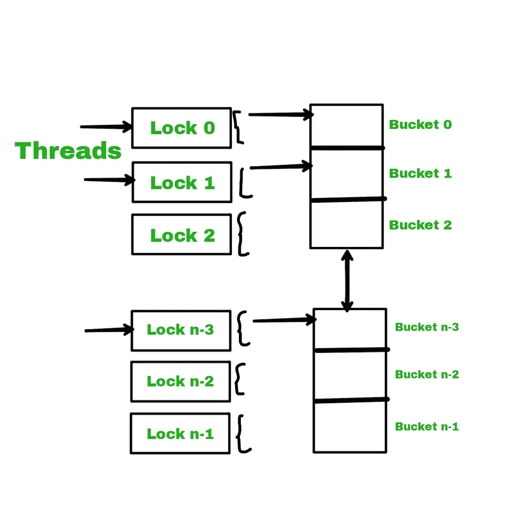

# 什么是 Java 并发中的锁条带化？

> 原文:[https://www . geesforgeks . org/什么是 java 中的锁分条-并发/](https://www.geeksforgeeks.org/what-is-lock-striping-in-java-concurrency/)

**锁定条带化**是锁定发生在几个容器或条带或桶上的地方，这意味着到达桶只是可以的螺栓，而不是整个信息结构。这就是锁分条的概念。对信息结构的一个位有单独的锁，其中每个锁都锁定在一个独立项目的可变度量排列上。让我们以 **ConcurrentHashMap** 为例。

**示例:**

当然，Java 中的 ConcurrentHashMap 有 16 个桶，每个容器都有自己的锁系统。所以在不连续的桶中接触琴键的琴弦可以同时接触到它们。如果您需要想象一下，那么下面的图片会让您想到如何为 ConcurrentHashMap 锁定分条。

这里两个字符串需要到达 can 0 中的键，以便其中一个可以输入，同样两个字符串需要到达盆地 1 中的键，以便其中一个可以输入。桶 n-3 也是如此。按照这种思路，用 6 个字符串的锁分条，3 个字符串可以在信息结构中逐渐消失。

为了发现新组件的桶，我们依赖于键的 hashcode。为了包含更多的桶，我们应该复制当前的哈希表，并使用、state 和双倍大小创建另一个表。

**锁条的特点:**

1.  它只出现在一些桶/容器上。
2.  它有助于向不同的容器中添加两个或多个元素。

**锁定分条在** [**Java 并发**](https://www.geeksforgeeks.org/java-concurrency-yield-sleep-and-join-methods/) **中的作用:**

1.  它处理对数据的并发访问，同时具有良好的性能。
2.  它帮助线程访问不同桶/容器中的密钥。

**Java 并发缺点:**

在应用锁的 [Java 并发](https://www.geeksforgeeks.org/java-concurrency-yield-sleep-and-join-methods/)中的锁条带化的情况下，如果您需要  一个[集合](https://www.geeksforgeeks.org/collections-in-java-2/)进行独占访问，那么这将比使用单个锁更加困难和昂贵。